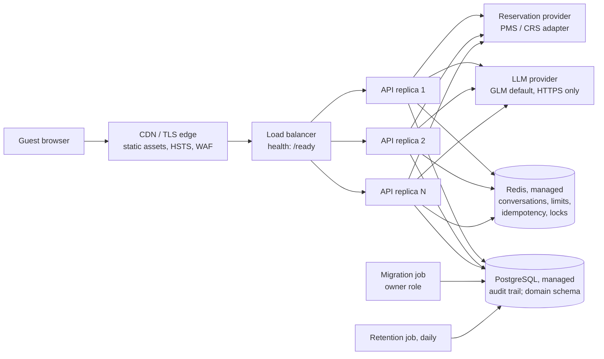

# Deployment

This page describes how the system runs today, locally and in CI, and the **proposed** production topology. Status labels follow [ENTERPRISE_READINESS.md](ENTERPRISE_READINESS.md): nothing on this page has been deployed to a cloud environment.

## What exists and has been run

| Artifact | What it is | Verified how |
|---|---|---|
| `backend/Dockerfile` | Multi-stage, digest-pinned `python:3.13-slim`, non-root uid 10001, `APP_ENV=production`, JSON logs, health check, migrations included, `uvicorn --timeout-graceful-shutdown 25` | Built and run locally; image filesystem scanned for credentials (0 matches, no `.env`) |
| `frontend/Dockerfile` | Vite build served by nginx as uid 101, security headers on every location, `/api/` proxied to `backend:8000`, 64 KB body limit | Built and run locally; headers checked by `scripts/verify_stack.py` |
| `docker-compose.yml` | nginx + one backend, in-memory state, read-only filesystems, dropped capabilities, `no-new-privileges` | `verify_stack.py` (CI docker job) |
| `docker-compose.scale.yml` | Adds Redis, PostgreSQL, a one-shot migration job and **3 backend replicas** | Run locally: 33/33 edge checks, cross-replica booking idempotency, graceful stop (details below) |
| `.github/workflows/ci.yml` | Builds both images, runs both compose topologies and the replica checks | **Written, not yet run on GitHub** |

Image sizes measured locally: backend 71.2 MB compressed (312 MB on disk), frontend 21.1 MB compressed (74.1 MB on disk).

## Running locally

```bash
# Single instance, in-memory state (offline FAQ mode unless backend/.env configures a provider)
docker compose up --build                                   # http://localhost:8080

# Three replicas with shared Redis state and the PostgreSQL audit trail
export SA_DB_OWNER_PASSWORD=<any local value> SA_DB_APP_PASSWORD=<any local value>
docker compose -f docker-compose.yml -f docker-compose.scale.yml up --build --wait
cd backend && python -m scripts.verify_stack --expect-shared-state
```

The scale file refuses to start without the two passwords (`${VAR:?}`), and neither Redis nor PostgreSQL publishes a host port. PostgreSQL's init script (`backend/deploy/postgres-init/01-app-role.sh`) creates `simplotel_app` as `NOSUPERUSER NOBYPASSRLS` with DML-only privileges. The backend connects as that role so row-level security applies, while the `migrate` job runs as the owner.

If `backend/.env` holds provider credentials, the stack uses them. To verify without model traffic, set `AI_ENABLED=false` for the backend service.

## Multi-replica verification (local, 2026-09-16)

Results from the three-replica stack with AI disabled. Details and commands are in [SRE.md](SRE.md).

| Check | Result |
|---|---|
| `verify_stack.py --expect-shared-state` | 33/33: headers, error envelope, 413 at the edge, `/metrics` not exposed, 8 concurrent turns → 16 stored messages, IP burst limit enforced once across replicas (15 of 30 with the then-default 15 per 5 s; the default is now 30 per 10 s) |
| Load spread | nginx round-robin across replicas: 23 / 18 / 16 API requests |
| Same booking fired simultaneously inside all 3 containers (`scripts/replica_booking_probe.py`) | One booking ID everywhere, created on exactly one replica; PostgreSQL audit: `BookingRequested` 3, `BookingConfirmed` 1 |
| Readiness | Every replica `ready`: knowledge ok, state ok, audit_store ok; uid 10001 |
| `docker stop` one replica (SIGTERM) | Exit code 0 after about 2.1 s, `shutdown_complete` logged; the edge answered 12/12 requests while it was down |

## Graceful shutdown

1. The orchestrator sends SIGTERM (compose `stop_grace_period: 30s`; Kubernetes `terminationGracePeriodSeconds` should be at least 30).
2. uvicorn stops accepting connections and waits up to **25 s** (`--timeout-graceful-shutdown 25`) for in-flight requests. A guest turn is bounded by the LLM budget (`LLM_TIMEOUT_SECONDS × (LLM_MAX_RETRIES + 1)`, 40 s by default). A turn slower than 25 s is cut off, and the client sees a network error with a retry button. Lower the LLM budget or raise both grace periods together if that matters.
3. The FastAPI lifespan shutdown then cancels the purge task and calls `Container.close()`. That flushes queued audit events (up to 10 s), closes the PostgreSQL pool, closes the LLM HTTP client and closes Redis. `shutdown_complete` is logged.
4. Held conversation locks are released as each request finishes. If a process is killed instead, its locks expire with their lease (`CONVERSATION_LOCK_LEASE_SECONDS`), and version checks prevent lost updates in the meantime.

In a load balancer, readiness should fail before SIGTERM, for example with a pre-stop delay, so new requests stop arriving. **Not implemented:** `/ready` does not yet flip to "draining" on SIGTERM.

## Proposed production topology (DESIGNED, not deployed)



| Component | Proposal | Status of the code it needs |
|---|---|---|
| CDN / TLS edge | Serves the SPA and terminates TLS. Add `frontend/security-headers-tls.conf` (HSTS) at the TLS edge; blocks `/metrics` | Headers IMPLEMENTED + TESTED; CDN not built |
| Load balancer | Routes to replicas, probes `/ready` for readiness and `/health` for liveness | Endpoints IMPLEMENTED + TESTED |
| API replicas | The backend image, `APP_ENV=production`, `STATE_BACKEND=redis`, `WORKER_THREADS` tuned per [PERFORMANCE.md](PERFORMANCE.md), 2+ replicas across zones | Multi-replica behaviour IMPLEMENTED + TESTED locally; autoscaling not built |
| Redis | Managed, `rediss://` with auth, `noeviction` (locks and idempotency must not be evicted), persistence optional (state is ephemeral) | Redis backend IMPLEMENTED + TESTED against Redis 7.4; TLS/auth not exercised |
| PostgreSQL | Managed, backups, app connects as a non-superuser role; `python -m app.db.migrate` as a deploy step; `python -m app.db.retention` daily | Migrations, RLS, audit sink, retention IMPLEMENTED + TESTED against PostgreSQL 17; other repositories DESIGNED |
| LLM provider | `LLM_PROVIDER=glm`, `LLM_BASE_URL=https://…` (production validation rejects `http://`) | IMPLEMENTED + TESTED against a development GLM gateway; production endpoint not chosen |
| Reservation provider | PMS/CRS adapter implementing `ReservationProvider` ([RESERVATION_INTEGRATION.md](RESERVATION_INTEGRATION.md)) | NOT IMPLEMENTED (mock only) |
| Secrets | Secret manager injecting env vars at runtime; never in images | Images verified free of secrets; secret manager not integrated |
| Observability | Log shipping (JSON logs), Prometheus scrape of `/metrics` on the internal network, trace export | Signals IMPLEMENTED + TESTED; pipelines not built |

### Production configuration checklist

These are enforced at startup (the app refuses to start):
- `LLM_BASE_URL` and `ANTHROPIC_BASE_URL` use `https://`.
- `LLM_PROVIDER` is not `mock`.
- `CORS_ORIGINS` lists real origins.
- `LOG_FORMAT=json`.
- Rate limits are enabled.
- `AUTH_MODE` is not `static_token`.
- `STATE_BACKEND=redis` includes `REDIS_URL`.
- `CONVERSATION_LOCK_LEASE_SECONDS` exceeds the LLM budget.

Not enforced; the operator must ensure:
- `STATE_BACKEND=redis` whenever there is more than one replica.
- `TRUST_PROXY_HEADERS=true` only behind a proxy that overwrites `X-Forwarded-For`.
- `/metrics` is unreachable from the internet.
- The database role has no superuser or BYPASSRLS attribute.

The full reference is in [CONFIGURATION.md](CONFIGURATION.md).
