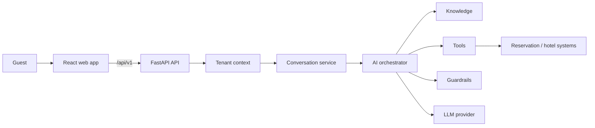
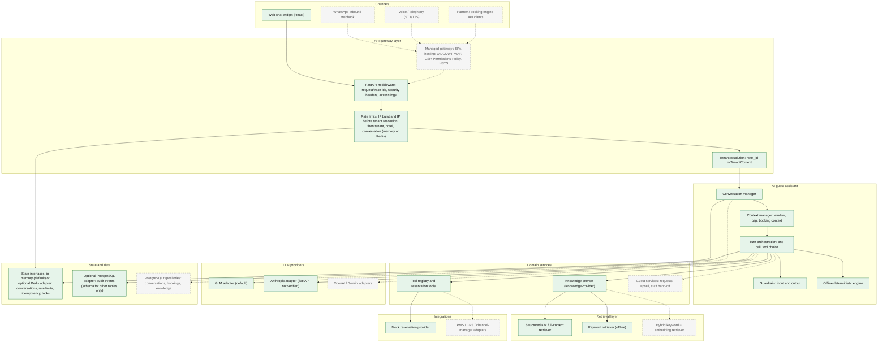
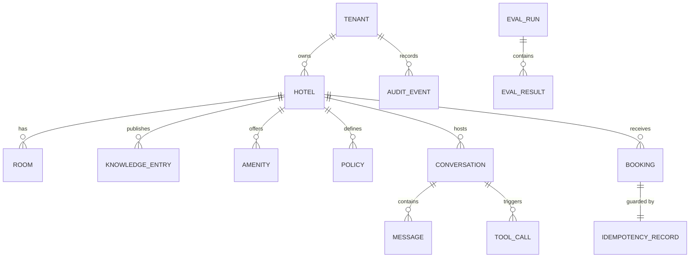

# Enterprise architecture

This document describes the architecture this repository has today and the architecture it is built to grow into. It is meant for engineers reviewing the platform. It separates what exists from what is only designed, and it does not claim production readiness.

**Status labels** (every capability below has exactly one):

| Label | Meaning |
|---|---|
| **IMPLEMENTED + TESTED** | Code exists and is covered by automated tests. Where the implementation is in-memory, per-process or mock, the row says so ("prototype"). |
| **IMPLEMENTED + NOT VERIFIED** | Code exists and is tested against fakes or mocks, but has not been exercised against the real external system or environment. |
| **DESIGNED** | An interface, schema or written design exists; there is no production implementation behind it. |
| **NOT IMPLEMENTED** | No code and no committed design. |

Companion documents: [ARCHITECTURE.md](ARCHITECTURE.md) (application-level design), [DECISIONS.md](DECISIONS.md), [EVALUATION.md](EVALUATION.md), [THREAT_MODEL.md](THREAT_MODEL.md), [OBSERVABILITY.md](OBSERVABILITY.md), [SRE.md](SRE.md), [COST_MODEL.md](COST_MODEL.md), [CONFIGURATION.md](CONFIGURATION.md), [DEPLOYMENT.md](DEPLOYMENT.md), [PERFORMANCE.md](PERFORMANCE.md), [PRIVACY.md](PRIVACY.md), [RESERVATION_INTEGRATION.md](RESERVATION_INTEGRATION.md), [ENTERPRISE_READINESS.md](ENTERPRISE_READINESS.md).

All code paths are relative to `backend/app/` unless stated otherwise. `container.py` is the source of truth for what is actually wired.

---

## 1. Current state at a glance

| Capability | Status | Where in code |
|---|---|---|
| Composition root (one place selects every implementation) | **IMPLEMENTED + TESTED** | `container.py` |
| Tenant → hotel resolution, `TenantContext` | **IMPLEMENTED + TESTED** | `tenancy.py`, `api/deps.py` |
| Tenant registry storage | **IMPLEMENTED + TESTED** (prototype: JSON file loaded at startup; tenant and hotel rows synced to PostgreSQL when `DATABASE_URL` is set) | `data/tenants.json`, `db/audit.py` |
| Per-tenant feature flags | **IMPLEMENTED + TESTED** | `core/flags.py`, `tenants.json` |
| Hotel configuration and knowledge storage | **IMPLEMENTED + TESTED** (prototype: per-hotel JSON, per-process TTL cache) | `knowledge/provider.py` (`JsonKnowledgeProvider`), `data/hotels/*/hotel.json` |
| Knowledge content lifecycle (status, version, effective dates) | **IMPLEMENTED + TESTED** | `knowledge/models.py` |
| Full-context and keyword retrieval | **IMPLEMENTED + TESTED** | `knowledge/retrieval.py` |
| Semantic (embedding) retrieval | **DESIGNED** (enabling the flag globally or for any tenant raises `ConfigError`) | `container.py` |
| Provider-neutral LLM interface and failure contract | **IMPLEMENTED + TESTED** | `llm/provider.py`, `tests/test_contracts.py` |
| GLM adapter (default, `LLM_PROVIDER=glm`) | **IMPLEMENTED + TESTED** (contract tests; live GLM eval runs, which are GLM-runtime evidence only) | `llm/glm_provider.py` |
| Anthropic adapter (`LLM_PROVIDER=anthropic`) | **IMPLEMENTED + NOT VERIFIED** (tested with the real SDK against a mocked HTTP transport; **Anthropic live API: NOT VERIFIED — no Anthropic credential**) | `llm/anthropic_provider.py` |
| Latency mock provider (load tests; rejected in production) | **IMPLEMENTED + TESTED** | `llm/mock_provider.py` |
| Scripted provider (tests, evals, benchmarks) | **IMPLEMENTED + TESTED** | `llm/scripted_provider.py` |
| OpenAI / Gemini adapters | **NOT IMPLEMENTED** | none |
| Model router (`GUEST_TURN`) | **IMPLEMENTED + TESTED** | `llm/router.py` |
| Routes for intent classification, summary, eval judge | **DESIGNED** (routes configured, no callers) | `llm/router.py` |
| One-call AI turn with three strict tools | **IMPLEMENTED + TESTED** | `assistant/agent.py`, `assistant/prompts.py` |
| Input and output guardrails | **IMPLEMENTED + TESTED** | `assistant/guardrails.py` |
| PII masking before the model, stored transcript and traces | **IMPLEMENTED + TESTED** (card numbers, emails, phone numbers; names and addresses not detected) | `core/privacy.py` |
| Deterministic offline fallback | **IMPLEMENTED + TESTED** | `assistant/offline.py` |
| Tool registry (validation, authorization, timeout, audit) | **IMPLEMENTED + TESTED** | `tools/base.py` |
| `check_availability`, `request_booking_details` tools | **IMPLEMENTED + TESTED** | `tools/builtin.py` |
| `create_booking` tool (not exposed to model, flag-gated) | **IMPLEMENTED + TESTED** (prototype) | `tools/builtin.py` |
| `ReservationProvider` boundary | **IMPLEMENTED + TESTED** (interface, mock and resilience wrapper); real PMS/CRS adapter **NOT IMPLEMENTED** ([RESERVATION_INTEGRATION.md](RESERVATION_INTEGRATION.md)) | `reservations/provider.py` |
| Mock reservation provider and bookings | **IMPLEMENTED + TESTED** (prototype: mock inventory, in-process bookings) | `reservations/provider.py`, `data/hotels/*/inventory.json` |
| Resilience wrapper (timeout, retries with deadline, circuit breaker, cache) | **IMPLEMENTED + TESTED** (breaker state is per process) | `reservations/provider.py`, `core/resilience.py` |
| Idempotency store | **IMPLEMENTED + TESTED** (memory by default, or optional Redis lease lock plus stored result; tested across 3 stores on real Redis, verified locally once, not run in CI) | `reservations/idempotency.py`, `state/redis_backend.py` |
| Server-side conversations (TTL, cap, delete, purge, version compare-and-set, turn locks) | **IMPLEMENTED + TESTED** (memory by default or optional Redis; Redis tested with three in-process app replicas, verified locally once, not run in CI) | `conversations/`, `core/locks.py`, `state/redis_backend.py` |
| Rate limiting (IP burst, IP, tenant, hotel, conversation) | **IMPLEMENTED + TESTED** (memory or Redis sliding window) | `core/rate_limit.py`, `api/deps.py`, `state/redis_backend.py` |
| Knowledge and availability cache | **IMPLEMENTED + TESTED** (per process by design; not shared across replicas) | `core/cache.py` |
| PostgreSQL schema (11 tables, composite tenant keys, RLS forced), migration runner, retention job | **IMPLEMENTED + TESTED** (optional adapter; real PostgreSQL 17 with a non-superuser app role, verified locally once, not run in CI) | `backend/migrations/0001_domain_model.sql`, `db/migrate.py`, `db/retention.py` |
| PostgreSQL audit sink | **IMPLEMENTED + TESTED** (optional adapter; integration test verified locally once, not run in CI) | `db/audit.py` |
| PostgreSQL repositories for conversations, messages, tool calls, bookings, knowledge, evaluations | **DESIGNED** (schema only; not wired) | `backend/migrations/0001_domain_model.sql` |
| Object storage | **NOT IMPLEMENTED** | none |
| Auth boundary for admin API, RBAC model | **IMPLEMENTED + TESTED** | `auth/`, `api/deps.py` |
| Static-token admin auth | **IMPLEMENTED + TESTED** (prototype: development only; rejected in production config) | `auth/providers.py` |
| OIDC / JWT authentication | **DESIGNED** | none |
| Read-only admin API (hotels, knowledge, ai-config) | **IMPLEMENTED + TESTED** | `api/v1_admin.py` |
| Admin writes (publish content, change AI config) | **NOT IMPLEMENTED** | none |
| Web channel (React/Vite UI, v1 guest API) | **IMPLEMENTED + TESTED** | `api/v1_guest.py`, `frontend/src` |
| WhatsApp and voice rendering adapters | **DESIGNED** (renderers only; no inbound webhooks or telephony) | `channels/adapters.py` |
| Structured JSON logs with context and redaction | **IMPLEMENTED + TESTED** | `core/observability.py` |
| AI traces (log + in-memory sinks) | **IMPLEMENTED + TESTED** | `core/tracing.py` |
| OpenTelemetry / external trace exporters | **DESIGNED** (`TraceSink` interface) | `core/tracing.py` |
| Prometheus metrics | **IMPLEMENTED + TESTED** | `core/metrics.py`, `api/ops.py` |
| Domain events (log, in-memory and PostgreSQL audit publishers) | **IMPLEMENTED + TESTED** | `core/events.py`, `db/audit.py` |
| Outbox / message broker for events | **DESIGNED** (`EventPublisher` interface) | `core/events.py` |
| Docker/containerization | **NOT REQUIRED FOR CURRENT PROJECT — removed intentionally** (an earlier container setup was removed as out of scope) | none |
| Security headers for the served SPA (CSP, Permissions-Policy, HSTS at TLS) | **NOT IMPLEMENTED** (hosting requirement for whatever serves the built SPA) | none |
| CI workflow | **IMPLEMENTED + NOT VERIFIED** (never run on GitHub) | `.github/workflows/ci.yml` |
| Manual live-AI eval workflow (GLM or Anthropic) | **IMPLEMENTED + NOT VERIFIED** (never run on GitHub) | `.github/workflows/live-ai-eval.yml` |

Latest test totals: [ENTERPRISE_READINESS.md](ENTERPRISE_READINESS.md).

---

## 2. Target enterprise architecture (conceptual)

Product topology today:

State stores are implementation details behind interfaces: in-memory by default, with optional Redis and PostgreSQL adapters. The detailed view below adds future components.

Solid boxes exist in this repository today. Dashed boxes are future components. A solid box can still be a prototype implementation (see section 1).

Main flow today: `POST /api/v1/hotels/{hotel_id}/conversations/{id}/messages` → middleware (request ids, IP burst and IP limits for every `/api/` request, 64 KB body limit) → `resolve_guest_context` (hotel resolution) → `enforce_rate_limits` (tenant, hotel, conversation) → `ConversationService.post_message` (turn lock, version compare-and-set on save) → `AssistantService.handle` (PII masking, input guardrails) → `AIAssistant.reply` (or `OfflineAssistant.reply`) → `ToolRegistry.execute` where a tool is chosen → reply, trace, metrics, events (and audit rows when `DATABASE_URL` is set). These endpoints are synchronous handlers run in the worker thread pool (`WORKER_THREADS`, default 150), so Redis round trips for rate limiting and tenant resolution never block the event loop; only `/health` is async.

---

## 3. Modular monolith and component boundaries

The backend is a single deployable (one FastAPI process) split into packages with explicit interfaces (`typing.Protocol`).

| Package | Responsibility | Key interface(s) |
|---|---|---|
| `api/` | HTTP routing, error envelope, middleware, request-scoped dependencies | none (adapter layer) |
| `conversations/` | Conversation lifecycle and short-term context | `ConversationRepository` |
| `assistant/` | Turn handling, AI and offline engines, guardrails, prompts | `AssistantService` |
| `tools/` | Tool contract, authorization pipeline, built-in tools | `Tool`, `ToolRegistry` |
| `knowledge/` | Hotel configuration, content lifecycle, retrieval | `KnowledgeProvider`, `Retriever` |
| `reservations/` | Inventory, pricing rules, bookings, idempotency | `ReservationProvider`, `IdempotencyStore` |
| `llm/` | Vendor-neutral model access and routing | `LLMProvider`, `ModelRouter` |
| `auth/` | Principal, roles, authentication providers | `AuthProvider` |
| `channels/` | Rendering a channel-independent reply per channel | `ChannelAdapter` |
| `core/` | Config, errors, flags, logging, metrics, tracing, events, cache, rate limiting, locks, privacy, resilience, clock | `Cache`, `RateLimiter`, `LockStore`, `TraceSink`, `EventPublisher`, `Clock` |
| `state/` | Redis implementations of the conversation repository, rate limiter, idempotency store and lock store | implements the interfaces above |
| `db/` | PostgreSQL migration runner, audit sink, retention job | `EventPublisher` (audit sink) |
| `tenancy.py` | Tenant registry and `TenantContext` | `TenantRegistry` |

**Dependency direction.** `api → conversations → assistant → {tools, knowledge, llm} → reservations → core`. `core` imports nothing from the domain packages. Only `llm/anthropic_provider.py` imports a vendor SDK; the GLM adapter uses `httpx`. The Redis and PostgreSQL clients are imported only when the corresponding setting selects them. `api/` is the only package that imports FastAPI (with `main.py`).

**Composition root.** `build_container(settings)` in `container.py` builds every concrete implementation and injects it. Tests pass alternatives (`llm_provider`, `reservation_provider`, `clock`, `extra_trace_sink`) through the same function. `STATE_BACKEND=redis` and `DATABASE_URL` were added this way: the container selects the Redis implementations and the PostgreSQL audit sink, and the assistant and API code did not change. A PMS adapter or further database repositories should follow the same path.

**Why not microservices now.** There is one team, one release cadence and no component with a scaling profile that differs from the rest. The expensive part of a turn is the LLM call, which is external either way. Network hops between services would add latency, partial-failure modes and distributed tracing work without any isolation benefit. The package boundaries keep extraction possible later.

**Extraction candidates and triggers** (all **DESIGNED**, written design only):

| Candidate | Boundary it would take | Trigger for extraction |
|---|---|---|
| Reservation integration service | `ReservationProvider` | Many PMS/CRS adapters with their own release cycle, credentials and outbound rate limits; a separate integrations team; long-running sync jobs |
| Knowledge / content service | `KnowledgeProvider` + admin writes | A CMS-style editing workflow, embedding pipelines and content ingestion with different scaling and ownership from guest traffic |
| Channel gateway (WhatsApp, voice) | Inbound webhooks → `TurnRequest` | Telephony and messaging providers need persistent connections, strict latency budgets or separate compliance scope |
| Analytics / event consumers | `EventPublisher` | Event volume or reporting queries that must not share resources with the request path |
| AI orchestration | `AssistantService` | Only if model-serving concerns (GPU, batching, self-hosted models) diverge from the API tier; unlikely while providers are external APIs |

---

## 4. Multi-tenancy

### Model

- **Tenant**: a customer (hotel group). `Tenant{id, name, status, hotels[], feature_flags}` in `tenancy.py`.
- **Hotel**: belongs to exactly one tenant; `hotel_id` is globally unique. `TenantRegistry` rejects a hotel assigned to two tenants at load time.
- **Channel**: `web | whatsapp | voice | api` (`tenancy.Channel`). Only `web` is used by the HTTP API today.
- **Conversation**: owned by `(tenant_id, hotel_id)` and carries its channel.

`TenantContext(tenant_id, hotel_id, channel, conversation_id, request_id, trace_id)` is an immutable value created per request by `TenantRegistry.resolve()` and passed explicitly to services, tools and providers. **IMPLEMENTED + TESTED.**

### How isolation is enforced today (IMPLEMENTED + TESTED unless noted)

1. **Registry resolution.** Guest routes are hotel-scoped (`/api/v1/hotels/{hotel_id}/…`). The HTTP middleware has already applied the IP burst and per-IP limits to every `/api/` request (so probing unknown hotel ids, unknown routes and malformed bodies are counted); `resolve_guest_context` maps `hotel_id` to its tenant; unknown hotels and hotels of suspended tenants return `404 HOTEL_NOT_FOUND`. The conversation rate-limit key is scoped per hotel, so ids sent to one hotel can't consume another hotel's budget.
2. **Repository keys.** `ConversationRepository.get/delete` take `(tenant_id, hotel_id, conversation_id)`, in both the memory and Redis backends. A conversation id from hotel A requested through hotel B is not found, including on another replica (tested with three in-process replicas sharing Redis).
3. **Provider checks.** `MockReservationProvider.check_availability` rejects a `KnowledgeBase` snapshot whose `hotel.id` differs from `ctx.hotel_id`. Availability cache keys and idempotency scopes include `tenant_id` and `hotel_id`.
4. **Admin principal scoping.** `Principal` carries `tenant_id` (or `*` for platform admins only) and an optional `hotel_ids` set. `require_admin` checks tenant or hotel access and role before any data access.
5. **No probing.** `require_hotel_in_tenant` returns the same `404 HOTEL_NOT_FOUND` whether a hotel doesn't exist or belongs to another tenant.
6. **Database.** Every PostgreSQL table carries `tenant_id`; composite keys and foreign keys include it, and row-level security is enabled and forced with policy `tenant_id = current_setting('app.tenant_id')`. Integration tests with a non-superuser role show other tenants' rows hidden, UPDATE/DELETE affecting 0 rows and cross-tenant INSERT rejected; composite foreign keys block cross-tenant references even for a superuser. Only the audit sink writes to the database today.
7. **Path safety.** `JsonKnowledgeProvider` rejects non-alphanumeric hotel ids and verifies the file's declared hotel id.
8. **Observability context.** Logs, traces and events carry `tenant_id` and `hotel_id`. Metrics deliberately do not (see section 13).

### Per-tenant feature flags

`FeatureFlags` holds global defaults (`FLAG_DEFAULTS`), global overrides from `FEATURE_<NAME>` environment variables, and per-tenant overrides from `tenants.json`. Unknown flag names, global or per tenant, fail at container build. Flags consumed today: `ai_assistant_enabled` (per tenant), `booking_tools_enabled` (per tenant, via `ToolDefinition.required_flag`), `guardrail_price_check_enabled` (per tenant; `AIAssistant` passes the resolved value into `OutputGuardrails.check_answer`), `semantic_retrieval_enabled` (enabling it globally or for any tenant raises `ConfigError` because no semantic retriever exists). `whatsapp_enabled` and `voice_enabled` are defined but not consumed by any code path.

### Hotel-local business dates

`core/clock.local_today(clock, hotel.timezone)` computes "today" in the hotel's IANA time zone. It drives knowledge effective dates, past-date validation, relative-date resolution in the prompt, and cache keys. A hotel in `Asia/Kolkata` rolls over at local midnight, not UTC midnight. **IMPLEMENTED + TESTED.**

### Production data isolation options

| Option | How | Strengths | Weaknesses |
|---|---|---|---|
| Shared schema, `tenant_id` on every row, PostgreSQL row-level security | One database; every tenant-owned table has `tenant_id` (and `hotel_id`) leading its indexes; RLS policy `tenant_id = current_setting('app.tenant_id')` set per transaction | Operationally simple at thousands of tenants; one migration path; efficient pooling; cross-tenant platform analytics are possible | A missing `SET` or a superuser connection bypasses RLS; noisy neighbours share resources; per-tenant restore is harder |
| Schema per tenant | One Postgres schema per tenant, `search_path` per connection | Stronger logical separation; per-tenant backup/restore and deletion are easier | Migrations fan out across N schemas; catalog bloat and pooling difficulties past a few thousand schemas |
| Database per tenant (for a few large or regulated tenants) | Dedicated instance | Strongest isolation, per-tenant region and encryption keys | Highest cost and operational load |

Chosen direction: shared schema with `tenant_id` + RLS is what `migrations/0001_domain_model.sql` implements (**IMPLEMENTED + TESTED** as schema; only the audit sink uses it). Repository-level scoping stays as defence in depth. A dedicated database for specific enterprise tenants through the same repository interfaces remains **DESIGNED**. The application connects as a non-superuser role without `BYPASSRLS`, which addresses the "superuser bypasses RLS" weakness above.

---

## 5. Hotel configuration model

Defined in `knowledge/models.py`, loaded from `data/hotels/<hotel_id>/hotel.json`. **IMPLEMENTED + TESTED** as models; storage is a JSON prototype.

| Model | Fields | Used for |
|---|---|---|
| `HotelProfile` | id, name, tagline, address, city, phone, email, whatsapp, currency, timezone, check-in/out times, `languages`, `brand` | Guest UI profile, prompt header, contact lines in fallbacks, local date |
| `Brand` | `assistant_name`, `primary_color` | Assistant persona in the prompt; UI theming (inline CSS variable) |
| `Room` | id, name, description, size, beds, max adults/children/occupancy, extra bed, `base_rate`, breakfast, features | Availability fit and pricing; also rendered as `rooms.<id>` knowledge entries |
| `KnowledgeEntry` | id, topic, title, content, keywords, lifecycle fields (section 7) | Grounded answers and citations |
| `Inventory` (`reservations/availability.py`) | total rooms, weekday rules, per-date bookings, seasonal multipliers | Mock availability only |

**Configuration boundary.** Code reads hotel data only through `KnowledgeProvider` (`profile`, `snapshot`, `list_entries`, `is_healthy`) and inventory only through `ReservationProvider`. `KnowledgeBase` is an immutable per-hotel, per-business-date snapshot with a content-hash `knowledge_version`. Platform configuration (models, timeouts, limits) comes from environment variables via `Settings`; tenant configuration (flags) from the tenant registry; hotel content from the knowledge provider. A database- or CMS-backed provider would replace the JSON provider without touching callers. The `languages` list drives the UI locale choice; model reply language is requested through the context block.

---

## 6. AI orchestration

**One model call per turn** (`assistant/agent.py`, **IMPLEMENTED + TESTED**). The model must reply by calling exactly one of three strict tools. The GLM adapter forces a tool call (`tool_choice="required"`, `parallel_tool_calls=false`); the Anthropic adapter uses strict tools with `disable_parallel_tool_use`:

| Tool | Policy | Outcome |
|---|---|---|
| `answer_guest` | reply schema (not a registry tool) | `{type: answer|clarification|fallback, text, source_ids, suggestions}` validated by `ModelReply`, then output guardrails |
| `check_availability` | READ_ONLY registry tool | Deterministic search; result goes straight to the UI |
| `request_booking_details` | READ_ONLY registry tool | Date/guest form, pre-filled from arguments and remembered context |

There is no agent loop: every tool result is final, so nothing needs to go back to the model. Prices and inventory never pass through model text.

**Why the answer is a tool.** The first design combined a JSON output format with two action tools. When the unchanged code path was pointed at a development model (`glm-5.2` via an Anthropic-compatible gateway), that model never called a tool while the output format was set (0/4 probes) and chose correctly without it (4/4). Making the answer a third strict tool gives one decision point per turn and avoids depending on one provider feature combination. This evidence is from GLM, **not Claude**; it is a portability decision, not a verified Claude behaviour.

**Why GLM has its own adapter.** Over the Anthropic-format protocol GLM occasionally answered in plain text instead of calling a tool, and tool choice could not be forced there. The GLM-native adapter (`llm/glm_provider.py`, OpenAI-compatible Chat Completions) forces the tool call, which removed that failure at the adapter layer. It has typed errors (timeout, connection, status, protocol), retries timeouts, connection errors and HTTP 408/409/429/5xx/529 (not other 4xx) with jittered backoff, and HTTP client timeouts that close the connection. Plain text instead of a tool call is still handled: it maps to fallback reason `invalid_output` (see [EVALUATION.md](EVALUATION.md), section D.2).

**Deterministic post-processing** (**IMPLEMENTED + TESTED**):
- If several tool calls arrive, an action tool beats `answer_guest`.
- Tool arguments pass through `ToolRegistry.execute` (null normalisation, validation, authorization, timeout).
- Replayed conversation history is passed through `neutralise_prompt_tags` in `build_messages`, as the current message is by `InputGuardrails`, so stored guest text can't open or close prompt sections.
- `OutputGuardrails.check_answer`: secret and prompt-leak detection, unknown `source_ids` dropped, uncited `answer` becomes a fallback, free-text availability claims become the booking form, currency amounts not present in cited entries become a fallback (per-tenant `guardrail_price_check_enabled`), fallbacks always include hotel contact details. Suggestions containing an availability claim or a price are dropped.
- `OutputGuardrails.check_model_text` (the `request_booking_details` form message): leaks, availability claims and prices are rejected (`unsupported_claim`) and a fixed message is used instead.
- `refusal`, `max_tokens`, invalid output, provider errors or rejected tool calls raise `LLMError`, and the turn is re-answered by `OfflineAssistant` with a notice and `meta.degradation` (for example provider timeout → `LLM_TIMEOUT`, provider 5xx or plain text → `LLM_UNAVAILABLE`). The same failure contract is tested for the GLM, Anthropic and scripted providers. Availability outages (`DEPENDENCY_UNAVAILABLE`/`TIMEOUT`) return a fixed safe reply instead.

**Offline fallback** (`assistant/offline.py`, **IMPLEMENTED + TESTED**): keyword retrieval, regex intent detection, the same `check_availability` tool through the registry (`invoked_by="system"`), and a conservative contact-details fallback. It also serves tenants with `ai_assistant_enabled=false` and deployments with no configured provider.

**Model router** (`llm/router.py`): tasks `GUEST_TURN` (primary model, configured effort, `LLM_MAX_TOKENS`), `INTENT_CLASSIFICATION` and `CONVERSATION_SUMMARY` (fast model, low effort), `EVAL_JUDGE` (primary model, high effort). Only `GUEST_TURN` has a caller. The fast model (`LLM_MODEL_FAST`, or `ANTHROPIC_MODEL_FAST` with the Anthropic adapter) defaults to the primary model until evals justify a cheaper one. Effort is an Anthropic parameter and is not sent to GLM.

**Versioning** (**IMPLEMENTED + TESTED**):

| Version | How it is computed | Where it appears |
|---|---|---|
| `prompt_version` | `guest-assistant@<revision>+<hash of template>` (an unbumped edit still changes it) | `AITrace`, v1 message response `meta`, admin `ai-config`, `AssistantResponseGenerated` event, eval results |
| `tool_schema_version` | Hash of `(name, description, input_schema)` for the tools sent to the model, which depends on tenant flags | `AITrace`, response `meta`, admin `ai-config`, eval results |
| `knowledge_version` | Hash of hotel profile, rooms and servable entries `(id, version, content)` on the business date | `AITrace`, response `meta`, admin `ai-config` and knowledge list, event, eval results |
| Tool `version` | Integer on `ToolDefinition` | admin `ai-config` |
| Model | Provider-reported model id | `AITrace`, eval results |

The rendered system prompt is memoised per `(hotel_id, knowledge_version, evidence ids)` so it is byte-identical across turns, and the Anthropic adapter marks it `cache_control: ephemeral`. The GLM adapter records cached prompt tokens when the endpoint reports them. Prompt cache hit rates have not been measured.

**GLM runtime evidence (not Claude).** With `glm-5.2` through the GLM-native adapter, on the current code: development suite 42/42 (critical 16/16, decision accuracy 17/17, p50 2560 ms) and holdout suite 12/12 with all 10 critical scenarios passing. Earlier runs, on smaller versions of the suite, scored 34/34 three times (decision accuracy 18/18 in each; p50 5511 / 5593 / 3718 ms). Earlier runs over the Anthropic-format path scored 33/34, 34/34 and 32/34. These numbers are evidence for the GLM runtime only. They say nothing about Claude quality or latency. Details: [EVALUATION.md](EVALUATION.md).

---

## 7. Knowledge platform and RAG readiness

**Provider.** `KnowledgeProvider` boundary with `JsonKnowledgeProvider` (**IMPLEMENTED + TESTED**, JSON prototype storage) and a per-process TTL cache (`KNOWLEDGE_CACHE_TTL_SECONDS`, default 300 s). A corrupt or unreadable knowledge file returns `503 KNOWLEDGE_UNAVAILABLE` with `Retry-After: 30`. The `knowledge_documents` and `knowledge_versions` tables exist in the PostgreSQL schema, but no database-backed provider is wired (**DESIGNED**).

**Content lifecycle** (**IMPLEMENTED + TESTED** in the model; there is no editing workflow):
- `status`: `draft | published | archived`; only `published` entries are servable.
- `version` (integer per entry), `source`, `updated_at`, `updated_by`.
- `effective_from` / `effective_until`, evaluated against the hotel-local business date, so seasonal content switches on and off without a deploy.
- The admin API lists entries with `servable_today` and supports `include_unpublished`.

**Retrieval contract.** `Retriever.retrieve(kb, query, limit) → RetrievalResult{strategy, evidence[Evidence{id, title, content, score, version, source}], latency_ms}`. Evidence ids are recorded on the trace, and citations are validated against the snapshot.

**Why full context today.** A demo hotel's system prompt plus tools is about 2.8k tokens. At that size, sending every servable entry costs little, benefits from prompt caching, and cannot miss the relevant entry, which is the main failure mode retrieval adds. Measured in-process: full-context retrieval p50 0.03 ms, keyword retrieval p50 0.55 ms.

**When to add semantic retrieval** (**DESIGNED**; proposed triggers): a hotel's servable content no longer fits comfortably in the prompt (for example, long documents, many properties per tenant, or multilingual duplicates), or eval groundedness drops because relevant facts get lost in a long context.

**How** (proposed):
1. Implement `Retriever` as hybrid keyword (BM25) + embedding search over chunked `KnowledgeEntry` content, filtered by `tenant_id`, `hotel_id`, `status=published` and effective dates **before** ranking.
2. Always include short, critical entries (contact, check-in/out, cancellation) regardless of rank.
3. Keep the citation contract unchanged: `source_ids` must refer to retrieved evidence; the output guardrails already enforce this.
4. Index per `knowledge_version`; re-embed on publish; include the embedding model and index version in `knowledge_version` or a new `retrieval_version`.
5. Gate with `semantic_retrieval_enabled` per tenant (the container-build `ConfigError` check must then be replaced by per-tenant retriever selection) and re-run the AI eval suite, adding retrieval recall scenarios, before enabling.

---

## 8. Tool system and authorization

Every tool call, whether requested by the model or by system code, goes through `ToolRegistry.execute` (`tools/base.py`, **IMPLEMENTED + TESTED**):

1. **Lookup.** Unknown name → `UNKNOWN_TOOL`.
2. **Exposure.** `invoked_by="model"` and `exposed_to_model=False` → `NOT_EXPOSED`.
3. **Feature flag.** `required_flag` evaluated with tenant overrides → `FEATURE_DISABLED`.
4. **Arguments.** String `"null"`/`""` normalised to `None`; Pydantic validation → `INVALID_ARGUMENTS`.
5. **Authorization.** `required_roles`: no principal → `AUTHENTICATION_REQUIRED`; principal outside the tenant/hotel or lacking the role → `FORBIDDEN`. For `MUTATING` tools: `requires_confirmation` without `guest_confirmed` → `CONFIRMATION_REQUIRED`; no idempotency key → `IDEMPOTENCY_KEY_REQUIRED`.
6. **Execution** in a dedicated thread pool with `timeout_seconds` → `TIMEOUT`; `ToolExecutionError` codes (`DEPENDENCY_UNAVAILABLE`, `BUSINESS_RULE`, …); any other exception → `EXECUTION_FAILED` (logged, not exposed).
7. **Observation.** `tool_calls_total`, `tool_latency_ms`, `tool_failures_total`; a `tool_audit` log line (tool, policy, invoked_by, principal subject, status, error code, latency; **no arguments**); a `ToolFailed` event on failure.

**Policies.** `READ_ONLY` tools may be retried by integrations and their validated arguments (dates, guest counts) are recorded on the trace. `MUTATING` tools never have arguments traced or logged, because they can carry guest references.

**Exposure to the model.** `model_tools(tenant_flags)` returns exposed and flag-enabled tools only. `create_booking` (MUTATING, requires `GUEST` role, confirmation and idempotency key, flag `booking_tools_enabled` default off) is `exposed_to_model=False`, so it is never offered to the model even when the flag is on. It is a prototype that exercises the authorization path in tests; no API endpoint invokes it.

Guest chat itself is unauthenticated by design, so no guest `Principal` exists in the running API today.

---

## 9. Reservation integration boundary

`ReservationProvider` (`reservations/provider.py`): `check_availability`, `get_room`, `create_booking`, `modify_booking`, `cancel_booking`, `is_healthy`. It is the only path to inventory and bookings. Business-rule violations raise `AvailabilityValidationError`; integration failures raise `ReservationError(code, retryable)`.

**`MockReservationProvider`** (**IMPLEMENTED + TESTED**, prototype): deterministic inventory and seasonal pricing from `inventory.json`; bookings held in process memory, deduplicated through the configured idempotency store; modify/cancel return `NOT_SUPPORTED`. Integration detail and the PMS path: [RESERVATION_INTEGRATION.md](RESERVATION_INTEGRATION.md).

**`ResilientReservationProvider`** (**IMPLEMENTED + TESTED**) wraps any provider:
- **Timeout** on every call (`RESERVATION_TIMEOUT_SECONDS`, default 5 s) in a separate integration thread pool, so tool and integration calls can't deadlock each other.
- **Read retries** (`RESERVATION_READ_RETRIES`, default 2) with exponential backoff and jitter, only on `IntegrationTimeout`/`ConnectionError`, bounded by a deadline: no new attempt starts once the budget is spent. The deadline is timeout × (retries + 1) + 1 s = 16 s by default, below the `check_availability` tool timeout (20 s); a test asserts this ordering.
- **Circuit breaker** (`CIRCUIT_BREAKER_FAILURES`=5 consecutive, `CIRCUIT_BREAKER_RESET_SECONDS`=30). CLOSED → OPEN after N consecutive failures → HALF_OPEN after the cooldown, which grants exactly one trial permit; concurrent callers during the trial are rejected, and a failed trial reopens for a full cooldown. The breaker wraps the whole retry sequence, so one logical call counts as one failure. Breaker state is per process. Business outcomes (invalid dates, sold out, idempotency conflict) are passed through the breaker as values, so they never trip it. Open circuit → `ReservationError(UNAVAILABLE)` → guest sees a safe "try again / contact us" reply, the availability endpoints return `503 RESERVATION_UNAVAILABLE` with `Retry-After: 30`, and `/ready` stays 200 with `reservations: degraded` (every replica shares the same PMS, so failing readiness would remove all of them while FAQ answers still work). Non-transient `ReservationError`s are treated as bugs or misconfiguration and surface as `500`.
- **Availability cache** keyed by tenant, hotel, business date and query (`AVAILABILITY_CACHE_TTL_SECONDS`, default 15 s), per process by design (short TTL, cheap to rebuild). Errors are not cached.
- **Mutations are never retried** by the wrapper; a caller retry is made safe by the idempotency key.

**Idempotency** (**IMPLEMENTED + TESTED**): scope `booking:{tenant}:{hotel}`, key of at least 8 characters, request fingerprint hash. The same key and request return the original booking; the same key with a different request → `IDEMPOTENCY_CONFLICT`. Records expire after 24 h. Two implementations:
- `InMemoryIdempotencyStore` (`reservations/idempotency.py`): a per-key lock makes concurrent duplicates in one process wait for the first attempt.
- `RedisIdempotencyStore` (`state/redis_backend.py`): a lease lock (`SET NX PX`) plus a stored result with the request fingerprint; waiters poll and get `IN_PROGRESS` after the wait budget; a Redis error becomes `ReservationError(UNAVAILABLE)`. Tested with 9 concurrent calls across 3 stores (the operation ran once), and with three in-process replicas sharing Redis, where 9 concurrent duplicate bookings produced one booking id (verified locally once; not run in CI).

**Production idempotency design** (**DESIGNED**; the schema has a unique `(tenant_id, hotel_id, idempotency_key)` constraint on `bookings`, but no booking repository is wired): an `idempotency_records` table with a unique constraint on `(tenant_id, hotel_id, scope, key)`, inserted in the **same transaction** as the booking row (or the outbox row that drives the external PMS call), storing the fingerprint and the response. Concurrent duplicates fail the unique constraint and read the stored result. For an external PMS, pass the key through where the vendor supports it and reconcile with the PMS confirmation number.

**Future adapters** (**DESIGNED**): PMS (for example, Opera-class systems), CRS and channel managers, each implementing `ReservationProvider` in its own module, with vendor rate limits, credential scoping per tenant, and rate/inventory caching tuned to the vendor's freshness guarantees. Real availability would move from "computed per request" to "vendor call, cached briefly", which the wrapper already models.

---

## 10. Conversation and context management

**IMPLEMENTED + TESTED** (`conversations/`; storage in memory or Redis):
- **Server-side state.** Clients send only the new message; history and booking context live on the server, so a client cannot forge prior assistant turns. The legacy `/api/chat` endpoint still accepts client history and is marked deprecated.
- **Stored data.** Message text (after PII masking), reply type, timestamps, locale, `active_intent`, and `availability_context` (dates and guest counts). Names and addresses typed by a guest are not detected.
- **Context window.** The last `CONVERSATION_CONTEXT_WINDOW` (default 12) messages, each truncated to 4,000 characters, plus the structured booking context in a `<context>` block. Incoming messages are limited to 1,000 characters.
- **Message cap.** `CONVERSATION_MAX_MESSAGES` (default 40); oldest dropped.
- **Sliding TTL.** `CONVERSATION_TTL_SECONDS` (default 24 h), extended on each write. Expired conversations are invisible on read. In Redis the TTL is native (`PX` set to the remaining lifetime).
- **Purge.** With the memory backend, a background task in `main.py` calls `purge_expired()` every 300 s, and the repository caps active conversations at `CONVERSATION_MAX_ACTIVE` (50,000) with least-recently-written eviction. Redis expires keys itself.
- **Concurrent turns.** Conversations carry a `version`, and `save(conversation, expected_version)` is compare-and-set in both backends (a Lua script in Redis). Turns on the same `(tenant, hotel, conversation)` are serialised by a `LockStore` (in memory, or Redis `SET NX PX` with a token and compare-and-delete release); `CONVERSATION_LOCK_WAIT_SECONDS` 30 and `CONVERSATION_LOCK_LEASE_SECONDS` 120, and configuration validation requires the lease to exceed the LLM time budget. If a lease expires, compare-and-set still prevents a lost update. A turn that can't get the lock returns `409 CONVERSATION_BUSY` with `Retry-After: 2`. Verified: three in-process replicas sharing Redis, 6 concurrent turns → 12 messages stored; with locks disabled on 3 replicas, 6 concurrent turns → 1 saved and 5 rejected with 409, no lost update.
- **State outage.** A Redis error in the conversation store returns `503 STATE_UNAVAILABLE` with `Retry-After: 5`, and `/ready` returns 503.
- **Deletion.** `DELETE /api/v1/hotels/{hotel_id}/conversations/{id}` removes a conversation immediately (204; later GET/POST/DELETE return 404) and emits `ConversationDeleted`.
- **PII masking.** Card numbers (Luhn-valid) are always masked, and emails and phone numbers when `PII_MASK_CONTACT_DETAILS=true` (default), before text reaches the model, the stored transcript or traces. See [PRIVACY.md](PRIVACY.md).
- **No long-lived profiling.** There are no guest identities, cross-conversation memory or preference stores.

**Summarisation is deliberately not implemented.** Hotel conversations are short, and 12 recent messages plus structured booking context cover the observed flows. A summariser would add a second model call per long conversation, cost, latency, and a new way to lose or invent facts (for example, dates). The `CONVERSATION_SUMMARY` route exists for when eval data shows long conversations losing context.

---

## 11. Channels

The assistant core consumes a `TurnRequest` and returns a channel-independent `ChatReply` (`type`, `text`, `sources`, `suggestions`, `availability`, `booking_prefill`, `form_error`). Nothing in `assistant/` produces UI markup.

| Channel | Status | Today |
|---|---|---|
| Web | **IMPLEMENTED + TESTED** | v1 guest API returns the structured reply; the React UI renders forms and room cards |
| WhatsApp | **DESIGNED** | `WhatsAppChannelAdapter` renders plain text within 4,096 characters, up to 3 quick-reply buttons of at most 20 characters, and asks for dates as text instead of showing a form |
| Voice | **DESIGNED** | `VoiceChannelAdapter` removes bullets and email addresses, speaks at most 2 room options, and ends booking prompts with a question |

The adapters are exercised by unit tests only. No API route accepts a non-web channel.

**What inbound WhatsApp would need** (**DESIGNED**): a webhook endpoint per Business Solution Provider or Meta Cloud API that verifies the request signature (HMAC of the raw body with the app secret) before parsing; mapping the business phone number to `hotel_id`, and the sender to an opaque, hashed conversation key; asynchronous processing (acknowledge quickly, reply through the send API) with deduplication on the provider message id; the 24-hour customer-service window, after which only pre-approved template messages may be sent; opt-in/opt-out handling; and media and location messages rejected or handled explicitly.

**What voice would need** (**DESIGNED**): telephony (SIP or a CPaaS provider) and number-to-hotel mapping; streaming STT and TTS; barge-in (stop TTS when the caller speaks); a latency budget (proposed: first audio within roughly 1 s of end of speech), which the current non-streaming turn does not meet (GLM per-scenario p50 was 2.6–5.6 s in the development-suite eval runs), so streaming model output and filler prompts would be required; DTMF or spoken confirmation for any booking step; and transfer to front-desk staff.

---

## 12. Security and privacy (summary)

The full threat model is in [THREAT_MODEL.md](THREAT_MODEL.md).

**Auth boundary.**
- Guest API: unauthenticated by design, hotel-scoped, rate limited.
- Admin API: default `AUTH_MODE=disabled` uses `DisabledAuthProvider`, and every admin endpoint returns `401 UNAUTHORIZED` with `details: [{"reason": "auth_not_configured"}]` rather than appearing open. `AUTH_MODE=static_token` (plaintext tokens from the environment, constant-time comparison, at least 16 characters) is development-only; production config validation rejects it.
- Production (**DESIGNED**): OIDC at a gateway, or an `AuthProvider` that validates JWTs (issuer, audience, expiry, signature via JWKS) and maps claims to `Principal`.

**RBAC** (**IMPLEMENTED + TESTED** model): `platform_admin ⊃ tenant_admin ⊃ hotel_admin ⊃ hotel_staff`; `guest` is separate. Principals are scoped to one tenant (or `*` for platform admins only) and optionally a hotel subset. Knowledge listing requires `hotel_staff`; `ai-config` requires `hotel_admin`.

**Secrets.** Environment variables only (optional local `.env`, never committed, read at runtime). `scripts/scan_secrets.py` found no credentials in tracked files or the frontend bundle. `Settings` hides keys from `repr`. `Redactor` removes configured secret values and common key/token patterns from log messages, arguments and structured fields, and the output guardrails block replies that contain them. The frontend bundle contains no secrets; the browser calls the backend only.

**HTTP hardening** (**IMPLEMENTED + TESTED** in the backend): `X-Content-Type-Options`, `Referrer-Policy: no-referrer`, `X-Frame-Options: DENY`, `Cache-Control: no-store` on `/api/`, HSTS when `APP_ENV=production`, all set by the backend middleware; request bodies over 64 KB are rejected by the backend middleware (`413 PAYLOAD_TOO_LARGE`); IP rate limiting on admin endpoints as well as guest endpoints; CORS allow-list with `GET/POST/DELETE` only; validated `X-Request-ID` and `traceparent`; `X-Forwarded-For` trusted only when `TRUST_PROXY_HEADERS=true` (the proxy in front must overwrite it); OpenAPI docs off by default in production. **Hosting requirement (NOT IMPLEMENTED in this repo):** whatever serves the built SPA in a real deployment must set `Content-Security-Policy`, `Permissions-Policy` and, at TLS termination, HSTS, and must not expose `/metrics` publicly. (These were previously set by an nginx edge in a container setup that has been removed intentionally.)

**Production config validation** (`Settings.validate`): rejects static-token auth, `*`/localhost CORS origins, non-JSON logs, disabled rate limiting, `LLM_PROVIDER=mock` and non-`https://` `LLM_BASE_URL`/`ANTHROPIC_BASE_URL` when `APP_ENV=production`; rejects unknown environments, providers, effort levels and feature flags in every environment.

**Data minimisation and retention** (**IMPLEMENTED + TESTED**): no guest identity data by design, PII masking before the model and storage, 24 h sliding conversation expiry, guest-initiated deletion, capped history. Logs, traces, events and PostgreSQL audit rows carry ids and counts, never message text (tested, including in PostgreSQL). A booking stores an opaque `guest_reference`, never contact details. `python -m app.db.retention` deletes audit events older than `AUDIT_RETENTION_DAYS` (365) and expired database conversations per tenant under RLS. Details: [PRIVACY.md](PRIVACY.md).

**What is sent to the LLM provider.** The system prompt (hotel profile and published knowledge entries, which are non-personal), the recent conversation window, the hotel-local date and booking context (dates, guest counts), and the current message. Guests can type personal data into free text; card numbers, emails and phone numbers are masked before the model call, but names and addresses are not detected. With the Anthropic adapter and `ANTHROPIC_REFUSAL_FALLBACK=default`, a declined request may be re-run by Anthropic on a substitute model; data handling for that path should be reviewed. To evaluate before production (**DESIGNED**, not done): data retention terms and zero-data-retention eligibility of whichever provider is used (GLM by default), regional processing, a DPA covering hotel tenants, and prompt guidance that the assistant never asks for personal data.

---

## 13. Observability (summary)

Details and metric catalogue: [OBSERVABILITY.md](OBSERVABILITY.md).

- **Structured logs** (**IMPLEMENTED + TESTED**): JSON in production; every record carries `request_id`, `trace_id`, `tenant_id`, `hotel_id`, `conversation_id` and `channel` from a context variable that is propagated into worker threads (ids bound inside a worker thread also appear on the middleware's `http_request` access log); `log_event` for machine-readable events; a redaction filter on the handler.
- **AI traces** (**IMPLEMENTED + TESTED**): one `AITrace` per turn with provider, model, prompt/tool/knowledge versions, evidence and cited ids, tool calls, guardrails and input flags, stop reason, token usage (including cache reads and cache writes), latency split into LLM, tool, knowledge, retrieval and app latency (app = total − LLM − tools), PII masked, mode and fallback reason. Sinks: structured log and a 500-entry in-memory ring; an exporter is a new `TraceSink`. A failing sink never breaks a reply.
- **Prometheus metrics** (**IMPLEMENTED + TESTED**): turns, success/failure, fallbacks by reason, reply types, tool calls/failures/latency, guardrail interventions, prompt-injection signals by input flag (`prompt_injection_signals_total{flag}`, counted whether or not the turn was blocked), rate-limit rejections, LLM tokens by kind (`input`, `output`, `cache_read`, `cache_write`) and model (`llm_tokens_total{kind, model}`, so cost can be priced per model), LLM latency by provider, HTTP latency by route template and status class, turn and app latency by mode, retrieval latency, `pii_masked_total{kind}`, `state_backend_errors_total{component}`, `conversation_conflicts_total`, `audit_events_total{outcome}`. Tests assert that key counters move. Labels are low-cardinality by design: no tenant, hotel or conversation labels. Per-tenant analysis comes from logs, traces and events. `/metrics` is intended for internal scraping only; keeping it off the public edge is a hosting requirement.
- **Domain events** (**IMPLEMENTED + TESTED** publishers; log, in-memory and PostgreSQL audit sink): `ConversationStarted/Deleted`, `GuestQuestionAsked`, `AssistantResponseGenerated`, `AvailabilityChecked`, `FallbackTriggered`, `GuardrailTriggered`, `ToolFailed`, `BookingRequested/Confirmed`. Each carries tenant context and no message text. The PostgreSQL audit sink uses a bounded queue (10k) and a background writer that batch-inserts per tenant under RLS; dropped events are counted, and the queue is flushed on shutdown. `BookingConfirmed` has a deterministic event id so idempotent replays record one row.

---

## 14. Data model and database readiness

The PostgreSQL schema in `backend/migrations/0001_domain_model.sql` (applied by `python -m app.db.migrate`: ordered, one transaction per migration, SHA-256 checksums in `schema_migrations`, advisory lock against concurrent migrators) defines `tenants`, `hotels`, `rooms`, `knowledge_documents`, `knowledge_versions`, `conversations`, `messages`, `tool_calls`, `bookings`, `audit_events` and `evaluations`. Every table has `tenant_id`, composite keys and foreign keys include it, check constraints cover dates, counts and statuses, and RLS is enabled and forced on all 11 tables. **IMPLEMENTED + TESTED** as schema against real PostgreSQL 17 (verified locally once; not run in CI).

What reads and writes each entity today:

| Entity | Runtime store today | PostgreSQL |
|---|---|---|
| Tenant | `tenants.json` (prototype) | `tenants` table; rows synced from the registry at startup when `DATABASE_URL` is set |
| Hotel | `hotel.json` → `HotelProfile` (prototype) | `hotels` table; rows synced at startup when `DATABASE_URL` is set |
| Room | `hotel.json` → `Room` (prototype) | `rooms` table, schema only (**DESIGNED**). Live rates and inventory would stay in the PMS |
| Amenity, Policy | Knowledge entries by topic; no dedicated model | No dedicated table; remain knowledge entries unless structured filtering is needed |
| Knowledge | `KnowledgeEntry` in JSON with lifecycle and version (prototype) | `knowledge_documents`, `knowledge_versions` (a published document requires a version), schema only (**DESIGNED**); embeddings only if semantic retrieval is built |
| Conversation | Memory or Redis (`STATE_BACKEND`) with native TTL and version compare-and-set | `conversations` table with expiry index, schema only (**DESIGNED**); the retention job already deletes expired rows per tenant |
| Message | Stored inside the conversation (memory or Redis) | `messages` table, schema only (**DESIGNED**) |
| ToolCall | `ToolCallRecord` on traces (logs, in-memory ring) | `tool_calls` table, schema only (**DESIGNED**) |
| Booking | Mock provider, in process memory (prototype) | `bookings` with unique `(tenant_id, hotel_id, idempotency_key)`, schema only (**DESIGNED**) |
| IdempotencyRecord | Memory or Redis idempotency store | Unique key on `bookings`; a transactional booking repository is **DESIGNED** |
| AuditEvent | Domain events in logs | `audit_events`, written by `PostgresAuditSink` (**IMPLEMENTED + TESTED**); indexes for recent audit and retention |
| Evaluation | JSON/Markdown files in `backend/evals/results/` | `evaluations` table, schema only (**DESIGNED**) |

Redis (**IMPLEMENTED + TESTED**) backs conversations, rate limits, idempotency and locks when `STATE_BACKEND=redis`. The knowledge snapshot and availability caches stay per process by design: short TTLs, cheap to rebuild, and no Python objects deserialised from a shared store.

---

## 15. Scalability path

**This is a design, not a demonstrated result.** The system has not been operated at any of these stages. The only load measurements are a local benchmark on one machine, not production capacity.

Measured locally (Windows 11, Python 3.13, in-process, no network, no real LLM): availability tool (3 nights) p50 1.95 ms / p95 5.2 ms; AI turn with a zero-latency scripted model p50 2.1 ms / p95 4.0 ms; offline turn p50 2.6 ms; HTTP conversation message (offline) p50 8.6 ms / p95 11.0 ms; HTTP availability p50 7.2 ms. These show that platform overhead is small next to model latency (GLM per-scenario p50 2.6–5.6 s in the development-suite eval runs); they are not capacity numbers.

Local HTTP load test (`python -m perf.load_test`; Windows 11, 4 cores / 8 threads, one uvicorn worker, in-memory state, rate limits off, client on the same machine): CPU-bound paths (offline turn, availability) saturate one core at about 25 concurrent users, after which latency grows; with a simulated 1.5 s model, AI-turn throughput was capped by the worker thread pool (about 25 rps with 40 threads), which is why `WORKER_THREADS` now defaults to 150. Full tables and caveats: [PERFORMANCE.md](PERFORMANCE.md). **LOCAL BENCHMARK, NOT PRODUCTION CAPACITY.**

| Stage | What changes (all proposed) |
|---|---|
| **1 hotel** (today, default settings) | Single process; in-memory conversations, rate limits, cache and idempotency; JSON configuration. Acceptable only for a demo or pilot with restart tolerance. The optional Redis state adapter and PostgreSQL audit sink already exist for the next stage and are covered by in-process multi-replica integration tests (verified locally once; not run in CI). |
| **~100 hotels** | Postgres repositories for tenants, hotels and knowledge (admin writes; audit exists); Redis for conversations, rate limits, idempotency and locks (exists) so that 2+ API replicas behind a load balancer are possible; OIDC for the admin API; real secret manager; OpenTelemetry exporter; first real PMS adapter; per-tenant LLM usage from traces. |
| **~1,000 hotels** | Connection pooling (for example, PgBouncer); async LLM client or a larger worker pool (a synchronous model call currently occupies a worker thread per turn); outbound integrations through queues with per-vendor concurrency limits; transactional outbox for events; knowledge snapshot cache invalidated on publish instead of TTL; provider rate limits and quotas managed with per-tenant budgets and priority; prompt caching effectiveness measured; gateway-level rate limiting and WAF. |
| **~10,000+ hotels** | Partition conversation, message and audit tables by time (and index by tenant); consider dedicated databases for the largest tenants; semantic retrieval with per-tenant index sharding if content grows; multiple LLM provider accounts or providers with routing and failover; regional deployments for data residency and latency; extraction of the reservation-integration and channel services if their triggers (section 3) are met; per-tenant cost dashboards and hard budget enforcement. |

---

## 16. Reliability and deployment (summary)

Operational detail, SLO proposals and runbooks: [SRE.md](SRE.md).

- **Running locally**: backend in a Python virtual environment with `uvicorn app.main:app --reload --port 8000`; frontend with `npm run dev` (Vite proxies `/api`). **Docker/containerization: NOT REQUIRED FOR CURRENT PROJECT — removed intentionally.**
- **Graceful shutdown** (**IMPLEMENTED**): in the application lifespan, after uvicorn stops accepting connections and drains in-flight requests (bounded by `--timeout-graceful-shutdown` when set), the purge task is cancelled, the audit sink is flushed and closed, LLM and Redis clients are closed, and `shutdown_complete` is logged.
- **Optional adapters**: Redis (`STATE_BACKEND=redis`) and PostgreSQL (`DATABASE_URL`; the application role should be `NOSUPERUSER NOBYPASSRLS` with DML only so RLS applies). Integration tests in `backend/tests/integration` skip unless `TEST_REDIS_URL` / `TEST_DATABASE_URL` point at running services; they were verified locally once against Redis 7.4 and PostgreSQL 17 and are not run in CI. Details: [DEPLOYMENT.md](DEPLOYMENT.md).
- **Health vs readiness** (**IMPLEMENTED + TESTED**): `/health` is liveness only and is the only async handler, served on the event loop, so a saturated worker thread pool can't fail liveness (tested: it stays under 300 ms while requests wait on a slow rate limiter). `/ready` returns 503 when knowledge can't be loaded or the conversation state store (Redis) is unreachable; the audit store is reported but not required; an open reservation circuit reports `reservations: degraded` with 200, and the LLM is reported as `configured`/`not_configured` without failing (offline mode exists).
- **Graceful degradation** (**IMPLEMENTED + TESTED**): LLM failure → offline engine with `meta.degradation`; reservation outage → safe reply / 503 with `Retry-After`; Redis outage → 503 `STATE_UNAVAILABLE` for conversations, while the rate limiter fails open with a log line and `state_backend_errors_total{component="rate_limiter"}`; broken trace or event sinks are isolated.
- **CI** (`.github/workflows/ci.yml`, **IMPLEMENTED + NOT VERIFIED**, never run on GitHub): four jobs: backend (ruff, pytest, offline eval regression gate, `pip-audit`); security (secret scan of tracked files, no committed `.env`); frontend (oxlint, type check and build, Vitest, bundle secret scan, `npm audit`); e2e (Playwright with AI disabled). The optional-adapter integration tests skip in CI. No CI job requires an LLM secret or Docker.
- **Live AI eval** (`.github/workflows/live-ai-eval.yml`, **IMPLEMENTED + NOT VERIFIED**): manual `workflow_dispatch`, provider `glm` or `anthropic`, secrets from the protected `ai-evaluation` environment, inputs sanitised, optional baseline gate, results as artifacts. It has **not** been run on GitHub.
- **Environments**: `APP_ENV=development|test|production`; `Settings.for_tests()` disables AI and rate limits; production validation fails startup on insecure configuration (section 12).

---

## 17. Cost controls (summary)

Model and assumptions: [COST_MODEL.md](COST_MODEL.md). Levers present in code:

- One model call per guest turn; no agent loop, no summariser, no LLM judge in the request path.
- Offline engine for tenants with AI disabled and for LLM failures.
- Model per task via the router, so a cheaper fast model can be introduced behind evals; with the Anthropic adapter, `effort=low` by default.
- Byte-stable system prompt (≈2.8k tokens per hotel for prompt + tools), marked with `cache_control` by the Anthropic adapter; cached tokens recorded in traces and `llm_tokens_total{kind, model}` when the provider reports them.
- Bounded input: 1,000-character messages, 12-message window, 4,000-character truncation per history message.
- Rate limits per IP (burst and per minute), tenant, hotel and conversation cap abuse-driven spend.
- Token usage per turn on traces with `tenant_id`, enabling per-tenant cost attribution from logs. Per-tenant budgets and hard caps are **DESIGNED** (not implemented).

Note: `LLM_MAX_TOKENS` defaults to 16,000, which bounds truncation risk rather than typical spend; a lower cap should be chosen from measured output sizes.

---

## 18. Migration strategy

| Step | Entry criteria | Main work | Risks |
|---|---|---|---|
| 1. MVP → modular monolith (**done**) | Working single-hotel MVP | Package boundaries, composition root, tenant registry, v1 API, tool registry, traces, flags, versioning, eval gate | Over-abstraction before real integrations validate the interfaces |
| 2. Persistent database (**partly done**: Redis state, PostgreSQL schema with RLS, migrations, audit sink and retention job exist) | Pilot with more than one replica or restart-sensitive data; admin writes needed | Remaining: Postgres repositories for tenants, hotels, knowledge, conversations and bookings; backups; OIDC for admin | Tenant-scoping bugs in new queries; migration of JSON content; operational load of new stateful services |
| 3. Real reservation integration | A signed pilot hotel with a PMS/CRS that exposes an API; sandbox credentials | One `ReservationProvider` adapter; persistent idempotency; vendor-specific timeouts and breaker tuning; reconciliation; contract tests against the vendor sandbox | Vendor latency and rate limits; inventory freshness vs cache TTL; booking mutations with payment and cancellation rules; liability for wrong bookings |
| 4. Semantic retrieval | Content size or eval results show full context is insufficient | Hybrid retriever, ingestion and embedding pipeline, retrieval recall evals, per-tenant flag rollout | Missed evidence reducing groundedness; embedding cost; index consistency with published versions |
| 5. Multi-channel | Customer demand and a chosen BSP/CPaaS; channel-specific legal review | Inbound WhatsApp webhooks with signature verification and template handling; voice with streaming STT/TTS; channel identity mapping | Latency budgets (voice); messaging policy compliance; duplicate or out-of-order webhook delivery |
| 6. Horizontal scaling (optional shared-state adapter for replicas exists; verified locally once with 3 in-process replicas, not run in CI) | Measured load approaching single-replica limits; steps 2 and 3 done | Autoscaling, gateway rate limits, async LLM client, queues for integrations, load tests with real providers in a production-like environment | Hidden in-process state; provider quota exhaustion; cost growth |
| 7. Service extraction (only where justified) | A trigger from section 3 is met and measured | Extract one boundary at a time behind its existing interface; contract tests; distributed tracing | Network failure modes; data ownership disputes; operational overhead exceeding the benefit |

---

## 19. Explicit non-goals and known gaps

**Non-goals for this repository:** production operation, compliance certification, payments, guest identity or loyalty profiles, staff console UI, real booking creation through the guest UI.

**Known gaps:**
- **Partial persistence.** With the default `STATE_BACKEND=memory`, conversations, idempotency records, rate-limit windows and locks are lost on restart; `STATE_BACKEND=redis` shares them across replicas. PostgreSQL stores only audit events (plus tenant and hotel rows); conversations, messages, tool calls, bookings, knowledge and evaluations have schema but no repository. Tenants and knowledge come from JSON files. Bookings stay in the mock provider's process memory.
- **Per-process caches and breaker.** The knowledge and availability caches and the circuit-breaker state are per process by design, so with N replicas each replica trips and refreshes independently.
- **No real authentication.** Admin API is either disabled (401) or uses development static tokens; OIDC/JWT is **DESIGNED** only. Guest chat has no identity.
- **No real PMS/CRS integration.** Availability and pricing come from mock JSON inventory; modify/cancel are unsupported.
- **Anthropic live API: NOT VERIFIED — no Anthropic credential.** The Anthropic adapter is tested with the real SDK against a mocked HTTP transport. GLM eval results are GLM-runtime evidence only, not Claude results.
- **No cross-provider failover.** GLM and Anthropic adapters exist, selected by `LLM_PROVIDER`; OpenAI/Gemini adapters are not implemented.
- **CI has never run on GitHub.** `ci.yml` and `live-ai-eval.yml` are defined but have not been executed there.
- **Hindi UI strings are machine-drafted** and need native-speaker review (`frontend/src/i18n/messages.ts`).
- **Timeouts don't cancel running work.** Provider calls run in a bounded executor; on timeout the caller stops waiting, but Python threads are not killed and the work may finish in the background, which is why mutating calls rely on idempotency keys. GLM HTTP timeouts do close the connection (tested with a real slow server).
- **Rate limiter fails open.** If Redis is unreachable, rate limiting is skipped (logged and counted) rather than rejecting guests.
- **Channel flags are not wired.** `whatsapp_enabled` and `voice_enabled` are defined but not read by any code.
- **Channel adapters are not on a request path.** They are unit-tested renderers; the API serves only the web channel.
- **PII detection is pattern-based.** Card numbers, emails and phone numbers are masked; names and addresses are not detected.
- **Synchronous model calls** run in the worker thread pool; concurrent AI turns per replica are bounded by `WORKER_THREADS`.
- **Router tasks other than `GUEST_TURN` have no callers**; the eval suite does not use an LLM judge.
- **Not measured:** prompt cache hit rate, production latency, production capacity and cost per turn with any provider in production; SLOs are proposals.
