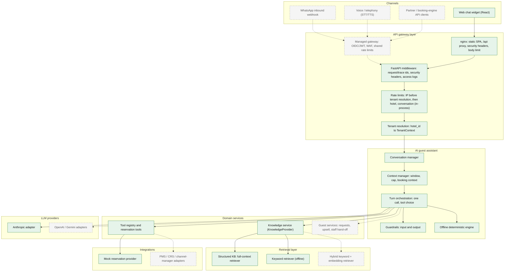
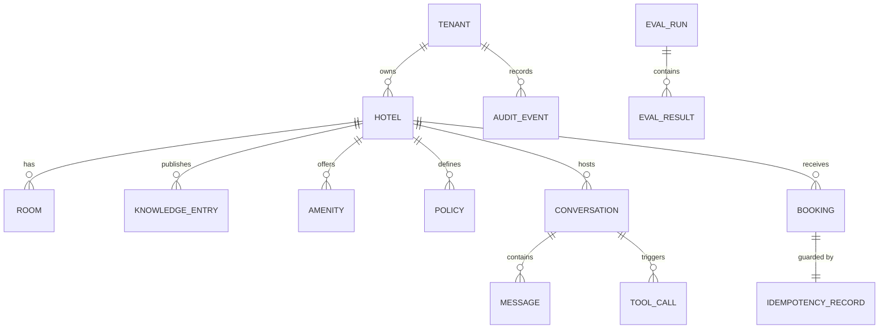

# Enterprise architecture

This document describes the architecture this repository has today and the architecture it is built to grow into. It is meant for engineers reviewing the platform. It separates what exists from what is only designed, and it does not claim production readiness.

**Status labels** (every capability below has exactly one):

| Label | Meaning |
|---|---|
| **Implemented** | Code exists and is covered by automated tests. |
| **Prototype** | Implemented and tested, but in-memory, single-process, file-backed or mock (not suitable for multi-replica production as is). |
| **Designed** | An interface or boundary exists in code; there is no production implementation behind it. |
| **Planned** | Documentation only; no code. |

Companion documents: [ARCHITECTURE.md](ARCHITECTURE.md) (application-level design), [DECISIONS.md](DECISIONS.md), [EVALUATION.md](EVALUATION.md), [THREAT_MODEL.md](THREAT_MODEL.md), [OBSERVABILITY.md](OBSERVABILITY.md), [SRE.md](SRE.md), [COST_MODEL.md](COST_MODEL.md).

All code paths are relative to `backend/app/` unless stated otherwise. `container.py` is the source of truth for what is actually wired.

---

## 1. Current state at a glance

| Capability | Status | Where in code |
|---|---|---|
| Composition root (one place selects every implementation) | **Implemented** | `container.py` |
| Tenant → hotel resolution, `TenantContext` | **Implemented** | `tenancy.py`, `api/deps.py` |
| Tenant registry storage | **Prototype** (JSON file loaded at startup) | `data/tenants.json` |
| Per-tenant feature flags | **Implemented** | `core/flags.py`, `tenants.json` |
| Hotel configuration and knowledge storage | **Prototype** (per-hotel JSON, in-process TTL cache) | `knowledge/provider.py` (`JsonKnowledgeProvider`), `data/hotels/*/hotel.json` |
| Knowledge content lifecycle (status, version, effective dates) | **Implemented** | `knowledge/models.py` |
| Full-context and keyword retrieval | **Implemented** | `knowledge/retrieval.py` |
| Semantic (embedding) retrieval | **Planned** (enabling the flag globally or for any tenant raises `ConfigError`) | `container.py` |
| Provider-neutral LLM interface | **Implemented** | `llm/provider.py` |
| Anthropic adapter | **Implemented** (contract-tested with a fake SDK client; **not verified against the live Anthropic API**) | `llm/anthropic_provider.py` |
| Scripted provider (tests, evals, benchmarks) | **Implemented** | `llm/scripted_provider.py` |
| OpenAI / Gemini adapters | **Planned** | none |
| Model router (`GUEST_TURN`) | **Implemented** | `llm/router.py` |
| Routes for intent classification, summary, eval judge | **Designed** (routes configured, no callers) | `llm/router.py` |
| One-call AI turn with three strict tools | **Implemented** | `assistant/agent.py`, `assistant/prompts.py` |
| Input and output guardrails | **Implemented** | `assistant/guardrails.py` |
| Deterministic offline fallback | **Implemented** | `assistant/offline.py` |
| Tool registry (validation, authorization, timeout, audit) | **Implemented** | `tools/base.py` |
| `check_availability`, `request_booking_details` tools | **Implemented** | `tools/builtin.py` |
| `create_booking` tool (not exposed to model, flag-gated) | **Prototype** | `tools/builtin.py` |
| `ReservationProvider` boundary | **Designed** (no real PMS/CRS adapter) | `reservations/provider.py` |
| Mock reservation provider and in-memory bookings | **Prototype** | `reservations/provider.py`, `data/hotels/*/inventory.json` |
| Resilience wrapper (timeout, retries, circuit breaker, cache) | **Implemented** | `reservations/provider.py`, `core/resilience.py` |
| Idempotency store | **Prototype** (in-memory) | `reservations/idempotency.py` |
| Server-side conversations (TTL, cap, delete, purge, per-conversation turn lock) | **Prototype** (in-memory repository, in-process lock) | `conversations/` |
| Rate limiting (IP, hotel, conversation) | **Prototype** (in-process sliding window) | `core/rate_limit.py`, `api/deps.py` |
| Auth boundary for admin API, RBAC model | **Implemented** | `auth/`, `api/deps.py` |
| Static-token admin auth | **Prototype** (development only; rejected in production config) | `auth/providers.py` |
| OIDC / JWT authentication | **Planned** | none |
| Read-only admin API (hotels, knowledge, ai-config) | **Implemented** | `api/v1_admin.py` |
| Admin writes (publish content, change AI config) | **Planned** | none |
| Web channel (React/Vite UI, v1 guest API) | **Implemented** | `api/v1_guest.py`, `frontend/src` |
| WhatsApp and voice rendering adapters | **Designed** (renderers only; no inbound webhooks or telephony) | `channels/adapters.py` |
| Structured JSON logs with context and redaction | **Implemented** | `core/observability.py` |
| AI traces (log + in-memory sinks) | **Implemented** | `core/tracing.py` |
| OpenTelemetry / external trace exporters | **Designed** (`TraceSink` interface) | `core/tracing.py` |
| Prometheus metrics | **Implemented** | `core/metrics.py`, `api/ops.py` |
| Domain events (log + in-memory publishers) | **Implemented** | `core/events.py` |
| Outbox / message broker for events | **Designed** (`EventPublisher` interface) | `core/events.py` |
| PostgreSQL, Redis, object storage | **Planned** | none |
| Containers, compose stack, CI, offline eval gate | **Implemented** | `backend/Dockerfile`, `frontend/Dockerfile`, `docker-compose.yml`, `.github/workflows/ci.yml` |
| Manual live-AI eval workflow (Anthropic) | **Designed** (workflow defined; never run, no credential) | `.github/workflows/ai-eval.yml` |

Latest verified test run: backend pytest 203 passed; frontend Vitest 13 passed; Playwright E2E 6 passed (3 flows × desktop and Pixel 7, AI disabled); offline eval 28/28 passed (34 scenarios, 6 AI-only skipped).

---

## 2. Target enterprise architecture (conceptual)

Solid boxes exist in this repository today. Dashed boxes are future components. A solid box can still be a prototype implementation (see section 1).

Main flow today: `POST /api/v1/hotels/{hotel_id}/conversations/{id}/messages` → middleware → `resolve_guest_context` (IP limit, then hotel resolution) → `enforce_rate_limits` (hotel, conversation) → `ConversationService.post_message` → `AssistantService.handle` → `AIAssistant.reply` (or `OfflineAssistant.reply`) → `ToolRegistry.execute` where a tool is chosen → reply, trace, metrics, events.

---

## 3. Modular monolith and component boundaries

The backend is a single deployable (one FastAPI process) split into packages with explicit interfaces (`typing.Protocol`).

| Package | Responsibility | Key interface(s) |
|---|---|---|
| `api/` | HTTP routing, error envelope, middleware, request-scoped dependencies | none (adapter layer) |
| `conversations/` | Conversation lifecycle and short-term context | `ConversationRepository` |
| `assistant/` | Turn handling, AI and offline engines, guardrails, prompts | `AssistantService` |
| `tools/` | Tool contract, authorization pipeline, built-in tools | `Tool`, `ToolRegistry` |
| `knowledge/` | Hotel configuration, content lifecycle, retrieval | `KnowledgeProvider`, `Retriever` |
| `reservations/` | Inventory, pricing rules, bookings, idempotency | `ReservationProvider`, `IdempotencyStore` |
| `llm/` | Vendor-neutral model access and routing | `LLMProvider`, `ModelRouter` |
| `auth/` | Principal, roles, authentication providers | `AuthProvider` |
| `channels/` | Rendering a channel-independent reply per channel | `ChannelAdapter` |
| `core/` | Config, flags, logging, metrics, tracing, events, cache, rate limiting, resilience, clock | `Cache`, `RateLimiter`, `TraceSink`, `EventPublisher`, `Clock` |
| `tenancy.py` | Tenant registry and `TenantContext` | `TenantRegistry` |

**Dependency direction.** `api → conversations → assistant → {tools, knowledge, llm} → reservations → core`. `core` imports nothing from the domain packages. Only `llm/anthropic_provider.py` imports a vendor SDK. `api/` is the only package that imports FastAPI (with `main.py`).

**Composition root.** `build_container(settings)` in `container.py` builds every concrete implementation and injects it. Tests pass alternatives (`llm_provider`, `reservation_provider`, `clock`, `extra_trace_sink`) through the same function. Moving to Redis, Postgres or a PMS should mean changing this file and adding an adapter, not editing the assistant or API code.

**Why not microservices now.** There is one team, one release cadence and no component with a scaling profile that differs from the rest. The expensive part of a turn is the LLM call, which is external either way. Network hops between services would add latency, partial-failure modes and distributed tracing work without any isolation benefit. The package boundaries keep extraction possible later.

**Extraction candidates and triggers** (all **Planned**):

| Candidate | Boundary it would take | Trigger for extraction |
|---|---|---|
| Reservation integration service | `ReservationProvider` | Many PMS/CRS adapters with their own release cycle, credentials and outbound rate limits; a separate integrations team; long-running sync jobs |
| Knowledge / content service | `KnowledgeProvider` + admin writes | A CMS-style editing workflow, embedding pipelines and content ingestion with different scaling and ownership from guest traffic |
| Channel gateway (WhatsApp, voice) | Inbound webhooks → `TurnRequest` | Telephony and messaging providers need persistent connections, strict latency budgets or separate compliance scope |
| Analytics / event consumers | `EventPublisher` | Event volume or reporting queries that must not share resources with the request path |
| AI orchestration | `AssistantService` | Only if model-serving concerns (GPU, batching, self-hosted models) diverge from the API tier; unlikely while providers are external APIs |

---

## 4. Multi-tenancy

### Model

- **Tenant**: a customer (hotel group). `Tenant{id, name, status, hotels[], feature_flags}` in `tenancy.py`.
- **Hotel**: belongs to exactly one tenant; `hotel_id` is globally unique. `TenantRegistry` rejects a hotel assigned to two tenants at load time.
- **Channel**: `web | whatsapp | voice | api` (`tenancy.Channel`). Only `web` is used by the HTTP API today.
- **Conversation**: owned by `(tenant_id, hotel_id)` and carries its channel.

`TenantContext(tenant_id, hotel_id, channel, conversation_id, request_id, trace_id)` is an immutable value created per request by `TenantRegistry.resolve()` and passed explicitly to services, tools and providers. **Implemented.**

### How isolation is enforced today (Implemented unless noted)

1. **Registry resolution.** Guest routes are hotel-scoped (`/api/v1/hotels/{hotel_id}/…`). `resolve_guest_context` applies the per-IP rate limit first (so probing unknown hotel ids is counted), then maps `hotel_id` to its tenant; unknown hotels and hotels of suspended tenants return `404 HOTEL_NOT_FOUND`. The conversation rate-limit key is scoped per hotel, so ids sent to one hotel can't consume another hotel's budget.
2. **Repository keys.** `ConversationRepository.get/delete` take `(tenant_id, hotel_id, conversation_id)`. A conversation id from hotel A requested through hotel B is not found.
3. **Provider checks.** `MockReservationProvider.check_availability` rejects a `KnowledgeBase` snapshot whose `hotel.id` differs from `ctx.hotel_id`. Availability cache keys and idempotency scopes include `tenant_id` and `hotel_id`.
4. **Admin principal scoping.** `Principal` carries `tenant_id` (or `*` for platform admins only) and an optional `hotel_ids` set. `require_admin` checks tenant or hotel access and role before any data access.
5. **No probing.** `require_hotel_in_tenant` returns the same `404 HOTEL_NOT_FOUND` whether a hotel doesn't exist or belongs to another tenant.
6. **Path safety.** `JsonKnowledgeProvider` rejects non-alphanumeric hotel ids and verifies the file's declared hotel id.
7. **Observability context.** Logs, traces and events carry `tenant_id` and `hotel_id`. Metrics deliberately do not (see section 13).

### Per-tenant feature flags

`FeatureFlags` holds global defaults (`FLAG_DEFAULTS`), global overrides from `FEATURE_<NAME>` environment variables, and per-tenant overrides from `tenants.json`. Unknown flag names, global or per tenant, fail at container build. Flags consumed today: `ai_assistant_enabled` (per tenant), `booking_tools_enabled` (per tenant, via `ToolDefinition.required_flag`), `guardrail_price_check_enabled` (per tenant; `AIAssistant` passes the resolved value into `OutputGuardrails.check_answer`), `semantic_retrieval_enabled` (enabling it globally or for any tenant raises `ConfigError` because no semantic retriever exists). `whatsapp_enabled` and `voice_enabled` are defined but not consumed by any code path.

### Hotel-local business dates

`core/clock.local_today(clock, hotel.timezone)` computes "today" in the hotel's IANA time zone. It drives knowledge effective dates, past-date validation, relative-date resolution in the prompt, and cache keys. A hotel in `Asia/Kolkata` rolls over at local midnight, not UTC midnight. **Implemented.**

### Production data isolation options (Planned)

| Option | How | Strengths | Weaknesses |
|---|---|---|---|
| Shared schema, `tenant_id` on every row, PostgreSQL row-level security | One database; every tenant-owned table has `tenant_id` (and `hotel_id`) leading its indexes; RLS policy `tenant_id = current_setting('app.tenant_id')` set per transaction | Operationally simple at thousands of tenants; one migration path; efficient pooling; cross-tenant platform analytics are possible | A missing `SET` or a superuser connection bypasses RLS; noisy neighbours share resources; per-tenant restore is harder |
| Schema per tenant | One Postgres schema per tenant, `search_path` per connection | Stronger logical separation; per-tenant backup/restore and deletion are easier | Migrations fan out across N schemas; catalog bloat and pooling difficulties past a few thousand schemas |
| Database per tenant (for a few large or regulated tenants) | Dedicated instance | Strongest isolation, per-tenant region and encryption keys | Highest cost and operational load |

Recommended direction (proposed): shared schema with `tenant_id` + RLS as the default, keeping repository-level scoping as defence in depth, and allowing a dedicated database for specific enterprise tenants through the same repository interfaces.

---

## 5. Hotel configuration model

Defined in `knowledge/models.py`, loaded from `data/hotels/<hotel_id>/hotel.json`. **Implemented** as models, **Prototype** as storage.

| Model | Fields | Used for |
|---|---|---|
| `HotelProfile` | id, name, tagline, address, city, phone, email, whatsapp, currency, timezone, check-in/out times, `languages`, `brand` | Guest UI profile, prompt header, contact lines in fallbacks, local date |
| `Brand` | `assistant_name`, `primary_color` | Assistant persona in the prompt; UI theming (inline CSS variable) |
| `Room` | id, name, description, size, beds, max adults/children/occupancy, extra bed, `base_rate`, breakfast, features | Availability fit and pricing; also rendered as `rooms.<id>` knowledge entries |
| `KnowledgeEntry` | id, topic, title, content, keywords, lifecycle fields (section 7) | Grounded answers and citations |
| `Inventory` (`reservations/availability.py`) | total rooms, weekday rules, per-date bookings, seasonal multipliers | Mock availability only |

**Configuration boundary.** Code reads hotel data only through `KnowledgeProvider` (`profile`, `snapshot`, `list_entries`, `is_healthy`) and inventory only through `ReservationProvider`. `KnowledgeBase` is an immutable per-hotel, per-business-date snapshot with a content-hash `knowledge_version`. Platform configuration (models, timeouts, limits) comes from environment variables via `Settings`; tenant configuration (flags) from the tenant registry; hotel content from the knowledge provider. A database- or CMS-backed provider would replace the JSON provider without touching callers. The `languages` list drives the UI locale choice; model reply language is requested through the context block.

---

## 6. AI orchestration

**One model call per turn** (`assistant/agent.py`, **Implemented**). The model must reply by calling exactly one of three strict tools (`strict: true`, `disable_parallel_tool_use`):

| Tool | Policy | Outcome |
|---|---|---|
| `answer_guest` | reply schema (not a registry tool) | `{type: answer|clarification|fallback, text, source_ids, suggestions}` validated by `ModelReply`, then output guardrails |
| `check_availability` | READ_ONLY registry tool | Deterministic search; result goes straight to the UI |
| `request_booking_details` | READ_ONLY registry tool | Date/guest form, pre-filled from arguments and remembered context |

There is no agent loop: every tool result is final, so nothing needs to go back to the model. Prices and inventory never pass through model text.

**Why the answer is a tool.** The first design combined a JSON output format with two action tools. When the unchanged code path was pointed at a development model (`glm-5.2` via an Anthropic-compatible gateway), that model never called a tool while the output format was set (0/4 probes) and chose correctly without it (4/4). Making the answer a third strict tool gives one decision point per turn and avoids depending on one provider feature combination. This evidence is from GLM, **not Claude**; it is a portability decision, not a verified Claude behaviour.

**Deterministic post-processing** (**Implemented**):
- If several tool calls arrive, an action tool beats `answer_guest`.
- Tool arguments pass through `ToolRegistry.execute` (null normalisation, validation, authorization, timeout).
- Replayed conversation history is passed through `neutralise_prompt_tags` in `build_messages`, as the current message is by `InputGuardrails`, so stored guest text can't open or close prompt sections.
- `OutputGuardrails.check_answer`: secret and prompt-leak detection, unknown `source_ids` dropped, uncited `answer` becomes a fallback, free-text availability claims become the booking form, currency amounts not present in cited entries become a fallback (per-tenant `guardrail_price_check_enabled`), fallbacks always include hotel contact details. Suggestions containing an availability claim or a price are dropped.
- `OutputGuardrails.check_model_text` (the `request_booking_details` form message): leaks, availability claims and prices are rejected (`unsupported_claim`) and a fixed message is used instead.
- `refusal`, `max_tokens`, invalid output, provider errors or rejected tool calls raise `LLMError`, and the turn is re-answered by `OfflineAssistant` with a notice. Availability outages (`DEPENDENCY_UNAVAILABLE`/`TIMEOUT`) return a fixed safe reply instead.

**Offline fallback** (`assistant/offline.py`, **Implemented**): keyword retrieval, regex intent detection, the same `check_availability` tool through the registry (`invoked_by="system"`), and a conservative contact-details fallback. It also serves tenants with `ai_assistant_enabled=false` and deployments with no API key.

**Model router** (`llm/router.py`): tasks `GUEST_TURN` (primary model, configured effort, `LLM_MAX_TOKENS`), `INTENT_CLASSIFICATION` and `CONVERSATION_SUMMARY` (fast model, low effort), `EVAL_JUDGE` (primary model, high effort). Only `GUEST_TURN` has a caller. `ANTHROPIC_MODEL_FAST` defaults to the primary model until evals justify a cheaper one.

**Versioning** (**Implemented**):

| Version | How it is computed | Where it appears |
|---|---|---|
| `prompt_version` | `guest-assistant@<revision>+<hash of template>` (an unbumped edit still changes it) | `AITrace`, v1 message response `meta`, admin `ai-config`, `AssistantResponseGenerated` event, eval results |
| `tool_schema_version` | Hash of `(name, description, input_schema)` for the tools sent to the model, which depends on tenant flags | `AITrace`, response `meta`, admin `ai-config`, eval results |
| `knowledge_version` | Hash of hotel profile, rooms and servable entries `(id, version, content)` on the business date | `AITrace`, response `meta`, admin `ai-config` and knowledge list, event, eval results |
| Tool `version` | Integer on `ToolDefinition` | admin `ai-config` |
| Model | Provider-reported model id | `AITrace`, eval results |

The rendered system prompt is memoised per `(hotel_id, knowledge_version, evidence ids)` so it is byte-identical across turns, and the Anthropic adapter marks it `cache_control: ephemeral`. Prompt cache hit rates have not been measured.

**Development-provider evidence (not Claude).** With GLM `glm-5.2` on this architecture: run 1 33/34, run 2 34/34 scenarios; decision accuracy 18/18 in both; groundedness 13/13 and 14/14; per-scenario latency p50 2667 ms / 2571 ms, p95 5504 ms / 5617 ms. These numbers show provider compatibility of the code path. They say nothing about Claude quality or latency.

---

## 7. Knowledge platform and RAG readiness

**Provider.** `KnowledgeProvider` (**Designed** boundary; `JsonKnowledgeProvider` is **Prototype**) with an in-process TTL cache (`KNOWLEDGE_CACHE_TTL_SECONDS`, default 300 s).

**Content lifecycle** (**Implemented** in the model; there is no editing workflow):
- `status`: `draft | published | archived`; only `published` entries are servable.
- `version` (integer per entry), `source`, `updated_at`, `updated_by`.
- `effective_from` / `effective_until`, evaluated against the hotel-local business date, so seasonal content switches on and off without a deploy.
- The admin API lists entries with `servable_today` and supports `include_unpublished`.

**Retrieval contract.** `Retriever.retrieve(kb, query, limit) → RetrievalResult{strategy, evidence[Evidence{id, title, content, score, version, source}], latency_ms}`. Evidence ids are recorded on the trace, and citations are validated against the snapshot.

**Why full context today.** A demo hotel's system prompt plus tools is about 2.8k tokens. At that size, sending every servable entry costs little, benefits from prompt caching, and cannot miss the relevant entry, which is the main failure mode retrieval adds. Measured in-process: full-context retrieval p50 0.03 ms, keyword retrieval p50 0.55 ms.

**When to add semantic retrieval** (**Planned**; proposed triggers): a hotel's servable content no longer fits comfortably in the prompt (for example, long documents, many properties per tenant, or multilingual duplicates), or eval groundedness drops because relevant facts get lost in a long context.

**How** (proposed):
1. Implement `Retriever` as hybrid keyword (BM25) + embedding search over chunked `KnowledgeEntry` content, filtered by `tenant_id`, `hotel_id`, `status=published` and effective dates **before** ranking.
2. Always include short, critical entries (contact, check-in/out, cancellation) regardless of rank.
3. Keep the citation contract unchanged: `source_ids` must refer to retrieved evidence; the output guardrails already enforce this.
4. Index per `knowledge_version`; re-embed on publish; include the embedding model and index version in `knowledge_version` or a new `retrieval_version`.
5. Gate with `semantic_retrieval_enabled` per tenant (the container-build `ConfigError` check must then be replaced by per-tenant retriever selection) and re-run the AI eval suite, adding retrieval recall scenarios, before enabling.

---

## 8. Tool system and authorization

Every tool call, whether requested by the model or by system code, goes through `ToolRegistry.execute` (`tools/base.py`, **Implemented**):

1. **Lookup.** Unknown name → `UNKNOWN_TOOL`.
2. **Exposure.** `invoked_by="model"` and `exposed_to_model=False` → `NOT_EXPOSED`.
3. **Feature flag.** `required_flag` evaluated with tenant overrides → `FEATURE_DISABLED`.
4. **Arguments.** String `"null"`/`""` normalised to `None`; Pydantic validation → `INVALID_ARGUMENTS`.
5. **Authorization.** `required_roles`: no principal → `AUTHENTICATION_REQUIRED`; principal outside the tenant/hotel or lacking the role → `FORBIDDEN`. For `MUTATING` tools: `requires_confirmation` without `guest_confirmed` → `CONFIRMATION_REQUIRED`; no idempotency key → `IDEMPOTENCY_KEY_REQUIRED`.
6. **Execution** in a dedicated thread pool with `timeout_seconds` → `TIMEOUT`; `ToolExecutionError` codes (`DEPENDENCY_UNAVAILABLE`, `BUSINESS_RULE`, …); any other exception → `EXECUTION_FAILED` (logged, not exposed).
7. **Observation.** `tool_calls_total`, `tool_latency_ms`, `tool_failures_total`; a `tool_audit` log line (tool, policy, invoked_by, principal subject, status, error code, latency; **no arguments**); a `ToolFailed` event on failure.

**Policies.** `READ_ONLY` tools may be retried by integrations and their validated arguments (dates, guest counts) are recorded on the trace. `MUTATING` tools never have arguments traced or logged, because they can carry guest references.

**Exposure to the model.** `model_tools(tenant_flags)` returns exposed and flag-enabled tools only. `create_booking` (MUTATING, requires `GUEST` role, confirmation and idempotency key, flag `booking_tools_enabled` default off) is `exposed_to_model=False`, so it is never offered to the model even when the flag is on. It is a **Prototype** that exercises the authorization path in tests; no API endpoint invokes it.

Guest chat itself is unauthenticated by design, so no guest `Principal` exists in the running API today.

---

## 9. Reservation integration boundary

`ReservationProvider` (`reservations/provider.py`): `check_availability`, `get_room`, `create_booking`, `modify_booking`, `cancel_booking`, `is_healthy`. It is the only path to inventory and bookings. Business-rule violations raise `AvailabilityValidationError`; integration failures raise `ReservationError(code, retryable)`.

**`MockReservationProvider`** (**Prototype**): deterministic inventory and seasonal pricing from `inventory.json`; bookings held in a process dictionary; modify/cancel return `NOT_SUPPORTED`.

**`ResilientReservationProvider`** (**Implemented**) wraps any provider:
- **Timeout** on every call (`RESERVATION_TIMEOUT_SECONDS`, default 5 s) in a separate integration thread pool, so tool and integration calls can't deadlock each other.
- **Read retries** (`RESERVATION_READ_RETRIES`, default 2) with exponential backoff and jitter, only on `IntegrationTimeout`/`ConnectionError`.
- **Circuit breaker** (`CIRCUIT_BREAKER_FAILURES`=5 consecutive, `CIRCUIT_BREAKER_RESET_SECONDS`=30). Business outcomes (invalid dates, sold out, idempotency conflict) are passed through the breaker as values, so they never trip it. Open circuit → `ReservationError(UNAVAILABLE)` → guest sees a safe "try again / contact us" reply, the availability endpoints return `503` with `Retry-After: 30`, and `/ready` stays 200 with `reservations: degraded` (every replica shares the same PMS, so failing readiness would remove all of them while FAQ answers still work). Non-transient `ReservationError`s are treated as bugs or misconfiguration and surface as `500`.
- **Availability cache** keyed by tenant, hotel, business date and query (`AVAILABILITY_CACHE_TTL_SECONDS`, default 15 s). Errors are not cached.
- **Mutations are never retried** by the wrapper; a caller retry is made safe by the idempotency key.

**Idempotency** (`reservations/idempotency.py`, **Prototype**): scope `booking:{tenant}:{hotel}`, key of at least 8 characters, request fingerprint hash. The same key and request return the original booking; the same key with a different request → `IDEMPOTENCY_CONFLICT`. A per-key lock makes concurrent duplicates wait for the first attempt. Records expire after 24 h.

**Production idempotency design** (**Planned**): an `idempotency_records` table with a unique constraint on `(tenant_id, hotel_id, scope, key)`, inserted in the **same transaction** as the booking row (or the outbox row that drives the external PMS call), storing the fingerprint and the response. Concurrent duplicates fail the unique constraint and read the stored result. For an external PMS, pass the key through where the vendor supports it and reconcile with the PMS confirmation number.

**Future adapters** (**Planned**): PMS (for example, Opera-class systems), CRS and channel managers, each implementing `ReservationProvider` in its own module, with vendor rate limits, credential scoping per tenant, and rate/inventory caching tuned to the vendor's freshness guarantees. Real availability would move from "computed per request" to "vendor call, cached briefly", which the wrapper already models.

---

## 10. Conversation and context management

**Implemented behaviour, Prototype storage** (`conversations/`):
- **Server-side state.** Clients send only the new message; history and booking context live on the server, so a client cannot forge prior assistant turns. The legacy `/api/chat` endpoint still accepts client history and is marked deprecated.
- **Stored data.** Message text, reply type, timestamps, locale, `active_intent`, and `availability_context` (dates and guest counts). No names, contact details or payment data.
- **Context window.** The last `CONVERSATION_CONTEXT_WINDOW` (default 12) messages, each truncated to 4,000 characters, plus the structured booking context in a `<context>` block. Incoming messages are limited to 1,000 characters.
- **Message cap.** `CONVERSATION_MAX_MESSAGES` (default 40); oldest dropped.
- **Sliding TTL.** `CONVERSATION_TTL_SECONDS` (default 24 h), extended on each write. Expired conversations are invisible on read.
- **Purge.** A background task in `main.py` calls `purge_expired()` every 300 s. The repository also caps active conversations at `CONVERSATION_MAX_ACTIVE` (50,000) with least-recently-written eviction.
- **Concurrent turns.** `ConversationService` serialises turns on the same `(tenant, hotel, conversation)` with an in-process lock, so two simultaneous messages can't overwrite each other's appended messages. This only holds within one process; with a shared store, production would use optimistic concurrency (a version column checked on write) instead.
- **Deletion.** `DELETE /api/v1/hotels/{hotel_id}/conversations/{id}` removes a conversation immediately and emits `ConversationDeleted`.
- **No long-lived profiling.** There are no guest identities, cross-conversation memory or preference stores.

**Summarisation is deliberately not implemented.** Hotel conversations are short, and 12 recent messages plus structured booking context cover the observed flows. A summariser would add a second model call per long conversation, cost, latency, and a new way to lose or invent facts (for example, dates). The `CONVERSATION_SUMMARY` route exists for when eval data shows long conversations losing context.

---

## 11. Channels

The assistant core consumes a `TurnRequest` and returns a channel-independent `ChatReply` (`type`, `text`, `sources`, `suggestions`, `availability`, `booking_prefill`, `form_error`). Nothing in `assistant/` produces UI markup.

| Channel | Status | Today |
|---|---|---|
| Web | **Implemented** | v1 guest API returns the structured reply; the React UI renders forms and room cards |
| WhatsApp | **Designed** | `WhatsAppChannelAdapter` renders plain text within 4,096 characters, up to 3 quick-reply buttons of at most 20 characters, and asks for dates as text instead of showing a form |
| Voice | **Designed** | `VoiceChannelAdapter` removes bullets and email addresses, speaks at most 2 room options, and ends booking prompts with a question |

The adapters are exercised by unit tests only. No API route accepts a non-web channel.

**What inbound WhatsApp would need** (**Planned**): a webhook endpoint per Business Solution Provider or Meta Cloud API that verifies the request signature (HMAC of the raw body with the app secret) before parsing; mapping the business phone number to `hotel_id`, and the sender to an opaque, hashed conversation key; asynchronous processing (acknowledge quickly, reply through the send API) with deduplication on the provider message id; the 24-hour customer-service window, after which only pre-approved template messages may be sent; opt-in/opt-out handling; and media and location messages rejected or handled explicitly.

**What voice would need** (**Planned**): telephony (SIP or a CPaaS provider) and number-to-hotel mapping; streaming STT and TTS; barge-in (stop TTS when the caller speaks); a latency budget (proposed: first audio within roughly 1 s of end of speech), which the current non-streaming turn does not meet (development-provider p50 about 2.6 s per turn), so streaming model output and filler prompts would be required; DTMF or spoken confirmation for any booking step; and transfer to front-desk staff.

---

## 12. Security and privacy (summary)

The full threat model is in [THREAT_MODEL.md](THREAT_MODEL.md).

**Auth boundary.**
- Guest API: unauthenticated by design, hotel-scoped, rate limited.
- Admin API: default `AUTH_MODE=disabled` uses `DisabledAuthProvider`, and every admin endpoint returns `401 AUTH_NOT_CONFIGURED` rather than appearing open. `AUTH_MODE=static_token` (plaintext tokens from the environment, constant-time comparison, at least 16 characters) is development-only; production config validation rejects it.
- Production (**Planned**): OIDC at a gateway, or an `AuthProvider` that validates JWTs (issuer, audience, expiry, signature via JWKS) and maps claims to `Principal`.

**RBAC** (**Implemented** model): `platform_admin ⊃ tenant_admin ⊃ hotel_admin ⊃ hotel_staff`; `guest` is separate. Principals are scoped to one tenant (or `*` for platform admins only) and optionally a hotel subset. Knowledge listing requires `hotel_staff`; `ai-config` requires `hotel_admin`.

**Secrets.** Environment variables only (optional local `.env`, never committed, not copied into images; compose reads `backend/.env` at runtime). `Settings` hides keys from `repr`. `Redactor` removes configured secret values and common key/token patterns from log messages, arguments and structured fields, and the output guardrails block replies that contain them. The frontend bundle contains no secrets; the browser calls the backend only.

**HTTP hardening** (**Implemented**): `X-Content-Type-Options`, `Referrer-Policy: no-referrer`, `X-Frame-Options: DENY`, `Cache-Control: no-store` on `/api/`, HSTS in production (backend); in nginx, the same headers plus a strict CSP come from one snippet (`frontend/security-headers.conf`) included in every `location` (nginx discards inherited `add_header` directives in blocks that set their own), with the backend's duplicate headers hidden on `/api/`, and a 64 KB body limit; IP rate limiting on admin endpoints as well as guest endpoints; CORS allow-list with `GET/POST/DELETE` only; validated `X-Request-ID` and `traceparent`; `X-Forwarded-For` trusted only when `TRUST_PROXY_HEADERS=true` (nginx overwrites it); OpenAPI docs off by default in production.

**Production config validation** (`Settings.validate`): rejects static-token auth, `*`/localhost CORS origins, non-JSON logs and disabled rate limiting when `APP_ENV=production`; rejects unknown environments, providers, effort levels and feature flags in every environment.

**Data minimisation and retention** (**Implemented** behaviour on **Prototype** storage): no guest identity data by design, 24 h sliding conversation expiry, guest-initiated deletion, capped history. Logs, traces and events never include message text (events carry, for example, `message_length`). A booking stores an opaque `guest_reference`, never contact details.

**What is sent to the LLM provider.** The system prompt (hotel profile and published knowledge entries, which are non-personal), the recent conversation window, the hotel-local date and booking context (dates, guest counts), and the current message. Guests can type personal data into free text; there is no PII detection before the model call (**Planned**). With `ANTHROPIC_REFUSAL_FALLBACK=default`, a declined request may be re-run by Anthropic on a substitute model; data handling for that path should be reviewed. To evaluate before production (**Planned**): provider data retention terms and zero-data-retention eligibility, regional processing, a DPA covering hotel tenants, prompt guidance that the assistant never asks for personal data, and optional PII masking of inbound text.

---

## 13. Observability (summary)

Details and metric catalogue: [OBSERVABILITY.md](OBSERVABILITY.md).

- **Structured logs** (**Implemented**): JSON in production; every record carries `request_id`, `trace_id`, `tenant_id`, `hotel_id`, `conversation_id` and `channel` from a context variable that is propagated into worker threads; `log_event` for machine-readable events; a redaction filter on the handler.
- **AI traces** (**Implemented**): one `AITrace` per turn with provider, model, prompt/tool/knowledge versions, evidence and cited ids, tool calls, guardrails and input flags, stop reason, token usage (including cache reads and cache writes), latency, mode and fallback reason. Sinks: structured log and a 500-entry in-memory ring; an exporter is a new `TraceSink`. A failing sink never breaks a reply.
- **Prometheus metrics** (**Implemented**): turns, success/failure, fallbacks by reason, reply types, tool calls/failures/latency, guardrail interventions, prompt-injection signals by input flag (`prompt_injection_signals_total{flag}`, counted whether or not the turn was blocked), rate-limit rejections, LLM tokens by kind (`input`, `output`, `cache_read`, `cache_write`) and model (`llm_tokens_total{kind, model}`, so cost can be priced per model), LLM latency by provider, HTTP latency by route template and status class. Labels are low-cardinality by design: no tenant, hotel or conversation labels. Per-tenant analysis comes from logs, traces and events. `/metrics` should be blocked at the edge.
- **Domain events** (**Implemented** publisher): `ConversationStarted/Deleted`, `GuestQuestionAsked`, `AssistantResponseGenerated`, `AvailabilityChecked`, `FallbackTriggered`, `GuardrailTriggered`, `ToolFailed`, `BookingRequested/Confirmed`. Each carries tenant context and no message text.

---

## 14. Data model and database readiness

| Entity | Today | Proposed production store (Planned) |
|---|---|---|
| Tenant | `tenants.json` (Prototype) | Postgres `tenants(id PK, name, status, feature_flags jsonb, created_at)` |
| Hotel | `hotel.json` → `HotelProfile` (Prototype) | `hotels(id PK, tenant_id FK, name, timezone, currency, languages text[], brand jsonb, contact jsonb, status)`; index `(tenant_id)` |
| Room | `hotel.json` → `Room` (Prototype) | `rooms(tenant_id, hotel_id, id, attributes…, base_rate, PK(hotel_id, id))`; index `(tenant_id, hotel_id)`. Live rates and inventory stay in the PMS |
| Amenity | Knowledge entries by topic; no dedicated model | `amenities(tenant_id, hotel_id, id, name, hours jsonb, …)` if structured filtering is needed; otherwise remain knowledge entries |
| Policy | Knowledge entries by topic; no dedicated model | `policies(tenant_id, hotel_id, kind, content, version, effective_from/until)`, or knowledge entries with `topic` |
| KnowledgeDocument | `KnowledgeEntry` in JSON with lifecycle and version (Prototype) | `knowledge_entries(tenant_id, hotel_id, id, version, status, topic, title, content, effective_from, effective_until, updated_by, updated_at, PK(hotel_id, id, version))`; partial index on `(tenant_id, hotel_id) WHERE status='published'`; source files in object storage; embeddings in `pgvector` or a vector index (when semantic retrieval exists) |
| Conversation | `Conversation` in memory (Prototype) | Redis hash per `(tenant, hotel, id)` with native TTL for hot state; or `conversations(tenant_id, hotel_id, id, channel, locale, active_intent, availability_context jsonb, created_at, updated_at, expires_at)` with index `(tenant_id, hotel_id, id)` and `(expires_at)` for purge; time-partitioned |
| Message | `StoredMessage` inside the conversation (Prototype) | `messages(tenant_id, conversation_id, seq, role, content, reply_type, created_at)`; PK `(conversation_id, seq)`; same retention as conversations |
| ToolCall | `ToolCallRecord` on traces (logs, in-memory ring) | `tool_calls(tenant_id, hotel_id, trace_id, tool, status, error_code, latency_ms, invoked_by, created_at)`, or keep in the tracing backend |
| Evaluation | JSON/Markdown files in `backend/evals/results/` | `eval_runs(id, label, mode, model, prompt_version, tool_schema_version, knowledge_version, created_at, summary jsonb)` and `eval_results(run_id, scenario_id, passed, metrics jsonb)` |
| AuditEvent | `tool_audit` log lines and domain events in logs | Append-only `audit_events(id, tenant_id, hotel_id, actor, action, target, outcome, occurred_at)`, partitioned by month; events via a transactional outbox |
| Booking | `Booking` in a process dictionary (Prototype) | `bookings(tenant_id, hotel_id, id, external_ref, status, room_id, check_in, check_out, adults, children, total_price, currency, guest_reference, created_at)`; index `(tenant_id, hotel_id, check_in)` |
| IdempotencyRecord | `InMemoryIdempotencyStore` (Prototype) | `idempotency_records(tenant_id, hotel_id, scope, key, fingerprint, response jsonb, created_at, expires_at)`, `UNIQUE(tenant_id, hotel_id, scope, key)`, written in the booking transaction |

Redis (**Planned**) would also back rate limits (shared sliding windows or token buckets), the short-TTL availability cache and knowledge snapshot cache.

---

## 15. Scalability path

**This is a design, not a demonstrated result.** No load test beyond the in-process benchmarks below has been run, and the system has not been operated at any of these stages.

Measured locally (Windows 11, Python 3.13, in-process, no network, no real LLM): availability tool (3 nights) p50 1.95 ms / p95 5.2 ms; AI turn with a zero-latency scripted model p50 2.1 ms / p95 4.0 ms; offline turn p50 2.6 ms; HTTP conversation message (offline) p50 8.6 ms / p95 11.0 ms; HTTP availability p50 7.2 ms. These show that platform overhead is small next to model latency (development-provider p50 about 2.6 s); they are not capacity numbers.

| Stage | What changes (all proposed) |
|---|---|
| **1 hotel** (today) | Single process; in-memory conversations, rate limits, cache and idempotency; JSON configuration. Acceptable only for a demo or pilot with restart tolerance. |
| **~100 hotels** | Postgres for tenants, hotels and knowledge (admin writes, audit); Redis for conversations, rate limits and caches so that 2+ stateless API replicas behind a load balancer are possible; OIDC for the admin API; real secret manager; OpenTelemetry exporter; first real PMS adapter; per-tenant LLM usage from traces. |
| **~1,000 hotels** | Connection pooling (for example, PgBouncer); async LLM client or a larger worker pool (the synchronous SDK currently occupies a thread per turn); outbound integrations through queues with per-vendor concurrency limits; transactional outbox for events; knowledge snapshot cache invalidated on publish instead of TTL; provider rate limits and quotas managed with per-tenant budgets and priority; prompt caching effectiveness measured; gateway-level rate limiting and WAF. |
| **~10,000+ hotels** | Partition conversation, message and audit tables by time (and index by tenant); consider dedicated databases for the largest tenants; semantic retrieval with per-tenant index sharding if content grows; multiple LLM provider accounts or providers with routing and failover; regional deployments for data residency and latency; extraction of the reservation-integration and channel services if their triggers (section 3) are met; per-tenant cost dashboards and hard budget enforcement. |

---

## 16. Reliability and deployment (summary)

Operational detail, SLO proposals and runbooks: [SRE.md](SRE.md).

- **Containers** (**Implemented**): multi-stage builds with base images pinned by digest; backend runs as UID 10001, frontend on unprivileged nginx; image `HEALTHCHECK`s; compose runs both with `read_only: true`, `tmpfs /tmp`, `no-new-privileges` and `cap_drop: ALL`. No secrets are baked into images.
- **Health vs readiness** (**Implemented**): `/health` is liveness only and is an async handler served on the event loop, so a saturated worker thread pool can't fail liveness. `/ready` returns 503 only when knowledge can't be loaded; an open reservation circuit reports `reservations: degraded` with 200, and the LLM is reported as `configured`/`not_configured` without failing (offline mode exists).
- **Graceful degradation** (**Implemented**): LLM failure → offline engine; reservation outage → safe reply / 503 with `Retry-After`; broken trace or event sinks are isolated.
- **CI** (`.github/workflows/ci.yml`, **Implemented**): backend ruff lint, pytest, offline eval regression gate against the committed baseline, `pip-audit`; frontend oxlint, type check and build, Vitest, `npm audit`; Playwright E2E with AI disabled; docker compose build and smoke test through nginx. No CI job requires a secret.
- **Live AI eval** (`.github/workflows/ai-eval.yml`): manual `workflow_dispatch` in a protected environment with `ANTHROPIC_API_KEY`. It has **not** been run.
- **Environments**: `APP_ENV=development|test|production`; `Settings.for_tests()` disables AI and rate limits; production validation fails startup on insecure configuration (section 12).

---

## 17. Cost controls (summary)

Model and assumptions: [COST_MODEL.md](COST_MODEL.md). Levers present in code:

- One model call per guest turn; no agent loop, no summariser, no LLM judge in the request path.
- Offline engine for tenants with AI disabled and for LLM failures.
- `effort=low` default; model per task via the router, so a cheaper fast model can be introduced behind evals.
- Byte-stable system prompt with `cache_control` for provider prompt caching (≈2.8k tokens per hotel for prompt + tools); cache-read and cache-write tokens recorded in traces and `llm_tokens_total{kind, model}`.
- Bounded input: 1,000-character messages, 12-message window, 4,000-character truncation per history message.
- Rate limits per IP, hotel and conversation cap abuse-driven spend.
- Token usage per turn on traces with `tenant_id`, enabling per-tenant cost attribution from logs. Per-tenant budgets and hard caps are **Planned**.

Note: `LLM_MAX_TOKENS` defaults to 16,000, which bounds truncation risk rather than typical spend; a lower cap should be chosen from measured output sizes.

---

## 18. Migration strategy

| Step | Entry criteria | Main work | Risks |
|---|---|---|---|
| 1. MVP → modular monolith (**done**) | Working single-hotel MVP | Package boundaries, composition root, tenant registry, v1 API, tool registry, traces, flags, versioning, eval gate | Over-abstraction before real integrations validate the interfaces |
| 2. Persistent database | Pilot with more than one replica or restart-sensitive data; admin writes needed | Postgres repositories for tenants, hotels, knowledge, audit; Redis for conversations, rate limits, cache; migrations; RLS; backup and retention jobs; OIDC for admin | Tenant-scoping bugs in new queries; migration of JSON content; operational load of new stateful services |
| 3. Real reservation integration | A signed pilot hotel with a PMS/CRS that exposes an API; sandbox credentials | One `ReservationProvider` adapter; persistent idempotency; vendor-specific timeouts and breaker tuning; reconciliation; contract tests against the vendor sandbox | Vendor latency and rate limits; inventory freshness vs cache TTL; booking mutations with payment and cancellation rules; liability for wrong bookings |
| 4. Semantic retrieval | Content size or eval results show full context is insufficient | Hybrid retriever, ingestion and embedding pipeline, retrieval recall evals, per-tenant flag rollout | Missed evidence reducing groundedness; embedding cost; index consistency with published versions |
| 5. Multi-channel | Customer demand and a chosen BSP/CPaaS; channel-specific legal review | Inbound WhatsApp webhooks with signature verification and template handling; voice with streaming STT/TTS; channel identity mapping | Latency budgets (voice); messaging policy compliance; duplicate or out-of-order webhook delivery |
| 6. Horizontal scaling | Measured load approaching single-replica limits; steps 2 and 3 done | Stateless replicas, autoscaling, gateway rate limits, async LLM client, queues for integrations, load tests with real providers | Hidden in-process state; provider quota exhaustion; cost growth |
| 7. Service extraction (only where justified) | A trigger from section 3 is met and measured | Extract one boundary at a time behind its existing interface; contract tests; distributed tracing | Network failure modes; data ownership disputes; operational overhead exceeding the benefit |

---

## 19. Explicit non-goals and known gaps

**Non-goals for this repository:** production operation, compliance certification, payments, guest identity or loyalty profiles, staff console UI, real booking creation through the guest UI.

**Known gaps:**
- **No persistent store.** Conversations, bookings, idempotency records, rate-limit windows and caches live in process memory and are lost on restart; tenants and knowledge come from JSON files.
- **No real authentication.** Admin API is either disabled (401) or uses development static tokens; OIDC/JWT is not implemented. Guest chat has no identity.
- **No real PMS/CRS integration.** Availability and pricing come from mock JSON inventory; modify/cancel are unsupported.
- **No live Anthropic verification.** The Anthropic adapter is contract-tested with a fake client only. AI-mode evals were run with GLM `glm-5.2` through an Anthropic-compatible gateway for provider-compatibility testing; those results are not Claude results.
- **Only one LLM vendor adapter.** OpenAI/Gemini are not implemented; there is no cross-provider failover.
- **Hindi UI strings are machine-drafted** and need native-speaker review (`frontend/src/i18n/messages.ts`).
- **In-process rate limiting and caches are not shared across replicas.** With N replicas, effective limits are N times the configured value and cache invalidation is per process.
- **Circuit breaker half-open state allows concurrent trial calls.** After the reset timeout every caller passes until one fails (which reopens) or succeeds (which closes); there is no single-probe gate.
- **Timeouts don't cancel running work.** `call_with_timeout` stops waiting, but the worker thread continues until the underlying call returns.
- **Tool timeout vs. integration retries.** With defaults, the worst-case resilient read (3 attempts × 5 s plus backoff) slightly exceeds the `check_availability` tool timeout (15 s), so the tool times out first. The guest outcome is the same safe reply, but retry budgets should be aligned.
- **Channel flags are not wired.** `whatsapp_enabled` and `voice_enabled` are defined but not read by any code.
- **Conversation turn serialisation is in-process only.** The per-conversation lock does not coordinate across replicas; a shared store needs optimistic concurrency.
- **Channel adapters are not on a request path.** They are unit-tested renderers; the API serves only the web channel.
- **Rate-limit dimensions** are IP (guest and admin endpoints), hotel and hotel-scoped conversation; the `tenant` and `api_key` dimensions named in `RateLimitRule` are not enforced.
- **No PII detection** on guest input before it is sent to the model or stored in the conversation.
- **Synchronous LLM client** runs in the Starlette thread pool; concurrency per replica is bounded by thread-pool size.
- **Router tasks other than `GUEST_TURN` have no callers**; the eval suite does not use an LLM judge.
- **Prompt cache hit rate, production latency and cost per turn with Claude have not been measured.**
