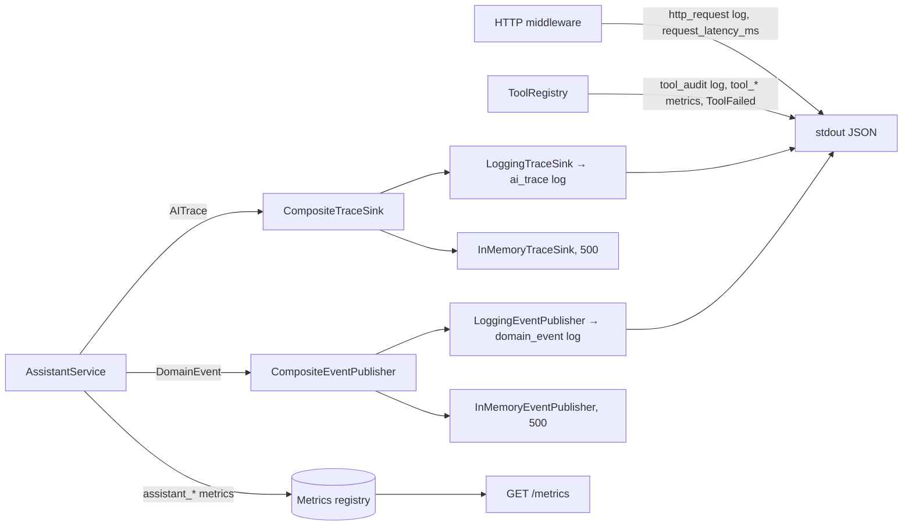

# Observability

What the backend emits today, how to query it, and the proposed dashboards, alerts, product metrics and integrations built on it. Runbooks and SLOs are in [SRE.md](SRE.md).

> **Status.** No production traffic exists and the live Anthropic API has not been verified. There is no Grafana, Alertmanager, log backend or OpenTelemetry exporter today; dashboards, alerts and integrations below are **proposed designs**. Every threshold is a **Proposed target (not measured in production)**.

---

## 1. Signals overview



### 1.1 Structured logs (`app/core/observability.py`)

- **Format:** `LOG_FORMAT=json` (required when `APP_ENV=production`; the backend image sets it) or `text`. JSON keys: `ts`, `level`, `logger`, `message`, the context fields, all event fields merged at top level, and `exception` when present.
- **Event name** is the `message` value for `log_event(...)` calls.
- **Context fields**, bound per request via contextvars and copied into integration threads: `request_id`, `trace_id`, `tenant_id`, `hotel_id`, `conversation_id`, `channel`.
- **Loggers:** `hotel_assistant.api`, `.service`, `.agent`, `.tools`, `.trace`, `.events`.

| Event (`message`) | Logger | Fields |
|---|---|---|
| `http_request` | api | `method`, `route` (template), `status`, `latency_ms` |
| `startup` | api | `app_env`, `llm_provider`, `model`, `prompt_version`, `hotels`, `auth_mode` |
| `conversations_purged` | api | `count` |
| `unhandled_error path=...` | api | exception traceback (plain `logger.exception`) |
| `llm_failure` (ERROR) | service | `reason`, `error` |
| `ai_trace` | trace | all `AITrace` fields (§1.2) |
| `domain_event` | events | `DomainEvent` envelope (§1.4) |
| `tool_audit` | tools | `tool`, `policy`, `invoked_by` (`model`/`system`), `principal`, `status`, `error_code`, `latency_ms`; arguments deliberately **not** logged |
| `tool_crashed tool=...` | tools | exception traceback |
| `trace_sink_failed sink=...` / `event_publish_failed publisher=...` | trace / events | exception; a broken sink never breaks a guest reply |

**Redaction** (`RedactingFilter`, applied to message, args and fields): configured secret values (`ANTHROPIC_API_KEY`, admin token values, ≥ 8 chars) and patterns for `sk-`/`sk-ant-` keys, `Bearer` tokens, PEM private keys and `api_key|password|secret|authorization|token = value` pairs. Keys named `api_key`, `anthropic_api_key`, `authorization`, `password`, `secret`, `token`, `admin_api_tokens` are fully masked as `[REDACTED]`. `log_event` must never receive guest message text; no current call site passes it.

### 1.2 AI traces (`AITrace`, `app/core/tracing.py`)

One trace per guest turn, recorded even when the turn raises.

| Field | Meaning |
|---|---|
| `trace_id`, `request_id` | Correlation ids (from middleware) |
| `tenant_id`, `hotel_id`, `channel`, `conversation_id` | Tenant context |
| `provider`, `model` | LLM provider name and model actually returned |
| `prompt_version` | `guest-assistant@<PROMPT_REVISION>+<hash8>` |
| `tool_schema_version` | Hash of tool specs offered to the model |
| `knowledge_version` | Knowledge snapshot version |
| `evidence_ids` | Entries retrieved (AI mode uses full context, so all entries) |
| `cited_ids` | Sources cited in the final reply after guardrails |
| `tool_calls` | List of `ToolCallRecord`: `name`, `status` (`ok`/`error`), `latency_ms`, `error_code`, `invoked_by`, `arguments` (validated args, **read-only tools only**) |
| `guardrails` | Interventions: `input_blocked`, `secret_leak`, `prompt_leak`, `unknown_source`, `uncited_answer`, `availability_claim`, `unsupported_price`, `unsupported_claim` (model-written form message with a price or inventory claim) |
| `input_flags` | Input detections: `ignore_instructions`, `role_override`, `policy_override`, `tool_coercion`, `prompt_tag_injection`, `exfiltration_attempt` |
| `stop_reason` | `end_turn`, `tool_use`, `max_tokens`, `refusal`, `other` |
| `llm_latency_ms`, `input_tokens`, `output_tokens`, `cache_read_tokens`, `cache_write_tokens` | LLM call data |
| `mode` | `ai`, `offline`, `guardrail` |
| `fallback_used`, `fallback_reason` | See reasons in §1.3 |
| `reply_type` | `answer`, `clarification`, `fallback`, `availability`, `collect_booking_details` |
| `success`, `error_type` | Outcome; `error_type` is an exception class name or fallback reason |
| `total_latency_ms` | Whole turn inside `AssistantService.handle` |

There is no `decision` field. Derive it the way `evals/run_evals.py::decision_of` does: `mode=="guardrail"` → `blocked`; else the first `tool_calls[]` with `invoked_by=="model"` → its `name`; else `answer_guest` if `mode=="ai"`, otherwise `offline`.

### 1.3 Prometheus metrics (`app/core/metrics.py`)

Exposed on `GET /metrics` (internal network only; nginx doesn't proxy it). A dedicated `CollectorRegistry` is used, so **no default `process_*`/`python_*` collectors are exported**; get CPU/memory from the container runtime. Histogram buckets (ms): `5, 10, 25, 50, 100, 250, 500, 1000, 2500, 5000, 10000, 20000, 45000`.

| Name | Type | Labels | Meaning |
|---|---|---|---|
| `assistant_requests_total` | Counter | `channel` (`web`, `whatsapp`, `voice`, `api`) | Guest turns received |
| `assistant_success_total` | Counter | `mode` (`ai`, `offline`) | Turns answered. Guardrail-blocked turns count under the mode that would have served them |
| `assistant_failures_total` | Counter | `error_type` (exception class) | Turns that raised (→ HTTP error) |
| `assistant_fallback_total` | Counter | `reason`: `ai_disabled`, `provider_status`, `provider_connection`, `provider_sdk`, `refusal`, `truncated`, `invalid_output`, `invalid_tool_call`, `availability_unavailable`, `unknown` | Turns with `fallback_used` |
| `assistant_replies_total` | Counter | `reply_type`, `mode` | Replies by type |
| `unsupported_question_total` | Counter | none | Replies of type `fallback` (includes outage and guardrail safe fallbacks, not just unsupported questions) |
| `availability_search_total` | Counter | `source` (`assistant`, `form`), `available` (`true`, `false`) | Successful availability searches |
| `tool_calls_total` | Counter | `tool`, `status` (`ok`, `error`) | Tool executions |
| `tool_failures_total` | Counter | `tool`, `error_code` (`ToolErrorCode` value) | Failed tool executions |
| `guardrail_interventions_total` | Counter | `guardrail` | One increment per intervention name per turn |
| `prompt_injection_signals_total` | Counter | `flag` (`ignore_instructions`, `role_override`, `policy_override`, `tool_coercion`, `prompt_tag_injection`, `exfiltration_attempt`) | Input guardrail flags, whether or not the message was blocked |
| `rate_limited_total` | Counter | `dimension` (`ip`, `hotel`, `conversation`) | 429 rejections. `ip` is checked before hotel resolution and on admin endpoints; `conversation` is keyed `{hotel_id}:{conversation_id}` |
| `llm_tokens_total` | Counter | `kind` (`input`, `output`, `cache_read`, `cache_write`), `model` | LLM tokens; `model` lets cost be priced per model (bounded by configured routes) |
| `llm_latency_ms` | Histogram | `provider` | LLM call latency |
| `tool_latency_ms` | Histogram | `tool` | Tool latency, including validation and authorization |
| `request_latency_ms` | Histogram | `route` (template or `unmatched`), `status_class` (`2xx`…`5xx`) | HTTP latency |

**Cardinality by design:** no `tenant_id`, `hotel_id` or `conversation_id` labels. Thousands of hotels multiplied by every series would explode storage. Per-tenant views come from `domain_event` and `ai_trace` logs, which carry tenant context on every record (§2.2).

### 1.4 Domain events (`app/core/events.py`)

Envelope: `event_id`, `name`, `occurred_at`, `tenant_id`, `hotel_id`, `conversation_id`, `channel`, `data`. Logged as `domain_event`, and kept in memory (last 500). **Events never include guest message text or other personal data.**

| `name` | Emitted by | `data` |
|---|---|---|
| `ConversationStarted` | `ConversationService.start` | `locale` |
| `ConversationDeleted` | `ConversationService.delete` | `{}` |
| `GuestQuestionAsked` | `AssistantService.handle` | `message_length`, `locale` |
| `AssistantResponseGenerated` | `AssistantService._observe` | `reply_type`, `mode`, `sources` (ids), `prompt_version`, `knowledge_version`, `latency_ms` |
| `AvailabilityChecked` | `record_availability_search` | `source`, `nights`, `guests`, `available`, `room_types` |
| `FallbackTriggered` | `AssistantService._observe` | `reason` |
| `GuardrailTriggered` | `AssistantService._observe` (when `guardrails` **or** `input_flags` is non-empty) | `guardrails`, `input_flags` |
| `ToolFailed` | `ToolRegistry._observe` | `tool`, `error_code`, `invoked_by` |
| `BookingRequested` | `CreateBookingTool` | `room_id` |
| `BookingConfirmed` | `CreateBookingTool` | `booking_id` |

### 1.5 Request ids and trace context

- `X-Request-ID` is accepted if it matches `^[A-Za-z0-9._\-]{1,64}$`; otherwise a 16-hex id is generated. It is echoed in the response header and error bodies. nginx sets it to its own `$request_id`.
- A W3C `traceparent` header (`00-<32hex>-<16hex>-<2hex>`) supplies `trace_id`; otherwise a random 32-hex id is used. **Only the trace-id is kept**: the parent span id is dropped and nothing is propagated outbound (LLM, PMS). CORS allows `traceparent` and `X-Request-ID`.
- `POST .../messages` responses include `meta.trace_id`, `prompt_version`, `tool_schema_version`, `knowledge_version`, so a support ticket can be joined to its `ai_trace`.

## 2. Dashboards (proposed)

### 2.1 AI dashboard

| Panel | Query |
|---|---|
| Turn volume by channel | `sum by (channel) (rate(assistant_requests_total[5m]))` |
| Served by mode | `sum by (mode) (rate(assistant_success_total[5m]))` |
| LLM latency p50/p95/p99 | `histogram_quantile(0.95, sum by (le, provider) (rate(llm_latency_ms_bucket[5m])))` (repeat for 0.5/0.99) |
| Token usage by kind and model | `sum by (kind, model) (rate(llm_tokens_total[5m])) * 60` (tokens/min); multiply per model by price for cost |
| Prompt cache hit share | `sum by (model) (rate(llm_tokens_total{kind="cache_read"}[1h])) / sum by (model) (rate(llm_tokens_total{kind=~"input\|cache_read\|cache_write"}[1h]))` |
| Fallback rate by reason | `sum by (reason) (rate(assistant_fallback_total[5m])) / scalar(sum(rate(assistant_requests_total[5m])))` |
| Guardrail interventions by type | `sum by (guardrail) (increase(guardrail_interventions_total[1h]))` |
| Tool success/failure | `sum by (tool, status) (rate(tool_calls_total[5m]))`; failures `sum by (tool, error_code) (increase(tool_failures_total[1h]))` |
| Tool latency p95 | `histogram_quantile(0.95, sum by (le, tool) (rate(tool_latency_ms_bucket[5m])))` |
| Decision distribution | Logs: `ai_trace` → derived `decision` (§1.2), count by decision per hour |
| `prompt_version` rollout | Logs: `ai_trace` count by `prompt_version`, `model` over time; overlay fallback rate and guardrail count per version |
| Injection signals by flag | `sum by (flag) (increase(prompt_injection_signals_total[1h]))`; per hotel from `GuardrailTriggered` events |

Example (jq, until a log backend exists):

```bash
# decision distribution per prompt_version
jq -r 'select(.message=="ai_trace")
  | [.prompt_version,
     (if .mode=="guardrail" then "blocked"
      elif ([.tool_calls[]|select(.invoked_by=="model")]|length)>0 then ([.tool_calls[]|select(.invoked_by=="model")][0].name)
      elif .mode=="ai" then "answer_guest" else "offline" end)] | @tsv' app.log | sort | uniq -c
```

### 2.2 Product dashboard

| Panel | Source |
|---|---|
| Guest questions | `sum(increase(assistant_requests_total[1d]))`; per tenant: `domain_event` `name=GuestQuestionAsked` count by `tenant_id`, `hotel_id` |
| Availability searches | `sum by (source, available) (increase(availability_search_total[1d]))` |
| Unsupported-question rate (upper bound) | `sum(rate(unsupported_question_total[1h])) / sum(rate(assistant_success_total[1h]))`. For the true rate, exclude `fallback_reason="availability_unavailable"` and fallback replies caused by guardrails, using `ai_trace` |
| Reply type mix | `sum by (reply_type) (increase(assistant_replies_total[1d]))` |
| Resolved-conversation proxy | Events, §4 |
| Abandonment proxy | Events, §4 |
| Per-tenant table | `domain_event` grouped by `tenant_id`/`hotel_id`: questions, responses by `reply_type`, `FallbackTriggered` by `reason`, `AvailabilityChecked` by `available` |

### 2.3 Infrastructure dashboard

| Panel | Query / source |
|---|---|
| CPU, memory | Container runtime (cAdvisor `container_cpu_usage_seconds_total`, `container_memory_working_set_bytes`), proposed. The app exports no process metrics |
| Request rate by route | `sum by (route) (rate(request_latency_ms_count[5m]))` |
| 5xx rate by route | `sum by (route) (rate(request_latency_ms_count{status_class="5xx"}[5m]))` |
| 429 rate | `sum by (dimension) (rate(rate_limited_total[5m]))` |
| Latency by route p95 | `histogram_quantile(0.95, sum by (le, route) (rate(request_latency_ms_bucket[5m])))` |
| Thread-pool saturation | **Proposed metric** `executor_active_threads{pool="tool\|integration\|anyio"}` and `executor_queue_depth{pool}` (gauges sampled at scrape time) |
| Circuit breaker state | **Proposed metric** `circuit_breaker_state{name}` (0 closed, 1 half-open, 2 open); until then, probe the `/ready` body `checks.reservations` (`degraded` = open) |
| Container restarts | Orchestrator (`kube_pod_container_status_restarts_total`) or `docker inspect` `RestartCount`, proposed |
| Readiness | Blackbox probe of `/ready`, proposed: status code (knowledge) **and** body `checks.reservations` |

## 3. Proposed alerts

All thresholds are **Proposed target (not measured in production)**. Severity per [SRE.md §7](SRE.md#7-incident-response).

| Alert | Condition | For | Sev | Runbook |
|---|---|---|---|---|
| GuestAPIHigh5xx | `sum(rate(request_latency_ms_count{route=~"/api/.*",status_class="5xx"}[5m])) / sum(rate(request_latency_ms_count{route=~"/api/.*"}[5m])) > 0.05` | 5m | SEV1 | [SRE §7](SRE.md#7-incident-response) |
| ErrorBudgetFastBurn | 1h and 5m 5xx ratio both > 14.4 × (1 − 0.995) | 2m | SEV2 | [SRE §3](SRE.md#3-proposed-slis-and-slos) |
| LLMFallbackSpike | `sum(rate(assistant_fallback_total{reason=~"provider_.*"}[5m])) / sum(rate(assistant_requests_total[5m])) > 0.2` | 10m | SEV2 | [LLM outage](SRE.md#runbook-llm-provider-outage-or-latency-spike) |
| LLMLatencyHigh | `histogram_quantile(0.95, sum by (le) (rate(llm_latency_ms_bucket[10m]))) > 15000` | 15m | SEV3 | [LLM outage](SRE.md#runbook-llm-provider-outage-or-latency-spike) |
| ModelOutputRegression | `sum(rate(assistant_fallback_total{reason=~"invalid_output\|invalid_tool_call\|truncated\|refusal"}[30m])) / sum(rate(assistant_success_total{mode="ai"}[30m])) > 0.05` | 30m | SEV2 | [Regression](SRE.md#runbook-elevated-fallback-or-guardrail-rates-possible-promptmodel-regression) |
| GroundingGuardrailSpike | `sum(rate(guardrail_interventions_total{guardrail=~"uncited_answer\|unknown_source\|unsupported_price\|availability_claim\|unsupported_claim"}[1h])) / sum(rate(assistant_success_total{mode="ai"}[1h])) > 0.05` | 30m | SEV3 | [Regression](SRE.md#runbook-elevated-fallback-or-guardrail-rates-possible-promptmodel-regression) |
| LeakGuardrailFired | `increase(guardrail_interventions_total{guardrail=~"secret_leak\|prompt_leak"}[15m]) > 0` | 0m | SEV2 | [Prompt injection](SRE.md#runbook-suspected-prompt-injection-campaign) |
| InjectionSignalSurge | `sum(rate(prompt_injection_signals_total[10m])) > 5 * sum(rate(prompt_injection_signals_total[1d] offset 1d))` | 10m | SEV3 | [Prompt injection](SRE.md#runbook-suspected-prompt-injection-campaign) |
| AvailabilityDependencyDown | `sum(rate(tool_failures_total{tool="check_availability",error_code=~"TIMEOUT\|DEPENDENCY_UNAVAILABLE"}[5m])) > 0` or `/ready` body `checks.reservations == "degraded"` (status stays 200) | 5m | SEV2 | [Reservation outage](SRE.md#runbook-reservation-provider-outage-circuit-open) |
| RateLimitMisfire | `sum(rate(rate_limited_total{dimension="ip"}[5m])) / sum(rate(request_latency_ms_count{route=~"/api/.*"}[5m])) > 0.1` | 10m | SEV3 | [Rate limits](SRE.md#runbook-rate-limit-misfires) |
| TokenBurnAnomaly | `sum(rate(llm_tokens_total[1h])) > 2 * sum(rate(llm_tokens_total[1h] offset 7d))` | 1h | SEV3 | [LLM outage](SRE.md#runbook-llm-provider-outage-or-latency-spike) (cost) |
| ScrapeDown | `up{job="hotel-assistant"} == 0` | 5m | SEV2 | [SRE §2](SRE.md#2-health-vs-readiness) |
| KnowledgeNotReady | `/ready` returns 503 (`checks.knowledge == "failing"`) | 2m | SEV1 | [SRE §2](SRE.md#2-health-vs-readiness) |

Low-traffic caveat: ratio alerts need a minimum volume guard (e.g. `and sum(rate(assistant_requests_total[30m])) > 0.05`) to avoid paging on single turns.

## 4. Product metric definitions

All are computed from `domain_event` and `ai_trace` logs keyed by `conversation_id`, which gives per-tenant views for free. "Today" means the data already exists; "Needs" means new instrumentation.

| Metric | Formula | Measurable today? | Limitations |
|---|---|---|---|
| `question_resolution_rate` | `AssistantResponseGenerated` with `reply_type ∈ {answer, availability}` ÷ all `AssistantResponseGenerated` | Today (turn-level proxy) | "Answered" ≠ "resolved": no guest feedback signal. Needs a thumbs-up/down or `FeedbackSubmitted` event for true resolution |
| Resolved-conversation proxy | Conversations whose last reply `reply_type ∈ {answer, availability}` **and** with no `GuestQuestionAsked` in the following 30 min | Today | A guest who leaves unhappy after an answer counts as resolved; the 30 min idle window is arbitrary |
| `availability_completion_rate` | Conversations with `AvailabilityChecked` after a `collect_booking_details` reply ÷ conversations with a `collect_booking_details` reply | Today | Form submissions without a `conversation_id` (stateless `/availability`) can't be joined; searches that fail (503 transient, 500 non-transient) emit no `AvailabilityChecked` |
| `conversation_abandonment_rate` | (`ConversationStarted` with zero `GuestQuestionAsked`) + (conversations whose last reply is `fallback`, `clarification` or `collect_booking_details` followed by ≥ 30 min inactivity) ÷ `ConversationStarted` | Today (proxy) | No client "widget closed" event; `ConversationDeleted` is an explicit end, not abandonment; conversations expire after 24 h. Needs client-side session-end events |
| `grounded_answer_rate` | `ai_trace` with `reply_type=="answer"`, non-empty `cited_ids`, and `cited_ids ⊆ evidence_ids` ÷ `ai_trace` with `reply_type=="answer"` | Today | Structural only. In AI mode `evidence_ids` is the whole knowledge base, so the check proves citations exist, not that the text is supported by them |
| `hallucination_rate` | Sampled turns labelled "unsupported claim" by human reviewers or an LLM judge (`ModelTask.EVAL_JUDGE` route exists, unused) ÷ sampled turns | **Needs** labelled sampling pipeline | Guardrail interventions (`uncited_answer`, `unknown_source`, `unsupported_price`, `availability_claim`, `unsupported_claim`) are only a **lower bound**. They catch blocked hallucinations, not fluent unsupported text that passes the checks |
| Booking conversion | `BookingConfirmed` ÷ conversations with `AvailabilityChecked{available=true}` | **Needs** booking-engine events | `create_booking` is off by default and the mock provider isn't a real booking engine. Bookings made on the hotel's booking engine after a handoff must be reported back with a correlation id |

## 5. Eval metrics as quality observability

`python -m evals.run_evals --mode offline|ai --label <label> [--baseline <json>]` writes `evals/results/<label>.json` and `.md`:

| Field | Meaning |
|---|---|
| `scenarios`, `ran`, `passed`, `skipped` | Counts (AI-only scenarios are skipped offline) |
| `pass_rate_by_tag` | `functional`, `grounding`, `conversation`, `tool_calling`, `safety`, `prompt_injection`, `regression` |
| `groundedness` | Answers whose `cited` ⊆ `evidence` |
| `decision_accuracy` | AI mode only: scenarios with `decision_any` expectations that passed |
| `fallback_correctness` | Unsupported-question scenarios that received a `fallback` reply |
| `guardrail_interventions` | Turns where hallucination/leak guards fired |
| `served_by_ai` | Turns actually answered by the model (the rest fell back) |
| `latency_ms_p50`, `latency_ms_p95`, `latency_ms_mean` | Per-scenario wall time (whole conversation) |
| `meta.versions` | Distinct `{prompt, tool_schema, knowledge, model}` under test |
| Per row | `decision`, `tool_calls`, `guardrails` (+ input flags), `evidence`, `cited`, `failures` |

Reference points: offline CI eval passes 28/28. The development provider (GLM `glm-5.2`, **not Claude**) passed 33/34 and 34/34 in two runs on the current architecture, with per-scenario p50 ~2.6 s, p95 ~5.5 s and one 63 s outlier in an earlier run. No live Claude results exist yet.

**Trending (proposed):** after each CI offline run and each manual `ai-eval.yml` run, append `summary` + `meta.versions` + git SHA to a time series (a CSV/JSON file in an artifact bucket, or push as Prometheus gauges such as `eval_pass_ratio{label,tag,prompt_version,model}` via Pushgateway). Plot pass rate by tag, `served_by_ai` and latency p95 against `prompt_version` and `model`. A drop in `served_by_ai` or `decision_accuracy` blocks a prompt/model rollout (see [SRE §8](SRE.md#8-release-safety)). Always label non-Anthropic runs (`--label glm-dev-...`) so they're never mistaken for Claude results.

## 6. Integration path (proposed)

- **OpenTelemetry:** implement an `OTelTraceSink(TraceSink)` and add it through `build_container(extra_trace_sink=...)` or `container.py`. Map each `AITrace` to a root span `guest_turn` (duration `total_latency_ms`, attributes `tenant.id`, `hotel.id`, `ai.prompt_version`, `ai.mode`, `ai.fallback_reason`, …), a child `llm.generate` span (`gen_ai.system=provider`, `gen_ai.request.model`, `gen_ai.usage.input_tokens`/`output_tokens`, duration `llm_latency_ms`), and a child `tool.<name>` span per `tool_calls` record. Limitation: `AITrace` stores durations, not start times, so reconstructed spans are approximate; for exact timing, add spans at the call sites. Reuse the incoming `trace_id` (already W3C-compatible), keep the parent span id in the middleware, and inject `traceparent` into outbound PMS calls. Use the OTLP exporter with batch processing so export never blocks a turn (`CompositeTraceSink` already isolates failures).
- **LangSmith / Langfuse:** another `TraceSink` that sends the trace's structured fields. Never send prompts or guest messages without a data-processing agreement and explicit tenant consent.
- **Sentry:** attach the Sentry logging integration to `ERROR` records (`llm_failure`, `unhandled_error`, `tool_crashed`) with `request_id`/`trace_id` tags; set `send_default_pii=False`.
- **Events:** replace `LoggingEventPublisher` with an outbox table + broker publisher (`EventPublisher` protocol) for analytics and notifications; keep the event schema free of message text.
- **Log shipping:** stdout JSON → Fluent Bit/Vector → log store. Index `message`, `tenant_id`, `hotel_id`, `conversation_id`, `request_id`, `trace_id`, `prompt_version`, `name`.
- **Metrics:** Prometheus scrape of `/metrics` per pod over the internal network; keep it off the public edge.

**Cardinality guidance:** metric labels must be bounded enums (`channel`, `mode`, `reason`, `tool`, `error_code`, `guardrail`, `flag`, `kind`, `route` template, `status_class`). `model` on `llm_tokens_total` is acceptable because it is bounded by configured routes; don't copy arbitrary provider-returned strings into other labels. Never label by tenant, hotel, conversation, request, model version strings from free text, or raw paths. Put high-cardinality dimensions in logs/traces. `prompt_version` could be a label only if limited to a few concurrent values; logs are preferred.

**PII and secrets in telemetry:**
- Guest message text is never logged, traced or evented; `GuestQuestionAsked` carries only `message_length`.
- `ai_trace.tool_calls[].arguments` holds dates and guest counts for read-only tools; mutating-tool arguments are never recorded.
- `tool_audit.principal` can be a guest reference once guest auth exists. Treat it as personal data (hash it before export).
- `llm_failure.error` includes provider error text; it passes through redaction but should not go to third-party tools unfiltered.
- Client IPs are used for rate limiting but not logged by `http_request`.
- Conversation content lives only in process memory (24 h TTL).

**Retention (proposed):**

| Signal | Retention |
|---|---|
| Prometheus metrics | 15 days raw, 13 months downsampled |
| `http_request`, debug/info application logs | 14 days |
| `ai_trace` | 30 days hot, 90 days archive (quality investigations, prompt rollbacks) |
| `domain_event` | 13 months (year-over-year product metrics); aggregate beyond that |
| `tool_audit` | ≥ 1 year, immutable storage (booking audit) |
| Eval result files | Indefinitely (versioned with git SHA) |
