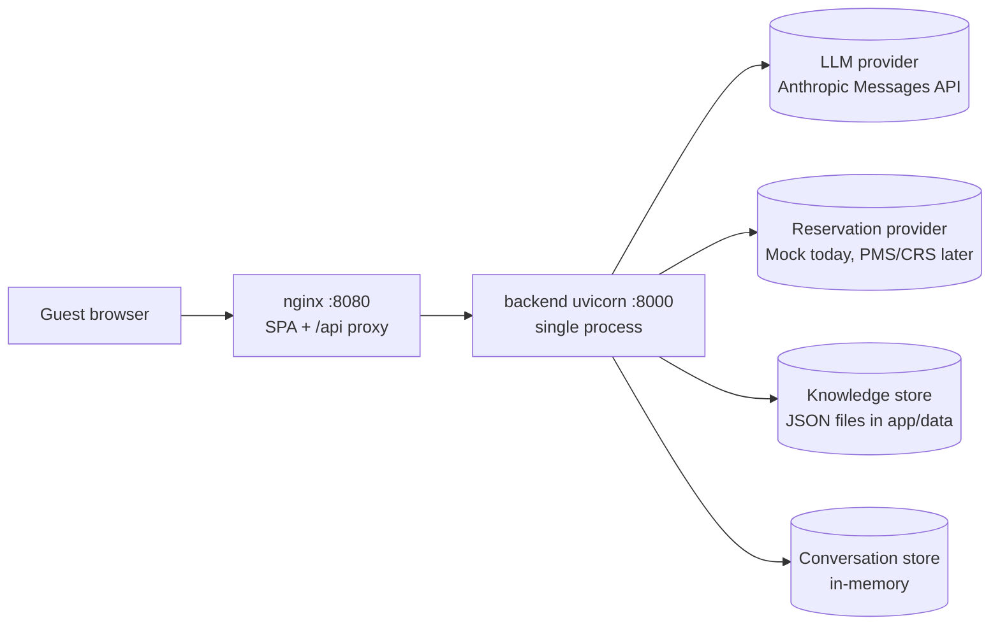

# SRE guide

Operational reference for the hotel guest assistant (FastAPI backend in `backend/app`, React/Vite SPA served by nginx in `frontend/`). For signal definitions, dashboards and alert queries see [OBSERVABILITY.md](OBSERVABILITY.md).

> **Status of numbers in this document.** No production traffic exists and the live Anthropic API has not been verified. Every SLO, alert threshold, RPO and RTO below is a **Proposed target (not measured in production)**. The only measured figures are:
>
> | Measurement | p50 | p95 | Context |
> |---|---|---|---|
> | HTTP conversation message (offline mode) | 8.6 ms | 11.0 ms | `perf/benchmark.py`, in-process, Windows 11, Python 3.13, no network, no LLM |
> | HTTP availability | 7.2 ms | 10.3 ms | same |
> | Assistant turn, zero-latency scripted model | 2.1 ms | 4.0 ms | same (application overhead only) |
> | `check_availability` tool | 1.95 ms | 5.2 ms | same |
> | Eval scenario latency, development provider GLM `glm-5.2` (**not Claude**) | ~2.6 s | ~5.5 s | `evals/run_evals.py --mode ai`; one 63 s outlier in an earlier run |

---

## 1. Service overview and dependencies

| Dependency | Implementation today | Required? | Failure behaviour |
|---|---|---|---|
| LLM provider | `AnthropicProvider` (`app/llm/anthropic_provider.py`), created only when `AI_ENABLED=true`, `LLM_PROVIDER=anthropic` and `ANTHROPIC_API_KEY` is set | **Optional.** The deterministic `OfflineAssistant` answers from the FAQ when the model is disabled or fails | Turn served offline with a notice; `assistant_fallback_total{reason=...}` increments |
| Reservation provider | `MockReservationProvider` (per-hotel `inventory.json`) wrapped in `ResilientReservationProvider` | **Required for availability**; not needed for FAQ answers | Guest gets a safe "can't check live availability" reply (chat) or HTTP 503 `AVAILABILITY_UNAVAILABLE` with `Retry-After: 30` (form/API) for transient errors; non-transient reservation errors return 500. `/ready` stays 200 with `reservations: degraded` |
| Knowledge store | `JsonKnowledgeProvider` reading `app/data/hotels/<hotel_id>/hotel.json`, cached | **Required.** Every turn needs a knowledge snapshot | Turn raises → HTTP 500; `/ready` returns 503 |
| Conversation store | `InMemoryConversationRepository` | Required, but **ephemeral by design** | Process restart loses all conversations; clients get `CONVERSATION_NOT_FOUND` (404) and start a new one |
| Tenant registry | `app/data/tenants.json`, loaded once at startup | Required | Bad file → startup failure |

There is no database, Redis, message broker, Grafana, Alertmanager, OpenTelemetry exporter, multi-replica deployment or on-call rotation today. Where those appear below they are proposals.

## 2. Health vs readiness

| Endpoint | Semantics | Checks | Response |
|---|---|---|---|
| `GET /health` | Liveness: process is up and serving. `async def`, served on the event loop | None | `200 {"status":"ok"}` |
| `GET /ready` | Readiness: can this instance usefully serve guests? | `knowledge` (**gating**): every hotel in the tenant registry loads → `ok`/`failing`; `reservations` (informational): `ok`, or `degraded` when the breaker is `open` or the inner provider is unhealthy; `llm` (informational): `configured`/`not_configured` | `200 {"status":"ready","checks":{...}}`; `503 {"status":"not_ready",...}` **only** when `knowledge` is `failing` |
| `GET /metrics` | Prometheus exposition; 404 when `METRICS_ENABLED=false` | n/a | text format |
| `GET /api/health` | Deprecated legacy endpoint; also returns `mode` (`ai`/`offline`) for the default hotel | None | `200` with `Deprecation` header |
| nginx `GET /healthz` | Frontend container liveness | None | `200 ok` |

Container and compose wiring (as implemented):

- `backend/Dockerfile` `HEALTHCHECK` polls `http://127.0.0.1:8000/health` (interval 30 s, timeout 3 s, start period 15 s, 3 retries).
- `frontend/Dockerfile` `HEALTHCHECK` polls `http://127.0.0.1:8080/healthz` (interval 30 s, timeout 3 s, 3 retries).
- `docker-compose.yml`: `frontend.depends_on.backend.condition: service_healthy`; both services `restart: unless-stopped`. The backend port is not published; nginx proxies only `/api/`, so `/health`, `/ready` and `/metrics` are reachable only on the internal network.

Guidance for an orchestrator (proposed):

- **Liveness probe → `/health`.** It is `async def` and runs on the event loop, so a saturated worker thread pool (e.g. many turns blocked on a slow LLM) doesn't fail liveness. It does fail if the event loop itself is blocked, which is the right trigger for a restart. A restart drops in-memory conversations, so keep failure thresholds at ≥ 3.
- **Startup / deploy gate → `/ready`.** Don't shift traffic to a new revision until it returns 200.
- **Readiness probe → `/ready`.** Safe to use directly: only a failing knowledge store (which breaks every turn) returns 503. A reservation outage is shared by every replica. Failing readiness for it would eject all replicas and stop FAQ answers that still work, so it is reported as `reservations: "degraded"` with HTTP 200. **Alert on the response body** (`checks.reservations == "degraded"`), not only the status code. The value returns to `ok` as soon as the breaker is `half_open`, so it can flap every `CIRCUIT_BREAKER_RESET_SECONDS` during a prolonged outage.
- `/ready` is still a sync handler (it loads hotel files) and shares the AnyIO thread pool with guest turns, so under saturation it can be slow. Give it a probe timeout of ≥ 3 s.

## 3. Proposed SLIs and SLOs

All targets: **Proposed target (not measured in production)**. Window: rolling 28 days unless stated. Routes below use the `route` label of `request_latency_ms`, which is the FastAPI route template (e.g. `/api/v1/hotels/{hotel_id}/conversations/{conversation_id}/messages`). Metric semantics are in [OBSERVABILITY.md §1](OBSERVABILITY.md#13-prometheus-metrics).

| SLI | Definition (PromQL over the actual metrics) | Proposed target |
|---|---|---|
| API availability | `1 - sum(rate(request_latency_ms_count{route=~"/api/.*",status_class="5xx"}[5m])) / sum(rate(request_latency_ms_count{route=~"/api/.*"}[5m]))` (429 and 4xx are not errors) | 99.5 % |
| Guest-turn latency, all modes | Fraction of `.../messages` requests under 10 s: `sum(rate(request_latency_ms_bucket{route=~".*/messages",le="10000"}[5m])) / sum(rate(request_latency_ms_count{route=~".*/messages"}[5m]))` | 95 % < 10 s, 99 % < 20 s |
| Guest-turn latency, AI component | LLM call share: `histogram_quantile(0.95, sum by (le) (rate(llm_latency_ms_bucket[5m])))` | p95 < 10 s |
| Guest-turn latency, offline | Not separable in metrics (HTTP histogram has no `mode` label). Use `ai_trace` logs: `total_latency_ms` where `mode="offline"`; or add a proposed `assistant_turn_latency_ms{mode}` histogram | p95 < 500 ms |
| Availability endpoint latency | `request_latency_ms` for `route=~".*/availability"`, `le="1000"` bucket ratio | 99 % < 1 s (mock); renegotiate per real PMS |
| Tool latency | `histogram_quantile(0.95, sum by (le, tool) (rate(tool_latency_ms_bucket[5m])))` | `check_availability` p95 < 2.5 s |
| 5xx error rate (per route) | `sum by (route) (rate(request_latency_ms_count{status_class="5xx"}[5m])) / sum by (route) (rate(request_latency_ms_count[5m]))` | < 0.5 % |
| Unplanned fallback rate | `sum(rate(assistant_fallback_total{reason!~"ai_disabled\|availability_unavailable"}[1h])) / sum(rate(assistant_requests_total[1h]))` | < 2 % while AI is enabled |
| Offline-served share | `sum(rate(assistant_success_total{mode="offline"}[1h])) / sum(rate(assistant_success_total[1h]))` | Informational; equals 100 % when AI is deliberately off |
| Guardrail intervention rate (output) | `sum(rate(guardrail_interventions_total{guardrail!="input_blocked"}[1h])) / sum(rate(assistant_success_total{mode="ai"}[1h]))` (interventions per AI turn; a turn can trigger two, e.g. `unknown_source` + `uncited_answer`) | < 3 % |
| Availability-search success | `sum(rate(availability_search_total[1h])) / (sum(rate(availability_search_total[1h])) + sum(rate(tool_failures_total{tool="check_availability",error_code=~"TIMEOUT\|DEPENDENCY_UNAVAILABLE\|EXECUTION_FAILED"}[1h])) + sum(rate(request_latency_ms_count{route=~".*/availability",status_class="5xx"}[1h])))` | 99 % |

Notes on the definitions:

- Input-side signals are tracked separately in `prompt_injection_signals_total{flag}` (informational; attacks don't consume the error budget).
- `assistant_fallback_total` also counts `ai_disabled` (intentional) and `availability_unavailable` (reservation outage, where the turn may still be `mode=ai`). Exclude them for the "model is unhealthy" signal.
- Business outcomes ("sold out", invalid dates) count as successful searches: `availability_search_total{available="false"}` is not a failure.

**Error-budget policy (proposed).** 0.5 % of 28 days ≈ 3.4 h of 5xx-equivalent budget.
- < 50 % consumed: normal release cadence, including prompt/model changes.
- 50–100 % consumed: prompt/model changes require a green live AI eval run and a canary (§8); no risky infra changes on Fridays.
- Budget exhausted: freeze feature and prompt releases; only reliability fixes and rollbacks until the 28-day window recovers. Budget burn caused by a third party (LLM provider, PMS) still counts, but triggers a dependency review instead of a code freeze.

## 4. Resilience mechanisms (as implemented)

### Timeouts

| Where | Value | Source |
|---|---|---|
| LLM HTTP client, per attempt | `LLM_TIMEOUT_SECONDS=20` | `anthropic.Anthropic(timeout=...)` |
| LLM SDK retries | `LLM_MAX_RETRIES=1` (SDK-managed backoff) → worst case ≈ 2 × 20 s + backoff | `config.py`, `anthropic_provider.py` |
| LLM max output tokens | `LLM_MAX_TOKENS=16000` | `ModelRouter` |
| Reservation call, per attempt | `RESERVATION_TIMEOUT_SECONDS=5` (via `INTEGRATION_EXECUTOR`) | `ResilientReservationProvider` |
| Tool `check_availability` | 15 s (via `TOOL_EXECUTOR`) | `tools/builtin.py` |
| Tool `request_booking_details` | 2 s | same |
| Tool `create_booking` | 20 s | same |
| Tool default | 10 s | `ToolDefinition` |
| nginx → backend | `proxy_read_timeout 60s`, `client_max_body_size 64k` | `frontend/nginx.conf` |

There is no end-to-end request deadline. `call_with_timeout` cancels the *future*, not the running thread: a hung integration keeps its worker thread busy after the caller has given up. A reservation read with retries can take ≈ 3 × 5 s + backoff ≈ 15.3 s, just over the 15 s tool timeout, so a slow PMS surfaces in chat as tool `TIMEOUT` rather than `DEPENDENCY_UNAVAILABLE`. Both produce the same safe reply.

### Retries

- **Reads only.** `check_availability` and `get_room` retry `RESERVATION_READ_RETRIES=2` times (3 attempts) on `IntegrationTimeout` or `ConnectionError`. Backoff: `min(2.0, 0.1 × 2^attempt) × U(0.5, 1.0)` (jittered).
- **Mutations never retry** (`create_booking`, `modify_booking`, `cancel_booking` use `retries=0`). Safe caller retries rely on idempotency keys.
- `CircuitOpenError` is not retried.
- LLM retries are only the SDK's own (`LLM_MAX_RETRIES`). There is no application-level LLM retry and **no circuit breaker around the LLM**: during an outage every turn waits for the timeout before falling back (proposed: add an LLM breaker so fallback is immediate).

### Circuit breaker (`core/resilience.py`)

- One breaker per wrapped reservation provider, named `reservations:<provider>`. **It is shared by all tenants and hotels**, so one hotel's failing PMS would open it for everyone behind that provider. Use per-integration or per-hotel breakers once real PMS adapters exist.
- **Closed → open** after `CIRCUIT_BREAKER_FAILURES=5` *consecutive* failures. Each retry attempt counts, so two guest requests with three timed-out attempts each open the circuit.
- **Business errors are not failures.** `AvailabilityValidationError` and any `ReservationError` whose code is not `UNAVAILABLE` go through the breaker as successful outcomes and are re-raised afterwards. They also reset the failure count.
- **Open** for `CIRCUIT_BREAKER_RESET_SECONDS=30`: calls fail fast with `ReservationError(UNAVAILABLE)`, and `/ready` reports `reservations: degraded` (still HTTP 200).
- **Half-open** after the reset timeout: the docstring describes "one trial call", but the code does **not** limit concurrency. Every call made while half-open goes through. One failure re-opens the breaker immediately; one success closes it. Limitation: after recovery, a burst of queued traffic can hit a still-fragile PMS at once.
- Breaker state is per process and is not exported as a metric (proposed: `circuit_breaker_state{name}` gauge).

### Caching (`TTLCache`, in-process, 10,000 entries, LRU eviction)

| Key | TTL | Notes |
|---|---|---|
| Hotel file parse + knowledge snapshot per hotel/day | `KNOWLEDGE_CACHE_TTL_SECONDS=300` | Knowledge edits show up within 5 min |
| Availability result per tenant/hotel/day/query | `AVAILABILITY_CACHE_TTL_SECONDS=15` (`0` disables) | Only successful results are cached |
| Rendered system prompt per (hotel, knowledge_version, evidence hash) | Unbounded dict on `AIAssistant` | Grows with knowledge versions; process restart clears it |
| LLM prompt caching | Anthropic `cache_control: ephemeral` on the system block | `llm_tokens_total{kind="cache_read"}` shows hits, `kind="cache_write"` shows cache creation (per `model`) |

### Idempotency

`InMemoryIdempotencyStore` (`reservations/idempotency.py`): key ≥ 8 chars, scoped `booking:<tenant>:<hotel>`, 24 h TTL. A repeat with the same key and payload returns the original booking; the same key with a different payload raises `IDEMPOTENCY_CONFLICT`. Concurrent duplicates wait on a per-key lock. `create_booking` is not exposed to the model and needs `booking_tools_enabled` (default off), an authenticated guest principal and guest confirmation.

### Graceful-degradation matrix

| Dependency state | System behaviour | Guest impact | Signal |
|---|---|---|---|
| LLM down / 5xx / 429 after SDK retry | `LLMError(provider_status\|provider_connection\|provider_sdk)` → offline engine | FAQ-quality answers + notice "Our AI assistant is temporarily unavailable…" | `assistant_fallback_total{reason=~"provider_.*"}`, `llm_failure` log |
| LLM slow | Waits up to 20 s × (1 + retries) then falls back | High latency, then FAQ answer | `llm_latency_ms`, `request_latency_ms` |
| Model refuses / truncates / emits invalid output or tool call | Offline engine answers | Same as above | `reason` = `refusal`, `truncated`, `invalid_output`, `invalid_tool_call` |
| AI disabled (`AI_ENABLED=false` or flag) | Offline engine, reason `ai_disabled` | Notice "AI answers are turned off…" | `assistant_success_total{mode="offline"}` |
| Reservation provider timeout / down / circuit open | Chat: safe `fallback` reply with hotel contact line; form/API: 503 + `Retry-After: 30` | Can't see live availability; FAQ still works; instance stays in rotation | `assistant_fallback_total{reason="availability_unavailable"}`, `tool_failures_total{tool="check_availability"}`, `/ready` 200 with `reservations: degraded` |
| Reservation provider returns a non-transient error (not `UNAVAILABLE`, e.g. misconfiguration) | Form/API: HTTP 500 (not 503); chat tool: `EXECUTION_FAILED` → offline FAQ fallback reply | Error on availability search | 5xx on `route=~".*/availability"`, `tool_failures_total{error_code="EXECUTION_FAILED"}` |
| Knowledge file unreadable | Turn raises → 500 | Chat broken for that hotel | `assistant_failures_total{error_type}`, 5xx, `/ready` 503 |
| Output guardrail trips | Reply replaced by safe fallback / booking form; model-written form messages with a price or inventory claim are dropped (`unsupported_claim`) and such suggestions are filtered out | Less helpful answer, never an ungrounded price or availability claim | `guardrail_interventions_total{guardrail}` |
| Guest sends two messages concurrently on one conversation | Turns serialised by an in-process per-conversation lock | Second reply waits for the first (up to one LLM call) | `request_latency_ms` on `.../messages` |
| Process restart | Conversations, rate-limit windows, idempotency records and mock bookings lost | Guest starts a new chat | Container restart count |

## 5. Degraded modes and kill switches

All switches are read at startup. **Every change needs a process restart** (there is no runtime toggle API). The image runs with a read-only root filesystem and `app/data` baked in, so file-based changes need an image rebuild or a `DATA_DIR` volume.

| Switch | Effect | Use during incidents |
|---|---|---|
| `AI_ENABLED=false` | No LLM client is built; all turns go offline (`reason=ai_disabled`); `/ready` shows `llm: not_configured` | Global LLM kill: provider outage with long timeouts, runaway cost, confirmed harmful model output |
| `LLM_PROVIDER=none` | Same effect as above | Equivalent; prefer `AI_ENABLED` for clarity |
| `FEATURE_AI_ASSISTANT_ENABLED=false` | Global flag override; model client still built, `ai_available_for` returns false | Global AI off while keeping config intact |
| `tenants.json` → `feature_flags.ai_assistant_enabled: false` | Per-tenant AI off; tenant override beats global | Isolate a tenant with bad knowledge content or a targeted injection campaign |
| `ANTHROPIC_REFUSAL_FALLBACK=none` | Removes the server-side refusal fallback beta (`server-side-fallback-2026-07-01`) from requests | A gateway or endpoint rejects the beta parameters (every call fails with `provider_status`) |
| `ANTHROPIC_MODEL` / `ANTHROPIC_EFFORT` | Change model/effort for `guest_turn` | Roll back a model change |
| `FEATURE_GUARDRAIL_PRICE_CHECK_ENABLED` | Output price check (default on) | Do **not** disable in an incident; it prevents misquoted prices |
| `FEATURE_BOOKING_TOOLS_ENABLED` | Enables `create_booking` (default off) | Keep off |
| `RATE_LIMIT_IP_PER_MINUTE` (60), `RATE_LIMIT_CONVERSATION_PER_MINUTE` (20), `RATE_LIMIT_HOTEL_PER_MINUTE` (1200) | Sliding 60 s windows per process | Tighten during abuse; loosen on misfires. `RATE_LIMIT_ENABLED=false` is rejected in production |
| `RESERVATION_TIMEOUT_SECONDS`, `RESERVATION_READ_RETRIES`, `CIRCUIT_BREAKER_*` | Integration resilience tuning | Shorten timeouts / reduce retries when the PMS is degraded, so guests get fast failures |

Startup safety: an unknown `FEATURE_*` variable fails startup (`Unknown feature flags`), and so does `FEATURE_SEMANTIC_RETRIEVAL_ENABLED=true`. Check spelling before deploying a flag change during an incident.

## 6. Capacity and scaling notes

Current topology: **one uvicorn process, no `--workers`**, one container.

- Guest endpoints call synchronous code through `run_in_threadpool` (AnyIO's default limiter, 40 threads). The LLM call blocks one of those threads for its whole duration, so in-flight AI turns per process are capped by that limiter. Sync ops handlers (`/health`, `/ready`, `/metrics`) compete for the same pool, except `/health`, which is `async def` and runs on the event loop.
- Turns on the same conversation are serialised by an in-process lock keyed by tenant/hotel/conversation, so one conversation occupies at most one worker thread at a time.
- `TOOL_EXECUTOR` and `INTEGRATION_EXECUTOR` are separate `ThreadPoolExecutor`s with 32 workers each. They are separate on purpose: a tool running in one may call an integration in the other, and a shared pool could deadlock. Hung integration calls keep threads busy after timeouts (§4).
- Measured app overhead is single-digit milliseconds (see header). Throughput is bound by LLM latency and provider rate limits, not CPU. Size by concurrent AI turns ≈ arrival rate × LLM p95.
- LLM provider limits (requests/tokens per minute) apply per API key across all replicas. A 429 is retried once by the SDK, then the turn falls back with `reason=provider_status`. Watch `sum by (model) (rate(llm_tokens_total[1m]))` against the organisation's limits.

**Must move to shared stores before running multiple replicas or workers:**

| State | Today | Problem with N replicas | Proposed |
|---|---|---|---|
| Conversations | `InMemoryConversationRepository` (max 50,000, LRU eviction, 24 h sliding TTL, purge every 300 s) | A guest's next message hits a replica that doesn't know the conversation → 404 | Redis with TTL, or a SQL table keyed on (tenant_id, hotel_id, id). Sticky sessions only as a stopgap. The per-conversation turn lock is also in-process and must become a distributed lock (or optimistic versioning) |
| Rate limiter | `InMemorySlidingWindowRateLimiter` | Effective limit becomes N × configured | Redis `RateLimiter` or API gateway limits |
| Idempotency | `InMemoryIdempotencyStore` | Duplicate bookings across replicas | Unique-constrained table in the booking DB, same transaction |
| Cache | `TTLCache` | Per-replica staleness; acceptable for 15 s availability, awkward for knowledge invalidation | Redis, or keep local plus versioned knowledge keys |
| Circuit breaker | Per process | Each replica learns separately (acceptable) | Optional shared state |
| Metrics | Per-process `CollectorRegistry` | With `--workers > 1`, each scrape hits a random worker | Scrape each pod; use prometheus_client multiprocess mode if adding workers |
| Recent traces/events | In-memory deques (500) | Per replica only | Ship logs; see OBSERVABILITY.md |
| Mock bookings | In-memory | Lost on restart | Real PMS is the system of record |

## 7. Incident response

### Severity levels (proposed)

| Sev | Definition | Response (proposed) |
|---|---|---|
| SEV1 | Guest chat unavailable (5xx) for all or most hotels; suspected cross-tenant data exposure; credential leak | Page immediately; incident commander; status update every 30 min |
| SEV2 | Major degradation: AI fully in fallback > 15 min, availability down for most hotels, harmful/incorrect answers at scale | Page in working hours, escalate after 30 min |
| SEV3 | Partial: one tenant affected, elevated guardrail rate, latency SLO burn | Ticket, next business day |
| SEV4 | Cosmetic / single guest | Backlog |

Log query examples use `jq` over the JSON log stream (`LOG_FORMAT=json`), where the event name is in the `message` key. Translate them to your log backend.

### Runbook: LLM provider outage or latency spike

- **Signals:** `assistant_fallback_total{reason=~"provider_.*"}` rising; `llm_latency_ms` p95 up; `.../messages` latency up; `llm_failure` ERROR logs.
- **Diagnose:** `jq 'select(.message=="llm_failure") | {ts, reason, error}'` and group by `reason`. `provider_status` with `429` means rate limits; `5xx` or `connection` means provider outage; check the provider status page. Confirm the model name: `jq 'select(.message=="ai_trace") | .model' | sort | uniq -c`.
- **Mitigate:** If turns fall back quickly, no action needed: guests get FAQ answers. If turns wait for 20 s+ timeouts, set `AI_ENABLED=false` and restart so fallback is immediate. For a 429 storm, reduce traffic or request a limit increase.
- **Follow-up:** Re-enable AI and watch `assistant_success_total{mode="ai"}` recover. Consider the proposed LLM circuit breaker.

### Runbook: reservation provider outage (circuit open)

- **Signals:** `/ready` 200 with `checks.reservations: "degraded"` (the instance deliberately stays in rotation); `assistant_fallback_total{reason="availability_unavailable"}`; `tool_failures_total{tool="check_availability",error_code=~"TIMEOUT|DEPENDENCY_UNAVAILABLE"}`; 5xx on `route=~".*/availability"`.
- **Diagnose:** `jq 'select(.message=="tool_audit" and .tool=="check_availability") | {ts, status, error_code, latency_ms}'`. Latencies near 15000 point to slow timeouts; fast `DEPENDENCY_UNAVAILABLE` means the breaker is open. Check whether the problem is one hotel or all hotels (`hotel_id` context field).
- **Mitigate:** Nothing to fail over to; the safe reply already sends guests to the hotel contact line. If the PMS is slow rather than down, lower `RESERVATION_TIMEOUT_SECONDS` and `RESERVATION_READ_RETRIES` to free threads. Readiness no longer ejects pods for this, so don't "fix" it by restarting or draining replicas. If the 5xx are 500s rather than 503s, the error is non-transient (e.g. bad PMS credentials or mapping): escalate to the integration owner.
- **Follow-up:** Record PMS vendor incident; review per-hotel breaker need.

### Runbook: elevated fallback or guardrail rates (possible prompt/model regression)

- **Signals:** `assistant_fallback_total{reason=~"invalid_output|invalid_tool_call|truncated|refusal"}` or `guardrail_interventions_total{guardrail=~"uncited_answer|unknown_source|unsupported_price|availability_claim|unsupported_claim"}` rising after a deploy.
- **Diagnose:** Split by version: `jq 'select(.message=="ai_trace") | [.prompt_version, .model, .fallback_reason, (.guardrails|join(","))] | @tsv' | sort | uniq -c`. Check whether one `prompt_version`, `tool_schema_version`, `model` or `knowledge_version` accounts for the increase. A single hotel with a new `knowledge_version` points to content, not the prompt.
- **Mitigate:** Roll back to the previous image (the prompt lives in code: `PROMPT_VERSION = guest-assistant@<revision>+<hash>`) or to the previous `ANTHROPIC_MODEL`. For a single tenant, set its `ai_assistant_enabled` flag to false.
- **Follow-up:** Reproduce with `python -m evals.run_evals --mode ai --label <model>-<date>` (manual workflow) and add the failing case to `evals/scenarios.json`.

### Runbook: suspected prompt-injection campaign

- **Signals:** `prompt_injection_signals_total{flag}` rising (counts every input flag, blocked or not); `guardrail_interventions_total{guardrail="input_blocked"}`, `secret_leak` or `prompt_leak` spikes; `rate_limited_total{dimension="ip"}` up.
- **Diagnose:** `sum by (flag) (increase(prompt_injection_signals_total[1h]))` shows which technique (`ignore_instructions`, `role_override`, `policy_override`, `tool_coercion`, `prompt_tag_injection`, `exfiltration_attempt`). The metric has no tenant label. Find targeted hotels from `domain_event` `name=GuardrailTriggered` (now emitted whenever `input_flags` is non-empty) grouped by `hotel_id`, or from `ai_trace`: `jq 'select(.message=="ai_trace" and (.input_flags|length>0)) | {hotel_id, conversation_id, input_flags, guardrails, reply_type}'`. Group by `hotel_id` and time. Guest text is never logged, so look up specific conversations through the in-memory store only while they're alive, and only if policy allows.
- **Mitigate:** Tighten `RATE_LIMIT_IP_PER_MINUTE` / `RATE_LIMIT_CONVERSATION_PER_MINUTE`; block source IPs at the edge; disable AI for the targeted tenant. If a `secret_leak` or `prompt_leak` reply came from the model, treat it as the data-exposure runbook.
- **Follow-up:** Add scenarios to `evals/scenarios.json` (tags `safety`, `prompt_injection`); consider new input flags.

### Runbook: tenant data exposure suspicion

- **Signals:** Customer report; `ai_trace` where `cited_ids` or `evidence_ids` don't belong to `hotel_id`; `unknown_source` spikes.
- **Diagnose:** Conversation reads are keyed by (tenant_id, hotel_id, conversation_id); knowledge snapshots are per hotel; `MockReservationProvider` rejects snapshots from another hotel. Check `ai_trace` for mismatched ids and `http_request` logs by `request_id` from the report. Check recent changes to `tenants.json` (hotel mapped to the wrong tenant).
- **Mitigate:** SEV1. Disable AI globally if model output is involved; roll back the last deploy/data change; preserve logs.
- **Follow-up:** Legal/privacy notification process; regression test in `tests/`.

### Runbook: credential leak

- **Signals:** Key found in logs, repo, image or a guest reply (`secret_leak` guardrail); unexpected provider usage.
- **Mitigate:** Rotate `ANTHROPIC_API_KEY` / `ADMIN_API_TOKENS` immediately at the source; redeploy with new secrets (runtime env only, never baked into images). Purge affected log ranges in the log backend.
- **Diagnose/audit:** Redaction covers `sk-`/`sk-ant-` keys, bearer tokens, PEM private keys, `key/password/secret/token=` pairs, and the configured secret values (≥ 8 chars). Look for leaks outside that coverage (e.g. a new secret format). Review provider usage logs for the exposure window.
- **Follow-up:** Add the pattern to `_SECRET_PATTERNS`; add a test.

### Runbook: rate-limit misfires

- **Signals:** `rate_limited_total{dimension}` spike without matching abuse; guest 429 complaints.
- **Diagnose:** `dimension="ip"` spiking for everyone usually means all traffic appears to come from one IP: `TRUST_PROXY_HEADERS` is false behind a proxy, or the proxy doesn't overwrite `X-Forwarded-For` (nginx here does). `dimension="hotel"` means a hotel exceeds 1200/min (large group or bot). The IP limit is applied first, before hotel resolution (so probing unknown hotel ids is limited), and also on admin endpoints. Then come hotel, then conversation (keyed `{hotel_id}:{conversation_id}`, so ids sent to another hotel can't drain this hotel's budget). Each accepted check records a hit, so a request rejected at a later dimension still consumed earlier budgets. Admin tooling behind the same egress IP as guests shares the IP budget.
- **Mitigate:** Fix proxy trust configuration; raise the specific limit via env and restart.
- **Follow-up:** Move limits to a gateway/Redis before scaling out.

## 8. Release safety

CI (`.github/workflows/ci.yml`, on push to main/master and PRs):

| Gate | Job |
|---|---|
| `ruff` lint; pytest: unit, integration, contract, security (203 tests at last count) | backend |
| Offline eval (28/28 passing at last count): `python -m evals.run_evals --mode offline --label ci-offline --baseline evals/results/offline.json`. Exit 3 if a scenario that passed in the baseline now fails; exit 1 if any scenario fails | backend |
| `pip-audit -r requirements.txt` | backend |
| `oxlint`, type check + build, Vitest (13 tests), `npm audit --omit=dev --audit-level=high` | frontend |
| Playwright E2E with AI disabled (6 tests) | e2e |
| `docker compose build`, `up -d --wait` (healthchecks), smoke `GET /api/v1/hotels/hotel-goa-001` and `POST .../conversations` | docker |

Manual live eval (`.github/workflows/ai-eval.yml`, `workflow_dispatch`): inputs `model` (default `claude-opus-5`) and `effort`; runs `run_evals --mode ai` with `ANTHROPIC_API_KEY` from the `ai-evaluation` environment and uploads `evals/results/ai-*`. It has not yet been run against the live Anthropic API. On the current architecture, the development provider GLM `glm-5.2` (**not Claude**) passed 33/34 and 34/34 scenarios in two runs.

**Proposed canary and rollback for prompt/model changes:**
1. Bump `PROMPT_REVISION` (the hash also changes if the template changes) and run the live eval workflow; compare `summary` with the previous result file.
2. Deploy to a canary slice (one replica or selected tenants, once multi-replica exists). Every `ai_trace` and every API response `meta` carries `prompt_version`, `tool_schema_version`, `knowledge_version`, so canary and baseline can be split.
3. Watch per-version fallback reasons, guardrail interventions, `llm_latency_ms` and `llm_tokens_total` for ≥ 24 h or ≥ 500 turns (proposed).
4. Roll back by redeploying the previous image (prompt) or env (`ANTHROPIC_MODEL`). No data migration is involved.

## 9. Disaster recovery (proposed)

All RPO/RTO values: **Proposed target (not measured in production)**.

| Data | Where it lives today | Backup scope | Proposed RPO | Proposed RTO |
|---|---|---|---|---|
| Knowledge content (`hotel.json`) and inventory (`inventory.json`) | Git + container image | Git is the backup; future admin-edited DB → daily snapshots + PITR | 0 (git) / 15 min (future DB) | 1 h (redeploy image) |
| Tenant registry (`tenants.json`) | Git + image | Same as knowledge | 0 | 1 h |
| Bookings | Mock: process memory (lost on restart). Real: PMS/CRS is the system of record | Not backed up here by design; the future booking DB (idempotency records) gets PITR | 5 min (future) | 4 h (future) |
| Conversations | Process memory, 24 h TTL | **None: ephemeral by design** (guest can delete; no long-term storage) | n/a | n/a (guest starts a new chat) |
| Audit logs (`tool_audit`, `ai_trace`, `domain_event`) | stdout only; retention depends on the log shipper (none configured) | Ship to durable log storage with immutable retention | 5 min | 24 h for query access |
| Secrets | Runtime env / secret manager | Secret manager versioning | 0 | 30 min (rotate + redeploy) |

Scenarios:
- **LLM provider outage:** no DR action; offline mode serves FAQ answers (§4). Optional: a second Anthropic-compatible endpoint via `ANTHROPIC_BASE_URL`, validated by evals first.
- **Reservation provider outage:** safe fallback reply + contact line; nothing to restore.
- **Database outage (future):** once conversations/idempotency move to Redis/SQL, readiness must include them; conversations can degrade to "start a new chat"; idempotency store outage must block bookings (fail closed).
- **Region failure (future):** stateless backend redeployed in a second region from the same image; knowledge from git or a replicated DB; conversations lost (acceptable); DNS failover. RTO proposed 4 h.
- **DR test cadence (proposed):** quarterly restore of knowledge/booking DB snapshots into staging; semi-annual game day (LLM off, PMS breaker open, region evacuation); verify `/ready`, smoke tests and the offline eval after each.
