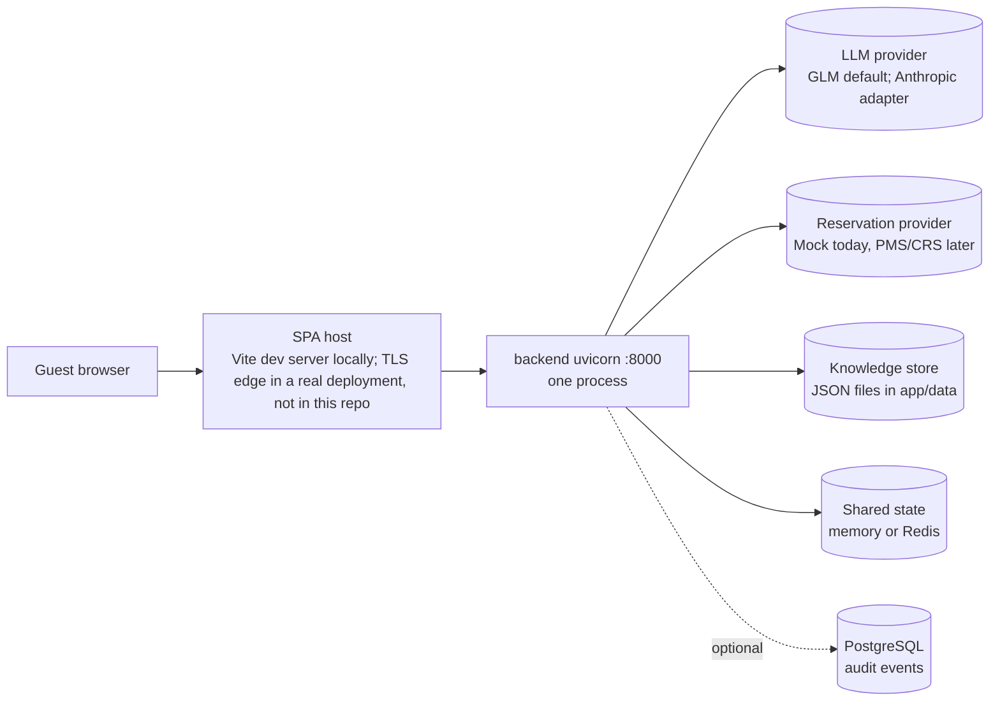

# SRE guide

Operational reference for the hotel guest assistant (FastAPI backend in `backend/app`, React/Vite SPA in `frontend/`). Docker/containerization: NOT REQUIRED FOR CURRENT PROJECT — removed intentionally. Locally the backend runs as `uvicorn app.main:app --reload --port 8000` (inside a virtualenv) and the SPA as `npm run dev` (Vite dev server on :5173, proxying `/api`). For signal definitions, dashboards and alert queries see [OBSERVABILITY.md](OBSERVABILITY.md). Related: deployment topology and procedures in [DEPLOYMENT.md](DEPLOYMENT.md), every environment variable in [CONFIGURATION.md](CONFIGURATION.md), load-test method and results in [PERFORMANCE.md](PERFORMANCE.md), PMS adapter contract in [RESERVATION_INTEGRATION.md](RESERVATION_INTEGRATION.md), data handling in [PRIVACY.md](PRIVACY.md), and the overall evidence status in [ENTERPRISE_READINESS.md](ENTERPRISE_READINESS.md).

> **Status of numbers in this document.** No production traffic exists. The live Anthropic API is **NOT VERIFIED (no Anthropic credential)**; the default runtime provider is GLM (`LLM_PROVIDER=glm`, model `glm-5.2`), and GLM results are evidence for the GLM runtime only. Neither GitHub Actions workflow has been run on GitHub. Every SLO, alert threshold, RPO and RTO below is a **Proposed target (not measured in production)**. The measured figures are local or development measurements, not production capacity:
>
> | Measurement | p50 | p95 | Context |
> |---|---|---|---|
> | HTTP conversation message (offline mode) | 8.6 ms | 11.0 ms | Earlier in-process profile (`perf/results.md`), Windows 11, Python 3.13, no network, no LLM |
> | Assistant turn, zero-latency scripted model | 2.1 ms | n/a | same (application overhead only) |
> | Local HTTP load test (offline turns, availability, mock AI turns at 10–100 users) | see [PERFORMANCE.md](PERFORMANCE.md) | | `python -m perf.load_test`, one uvicorn worker, same machine as the client. **Local benchmark, not production capacity** |
> | Eval scenario latency, GLM adapter, development suite (34 scenarios), two runs | 5511 / 5593 ms | 12620 / 14280 ms | `evals/results/glm-5.2-adapter-run{1,2}`; 34/34 both runs. **GLM runtime evidence, not Claude** |
> | Eval scenario latency, GLM adapter, holdout suite (12 adversarial scenarios) | 5820 ms | 9948 ms | `evals/results/glm-5.2-holdout-run1`; 12/12 |

---

## 1. Service overview and dependencies



| Dependency | Implementation today | Required? | Failure behaviour |
|---|---|---|---|
| LLM provider | `GLMProvider` (`app/llm/glm_provider.py`, default `LLM_PROVIDER=glm`) or `AnthropicProvider` (`LLM_PROVIDER=anthropic`, **live API NOT VERIFIED**), created only when AI is enabled and credentials are set | **Optional.** The deterministic `OfflineAssistant` answers from the FAQ when the model is disabled or fails | Turn served offline with HTTP 200 and `meta.degradation = {code: LLM_TIMEOUT \| LLM_UNAVAILABLE, message}`; `assistant_fallback_total{reason=...}` increments |
| Reservation provider | `MockReservationProvider` (per-hotel `inventory.json`) wrapped in `ResilientReservationProvider` | **Required for availability and bookings**; not needed for FAQ answers | Chat: safe "can't check live availability" reply, `meta.degradation.code = RESERVATION_UNAVAILABLE`, fallback reason `reservation_unavailable`. Form/API: HTTP 503 `RESERVATION_UNAVAILABLE` with `Retry-After: 30` for transient errors; non-transient reservation errors return 500. `/ready` stays 200 with `reservations: degraded` |
| Knowledge store | `JsonKnowledgeProvider` reading `app/data/hotels/<hotel_id>/hotel.json`, cached per process | **Required.** Every turn needs a knowledge snapshot | Corrupt or unreadable file → HTTP 503 `KNOWLEDGE_UNAVAILABLE` with `Retry-After: 30` (`knowledge_load_failed` log); `/ready` returns 503 (`knowledge: failing`) |
| Conversation store and turn locks | `STATE_BACKEND=memory` (default): in-process. `STATE_BACKEND=redis`: `RedisConversationRepository` + `RedisLockStore` (`app/state/redis_backend.py`) | **Required** | Memory: process restart loses all conversations (clients get `CONVERSATION_NOT_FOUND` 404 and start a new one). Redis unreachable: HTTP 503 `STATE_UNAVAILABLE` with `Retry-After: 5` (`state_backend_error` log) and `/ready` 503 (`state: failing`) |
| Rate limiter | Memory or `RedisSlidingWindowRateLimiter` | Not required to serve | Redis error → **fails open**: request allowed, `rate_limiter_unavailable` WARNING log, `state_backend_errors_total{component="rate_limiter"}` increments |
| Idempotency store | Memory or `RedisIdempotencyStore` | Required for bookings only | Redis error → `ReservationError(UNAVAILABLE)`: the booking is refused (fails closed); FAQ and availability unaffected |
| PostgreSQL audit store | `PostgresAuditSink` (`app/db/audit.py`), only when `DATABASE_URL` is set | **Not required for readiness** | Events are queued in memory (bounded, 10,000) and written by a background thread. Queue full → `audit_events_total{outcome="dropped"}`; write error → `audit_events_total{outcome="failed"}`, `audit_write_failed` ERROR log, `/ready` body `audit_store: failing` (status stays 200) |
| Tenant registry | `app/data/tenants.json`, loaded once at startup | Required | Bad file → startup failure |

Caches (knowledge snapshots, availability results) stay per process by design and are not shared across replicas. Conversations, bookings, knowledge and evaluations have PostgreSQL tables in `migrations/0001_domain_model.sql`, but only the audit sink is wired to them (the rest is **DESIGNED**, schema only). There is no message broker, Grafana, Alertmanager, OpenTelemetry exporter, production multi-replica deployment or on-call rotation. Where those appear below they are proposals.

## 2. Health vs readiness

| Endpoint | Semantics | Checks | Response |
|---|---|---|---|
| `GET /health` | Liveness: process is up and serving. `async def`, served on the event loop | None | `200 {"status":"ok"}` |
| `GET /ready` | Readiness: can this instance usefully serve guests? | `knowledge` (**gating**): every hotel in the tenant registry loads → `ok`/`failing`; `state` (**gating**): the conversation store answers (always `ok` for memory; Redis reachability for `STATE_BACKEND=redis`) → `ok`/`failing`; `reservations` (informational): `ok`, or `degraded` when the breaker is `open` or the inner provider is unhealthy; `llm` (informational): `configured`/`not_configured`; `audit_store` (informational): `ok`/`failing` (last batch write failed)/`not_configured` | `200 {"status":"ready","checks":{...}}`; `503 {"status":"not_ready",...}` **only** when `knowledge` or `state` is `failing` |
| `GET /metrics` | Prometheus exposition; 404 when `METRICS_ENABLED=false` | n/a | text format |
| `GET /api/health` | Deprecated legacy endpoint; also returns `mode` (`ai`/`offline`) for the default hotel | None | `200` with `Deprecation` header |

No health-check wiring ships with the repository (there are no container or process-manager definitions). `/health`, `/ready` and `/metrics` are served on the backend port itself; whatever hosts the backend in a real deployment must keep them off the public edge (see [THREAT_MODEL.md](THREAT_MODEL.md), cross-cutting notes).

Guidance for whatever supervises the process (proposed):

- **Liveness probe → `/health`.** It is the only `async def` endpoint and runs on the event loop, so a saturated worker thread pool (e.g. many turns blocked on a slow LLM) doesn't fail liveness. It does fail if the event loop itself is blocked, which is the right trigger for a restart. Guest endpoints that do tenant resolution and rate limiting (Redis round trips) are sync handlers so that work runs in the thread pool, not on the event loop; a regression test checks that only `/health` is async and that it answers in < 300 ms while 4 requests wait on a 0.5 s rate limiter (`tests/test_state.py::test_blocking_state_calls_never_run_on_the_event_loop`). A restart drops memory-backend conversations, so keep failure thresholds at ≥ 3.
- **Startup / deploy gate → `/ready`.** Don't shift traffic to a new revision until it returns 200.
- **Readiness probe → `/ready`.** It returns 503 only for a failing knowledge store or an unreachable conversation store (Redis), both of which break every turn on that instance. A reservation outage is shared by every replica. Failing readiness for it would eject all replicas and stop FAQ answers that still work, so it is reported as `reservations: "degraded"` with HTTP 200. The same reasoning applies to the audit store (`audit_store: "failing"`, HTTP 200). **Alert on the response body** (`checks.reservations`, `checks.audit_store`), not only the status code. `reservations` returns to `ok` as soon as the breaker is `half_open`, so it can flap every `CIRCUIT_BREAKER_RESET_SECONDS` during a prolonged outage.
- Note that a Redis outage fails readiness on **every** replica at once (they share the same Redis). That is intended: without the conversation store no turn can be served, and 503 `STATE_UNAVAILABLE` is what guests would get anyway.
- `/ready` is a sync handler (it loads hotel files and pings Redis) and shares the AnyIO thread pool (`WORKER_THREADS`, default 150) with guest turns, so under saturation it can be slow. Give it a probe timeout of ≥ 3 s.

## 3. Proposed SLIs and SLOs

All targets: **Proposed target (not measured in production)**. Window: rolling 28 days unless stated. Routes below use the `route` label of `request_latency_ms`, which is the FastAPI route template (e.g. `/api/v1/hotels/{hotel_id}/conversations/{conversation_id}/messages`). Metric semantics are in [OBSERVABILITY.md §1](OBSERVABILITY.md#13-prometheus-metrics).

| SLI | Definition (PromQL over the actual metrics) | Proposed target |
|---|---|---|
| API availability | `1 - sum(rate(request_latency_ms_count{route=~"/api/.*",status_class="5xx"}[5m])) / sum(rate(request_latency_ms_count{route=~"/api/.*"}[5m]))` (429 and 4xx are not errors) | 99.5 % |
| Guest-turn latency, all modes | Fraction of `.../messages` requests under 10 s: `sum(rate(request_latency_ms_bucket{route=~".*/messages",le="10000"}[5m])) / sum(rate(request_latency_ms_count{route=~".*/messages"}[5m]))` | 95 % < 10 s, 99 % < 20 s |
| Guest-turn latency, AI component | LLM call share: `histogram_quantile(0.95, sum by (le) (rate(llm_latency_ms_bucket[5m])))` | p95 < 10 s |
| Guest-turn latency, offline | `histogram_quantile(0.95, sum by (le) (rate(turn_latency_ms_bucket{mode="offline"}[5m])))` (successful turns only; see OBSERVABILITY.md §1.3) | p95 < 500 ms |
| Application overhead per turn | `histogram_quantile(0.95, sum by (le, mode) (rate(app_latency_ms_bucket[5m])))` (turn time minus LLM and tool time) | Informational; regressions point at our code, not a dependency |
| Availability endpoint latency | `request_latency_ms` for `route=~".*/availability"`, `le="1000"` bucket ratio | 99 % < 1 s (mock); renegotiate per real PMS |
| Tool latency | `histogram_quantile(0.95, sum by (le, tool) (rate(tool_latency_ms_bucket[5m])))` | `check_availability` p95 < 2.5 s |
| 5xx error rate (per route) | `sum by (route) (rate(request_latency_ms_count{status_class="5xx"}[5m])) / sum by (route) (rate(request_latency_ms_count[5m]))` | < 0.5 % |
| Unplanned fallback rate | `sum(rate(assistant_fallback_total{reason!~"ai_disabled\|reservation_unavailable\|tool_timeout\|tool_unavailable"}[1h])) / sum(rate(assistant_requests_total[1h]))` | < 2 % while AI is enabled |
| Offline-served share | `sum(rate(assistant_success_total{mode="offline"}[1h])) / sum(rate(assistant_success_total[1h]))` | Informational; equals 100 % when AI is deliberately off |
| Guardrail intervention rate (output) | `sum(rate(guardrail_interventions_total{guardrail!="input_blocked"}[1h])) / sum(rate(assistant_success_total{mode="ai"}[1h]))` (interventions per AI turn; a turn can trigger two, e.g. `unknown_source` + `uncited_answer`) | < 3 % |
| Availability-search success | `sum(rate(availability_search_total[1h])) / (sum(rate(availability_search_total[1h])) + sum(rate(tool_failures_total{tool="check_availability",error_code=~"TIMEOUT\|DEPENDENCY_UNAVAILABLE\|EXECUTION_FAILED"}[1h])) + sum(rate(request_latency_ms_count{route=~".*/availability",status_class="5xx"}[1h])))` | 99 % |

Notes on the definitions:

- Input-side signals are tracked separately in `prompt_injection_signals_total{flag}` (informational; attacks don't consume the error budget).
- `assistant_fallback_total` also counts `ai_disabled` (intentional, not a degradation) and the dependency reasons `reservation_unavailable`, `tool_timeout` and `tool_unavailable` (the turn may still be `mode=ai`). Exclude them for the "model is unhealthy" signal. `reservation_unavailable` was named `availability_unavailable` before the hardening phase; update any saved queries.
- 503 responses with `STATE_UNAVAILABLE`, `KNOWLEDGE_UNAVAILABLE` or `RESERVATION_UNAVAILABLE` are 5xx and consume the availability budget. 409 `CONVERSATION_BUSY` and 413 `PAYLOAD_TOO_LARGE` are 4xx and don't.
- Business outcomes ("sold out", invalid dates) count as successful searches: `availability_search_total{available="false"}` is not a failure.

**Error-budget policy (proposed).** 0.5 % of 28 days ≈ 3.4 h of 5xx-equivalent budget.
- < 50 % consumed: normal release cadence, including prompt/model changes.
- 50–100 % consumed: prompt/model changes require a green live AI eval run and a canary (§8); no risky infra changes on Fridays.
- Budget exhausted: freeze feature and prompt releases; only reliability fixes and rollbacks until the 28-day window recovers. Budget burn caused by a third party (LLM provider, PMS) still counts, but triggers a dependency review instead of a code freeze.

## 4. Resilience mechanisms (as implemented)

### Timeouts

| Where | Value | Source |
|---|---|---|
| LLM HTTP client, per attempt | `LLM_TIMEOUT_SECONDS=20` | GLM: httpx timeouts (connect ≤ 5 s, read 20 s); Anthropic: SDK `timeout` |
| LLM retries | `LLM_MAX_RETRIES=1` → worst case ≈ 2 × 20 s + backoff | GLM adapter retries only 408/409/429/5xx/529 with jittered backoff; Anthropic uses SDK-managed retries |
| LLM max output tokens | `LLM_MAX_TOKENS=16000` | `ModelRouter` |
| Reservation call, per attempt | `RESERVATION_TIMEOUT_SECONDS=5` (via `INTEGRATION_EXECUTOR`) | `ResilientReservationProvider` |
| Reservation logical call (all attempts + backoff) | deadline = timeout × (retries + 1) + 1 s = **16 s** by default | `ResilientReservationProvider.deadline` |
| Tool `check_availability` | **20 s** (raised from 15 s so it sits above the 16 s retry deadline) | `tools/builtin.py` |
| Tool `request_booking_details` | 2 s | same |
| Tool `create_booking` | 20 s | same |
| Tool default | 10 s | `ToolDefinition` |
| Conversation turn lock | wait `CONVERSATION_LOCK_WAIT_SECONDS=30`, lease `CONVERSATION_LOCK_LEASE_SECONDS=120` (startup fails unless the lease exceeds `LLM_TIMEOUT_SECONDS × (LLM_MAX_RETRIES + 1)`) | `config.py`, `conversations/service.py` |
| Redis socket | connect and read 2 s | `state/redis_backend.py` `connect` |
| Request body | 64 KB: API middleware rejects by `Content-Length` with 413 `PAYLOAD_TOO_LARGE` | `api/middleware.py` |
| Graceful shutdown drain | Not set in the repository: uvicorn's default applies unless the operator passes `--timeout-graceful-shutdown` | uvicorn command line (deployment) |

There is no end-to-end request deadline. `call_with_timeout` stops *waiting*; it cannot kill the running Python thread, so a hung integration keeps its worker thread busy (and its work may still finish in the background) after the caller has given up. This is why mutating calls rely on idempotency keys. GLM HTTP timeouts do close the connection (tested with a real slow HTTP server: a 0.3 s timeout is abandoned in < 1.5 s, `tests/test_contracts.py::test_glm_timeout_abandons_the_request_within_the_budget`).

**Retry deadline vs tool timeout.** `retry(..., deadline_seconds)` does not start a new attempt once the remaining budget can't cover the backoff (`test_retry_deadline_stops_new_attempts`, fake clock). The reservation deadline (16 s) is below the `check_availability` tool timeout (20 s), asserted by `test_reservation_deadline_is_below_the_tool_timeout`. By design, a slow PMS therefore exhausts the reservation retries before the tool gives up, and surfaces in chat as `DEPENDENCY_UNAVAILABLE` → reason `reservation_unavailable` rather than a tool `TIMEOUT` racing the retries (the ordering is asserted; the end-to-end slow-PMS path isn't separately tested). If you change `RESERVATION_TIMEOUT_SECONDS` or `RESERVATION_READ_RETRIES`, keep `timeout × (retries + 1) + 1` below 20 s or the tool timeout wins again (reason `tool_timeout`).

### Retries

- **Reads only.** `check_availability` and `get_room` retry `RESERVATION_READ_RETRIES=2` times (3 attempts) on `IntegrationTimeout` or `ConnectionError`, bounded by the deadline above. Backoff: `min(2.0, 0.1 × 2^attempt) × U(0.5, 1.0)` (jittered).
- **Mutations never retry** (`create_booking`, `modify_booking`, `cancel_booking` use `retries=0`). Safe caller retries rely on idempotency keys.
- `CircuitOpenError` is not retried.
- LLM retries are only the adapter's own (`LLM_MAX_RETRIES`). There is no application-level LLM retry and **no circuit breaker around the LLM**: during an outage every turn waits for the timeout before falling back (proposed: add an LLM breaker so fallback is immediate).

### Circuit breaker (`core/resilience.py`)

- One breaker per wrapped reservation provider, named `reservations:<provider>`. **It is shared by all tenants and hotels**, so one hotel's failing PMS would open it for everyone behind that provider. Use per-integration or per-hotel breakers once real PMS adapters exist.
- **The breaker wraps the whole retry sequence**: one logical call counts as one failure, however many attempts it made (`test_one_logical_call_counts_as_one_breaker_failure`: 3 attempts, breaker still closed at threshold 2).
- **Closed → open** after `CIRCUIT_BREAKER_FAILURES=5` *consecutive* failed logical calls.
- **Business errors are not failures.** `AvailabilityValidationError` and any `ReservationError` whose code is not `UNAVAILABLE` pass through the breaker as outcomes, are re-raised afterwards, and never count (`test_business_errors_do_not_trip_the_circuit`).
- **Open** for `CIRCUIT_BREAKER_RESET_SECONDS=30`: calls fail fast with `ReservationError(UNAVAILABLE)`, and `/ready` reports `reservations: degraded` (still HTTP 200).
- **Half-open** after the cooldown: **exactly one caller gets the trial permit**; concurrent callers during the trial fail fast with `CircuitOpenError` (`test_half_open_allows_exactly_one_concurrent_trial`, 5 concurrent callers, 1 trial call). A successful trial closes the breaker and resets counters. A failed trial reopens it for a **full cooldown regardless of the threshold** (`test_failed_half_open_trial_reopens_for_a_full_cooldown`). A non-failure (business/validation) error during the trial releases the permit and closes the breaker, since the dependency answered (`test_non_failure_error_during_trial_releases_the_permit`).
- Breaker state is per process: each replica learns about an outage separately. It is not exported as a metric (proposed: `circuit_breaker_state{name}` gauge).

### Caching (`TTLCache`, in-process, 10,000 entries, LRU eviction)

| Key | TTL | Notes |
|---|---|---|
| Hotel file parse + knowledge snapshot per hotel/day | `KNOWLEDGE_CACHE_TTL_SECONDS=300` | Knowledge edits show up within 5 min |
| Availability result per tenant/hotel/day/query | `AVAILABILITY_CACHE_TTL_SECONDS=15` (`0` disables) | Only successful results are cached |
| Rendered system prompt per (hotel, knowledge_version, evidence hash) | Unbounded dict on `AIAssistant` | Grows with knowledge versions; process restart clears it |
| LLM prompt caching | Anthropic adapter only: `cache_control: ephemeral` on the system block | `llm_tokens_total{kind="cache_read"}` shows hits, `kind="cache_write"` shows cache creation (per `model`) |

The `TTLCache` is per process in both state backends, by design (short TTL, cheap to rebuild, avoids deserialising Python objects from a shared store). With several replicas, each has its own knowledge and availability cache.

### Idempotency

`InMemoryIdempotencyStore` (`reservations/idempotency.py`, `STATE_BACKEND=memory`) or `RedisIdempotencyStore` (`STATE_BACKEND=redis`): key ≥ 8 chars, scoped `booking:<tenant>:<hotel>`, 24 h TTL. A repeat with the same key and payload returns the original booking; the same key with a different payload raises `IDEMPOTENCY_CONFLICT`. In memory, concurrent duplicates wait on a per-key lock. In Redis, one replica takes a lease (`SET NX PX`) and runs the operation while the others poll for its stored result (with a request fingerprint); a waiter that runs out of its wait budget gets `IN_PROGRESS`. A Redis error makes the booking fail closed with `ReservationError(UNAVAILABLE)`. Keys are hashed before use in Redis. `create_booking` is not exposed to the model and needs `booking_tools_enabled` (default off), an authenticated guest principal and guest confirmation. The PostgreSQL `bookings` table has a unique `(tenant_id, hotel_id, idempotency_key)` constraint, but no booking repository is wired to it (**DESIGNED**).

### Conversation concurrency

Every conversation has a `version`; `save(conversation, expected_version)` is compare-and-set in both backends (Lua script in Redis). A per-conversation lock (in-process for memory, `RedisLockStore` token lease for Redis) serialises turns so concurrent messages don't waste model calls; the version check guarantees no lost update if a lease expires. A turn that can't get the lock within the wait, or loses the version check, returns **409 `CONVERSATION_BUSY` with `Retry-After: 2`**; a lost version check also increments `conversation_conflicts_total`. The frontend retries a 409 once after `Retry-After` (capped at 3 s). Measured once locally with locks disabled (CAS alone): 6 concurrent turns on 3 replicas → 1 saved, 5 rejected with 409, no lost update.

### Graceful shutdown

- On SIGTERM/SIGINT uvicorn stops accepting connections and drains in-flight requests. The repository doesn't fix a drain limit; an operator can bound it with `uvicorn ... --timeout-graceful-shutdown <seconds>`.
- The FastAPI lifespan (`app/main.py`) then cancels the conversation purge task and calls `container.close()` (the app's dependency container): flush and close the PostgreSQL audit sink (up to 10 s), close the LLM client, close the Redis client. It logs `shutdown_complete` last.
- Whatever supervises the process should allow a stop grace period above the drain limit plus the audit flush time, so the process isn't killed while draining.
- Not measured: there is no current shutdown-timing measurement and no automated test reads the `shutdown_complete` log. An in-flight AI turn could need up to the LLM budget (≈ 40 s + backoff with defaults), so a short drain limit would cut it off.

### Graceful-degradation matrix

| Dependency state | System behaviour | Guest impact | Signal |
|---|---|---|---|
| LLM down / 5xx / 429 after adapter retries | `LLMError(provider_status\|provider_connection\|provider_sdk\|provider_protocol)` → offline engine | FAQ-quality answers + notice "Our AI assistant is temporarily unavailable…"; HTTP 200 with `meta.degradation.code = LLM_UNAVAILABLE` | `assistant_fallback_total{reason=~"provider_.*"}`, `llm_failure` log |
| LLM slow | Waits up to 20 s × (1 + retries) then falls back (`provider_timeout`) | High latency, then FAQ answer with `meta.degradation.code = LLM_TIMEOUT` | `llm_latency_ms`, `turn_latency_ms{mode}`, `request_latency_ms` |
| Model refuses / truncates / emits invalid output or tool call (including plain text instead of the forced tool call) | Offline engine answers | Same as above, `LLM_UNAVAILABLE` | `reason` = `refusal`, `truncated`, `invalid_output`, `invalid_tool_call` |
| AI disabled (`AI_ENABLED=false` or flag) | Offline engine, reason `ai_disabled` (not a degradation: `meta.degradation` is null) | Notice "AI answers are turned off…" | `assistant_success_total{mode="offline"}` |
| Reservation provider timeout / down / circuit open | Chat: safe `fallback` reply with hotel contact line, `meta.degradation.code = RESERVATION_UNAVAILABLE`; form/API: 503 `RESERVATION_UNAVAILABLE` + `Retry-After: 30` | Can't see live availability; FAQ still works; instance stays in rotation | `assistant_fallback_total{reason="reservation_unavailable"}`, `tool_failures_total{tool="check_availability",error_code="DEPENDENCY_UNAVAILABLE"}`, `/ready` 200 with `reservations: degraded` |
| Tool times out / fails for a non-dependency reason | Chat: fallback reply, `meta.degradation.code = TOOL_TIMEOUT` / `TOOL_UNAVAILABLE` | Same as above | `assistant_fallback_total{reason=~"tool_timeout\|tool_unavailable"}`, `tool_failures_total{error_code=~"TIMEOUT\|EXECUTION_FAILED"}` |
| Reservation provider returns a non-transient error (not `UNAVAILABLE`, e.g. misconfiguration) | Form/API: HTTP 500 `INTERNAL_ERROR` (not 503); chat tool: `EXECUTION_FAILED` → reason `tool_unavailable` | Error on availability search | 5xx on `route=~".*/availability"`, `tool_failures_total{error_code="EXECUTION_FAILED"}` |
| Knowledge file corrupt or unreadable | 503 `KNOWLEDGE_UNAVAILABLE` + `Retry-After: 30` | Chat broken for that hotel | `knowledge_load_failed` log, 5xx, `/ready` 503 (`knowledge: failing`) |
| Redis unreachable (`STATE_BACKEND=redis`): conversation store and locks | 503 `STATE_UNAVAILABLE` + `Retry-After: 5` | Chat unavailable on every replica | `state_backend_error` ERROR log, 5xx, `/ready` 503 (`state: failing`) |
| Redis unreachable: rate limiter | **Fails open**: request allowed | None, but limits are not enforced during the outage | `state_backend_errors_total{component="rate_limiter"}`, `rate_limiter_unavailable` WARNING log |
| Redis unreachable: idempotency store | Booking refused (`ReservationError(UNAVAILABLE)`, fails closed) | No booking possible (booking is off by default) | `idempotency_store_unavailable` ERROR log |
| PostgreSQL audit store slow or down (`DATABASE_URL` set) | Guest requests unaffected (asynchronous bounded queue); events lost when the queue is full or a batch write fails | None | `audit_events_total{outcome="dropped"\|"failed"}`, `audit_write_failed` ERROR log, `/ready` body `audit_store: failing` (HTTP 200) |
| Output guardrail trips | Reply replaced by safe fallback / booking form; model-written form messages with a price or inventory claim are dropped (`unsupported_claim`) and such suggestions are filtered out | Less helpful answer, never an ungrounded price or availability claim | `guardrail_interventions_total{guardrail}` |
| Guest sends two messages concurrently on one conversation | Turns serialised by the conversation lock (shared across replicas with Redis); CAS on save | Second reply waits for the first, or 409 `CONVERSATION_BUSY` after the lock wait (the widget retries once) | `request_latency_ms` on `.../messages`, `conversation_conflicts_total` |
| Request body > 64 KB | 413 `PAYLOAD_TOO_LARGE` in the API middleware (declared `Content-Length`) | Error, no retry offered | 4xx |
| Process restart | Memory backend: conversations, rate-limit windows, idempotency records and mock bookings lost. Redis backend: only per-process caches, breaker state and mock bookings are lost | Memory: guest starts a new chat | `startup` log events (process restarts) |

## 5. Degraded modes and kill switches

All switches are read at startup. **Every change needs a process restart** (there is no runtime toggle API). File-based changes (`tenants.json`, hotel data under `app/data` or `DATA_DIR`) are also read at startup or cached, so they need a restart (knowledge files refresh after the 300 s cache TTL).

| Switch | Effect | Use during incidents |
|---|---|---|
| `AI_ENABLED=false` | No LLM client is built; all turns go offline (`reason=ai_disabled`); `/ready` shows `llm: not_configured` | Global LLM kill: provider outage with long timeouts, runaway cost, confirmed harmful model output |
| `LLM_PROVIDER=none` | Same effect as above | Equivalent; prefer `AI_ENABLED` for clarity |
| `FEATURE_AI_ASSISTANT_ENABLED=false` | Global flag override; model client still built, `ai_available_for` returns false | Global AI off while keeping config intact |
| `tenants.json` → `feature_flags.ai_assistant_enabled: false` | Per-tenant AI off; tenant override beats global | Isolate a tenant with bad knowledge content or a targeted injection campaign |
| `ANTHROPIC_REFUSAL_FALLBACK=none` | Removes the server-side refusal fallback beta (`server-side-fallback-2026-07-01`) from requests | A gateway or endpoint rejects the beta parameters (every call fails with `provider_status`) |
| `LLM_MODEL` (GLM) / `ANTHROPIC_MODEL`, `ANTHROPIC_EFFORT` | Change model/effort for `guest_turn` | Roll back a model change |
| `FEATURE_GUARDRAIL_PRICE_CHECK_ENABLED` | Output price check (default on) | Do **not** disable in an incident; it prevents misquoted prices |
| `FEATURE_BOOKING_TOOLS_ENABLED` | Enables `create_booking` (default off) | Keep off |
| `RATE_LIMIT_IP_BURST` (30) per `RATE_LIMIT_BURST_WINDOW_SECONDS` (10), `RATE_LIMIT_IP_PER_MINUTE` (60), `RATE_LIMIT_TENANT_PER_MINUTE` (3000), `RATE_LIMIT_HOTEL_PER_MINUTE` (1200), `RATE_LIMIT_CONVERSATION_PER_MINUTE` (20) | Sliding windows, per process (memory) or shared by all replicas (Redis) | Tighten during abuse; loosen on misfires. `RATE_LIMIT_ENABLED=false` is rejected in production |
| `PII_MASK_CONTACT_DETAILS` (default true) | Masks emails and phone numbers before the model, storage and traces; card numbers are always masked | Leave on; see [PRIVACY.md](PRIVACY.md) |
| `RESERVATION_TIMEOUT_SECONDS`, `RESERVATION_READ_RETRIES`, `CIRCUIT_BREAKER_*` | Integration resilience tuning | Shorten timeouts / reduce retries when the PMS is degraded, so guests get fast failures |

Startup safety: an unknown `FEATURE_*` variable fails startup (`Unknown feature flags`), and so does `FEATURE_SEMANTIC_RETRIEVAL_ENABLED=true`. Check spelling before deploying a flag change during an incident.

## 6. Capacity and scaling notes

Topology today: **one uvicorn process, no `--workers`**, with memory state by default. Running several backend processes that share Redis (and PostgreSQL for audit events) behind a load balancer is a **DESIGNED/future** topology: the shared-state adapters exist and were exercised in-process (below), but no multi-instance deployment exists or is defined in this repository. Docker/containerization: NOT REQUIRED FOR CURRENT PROJECT — removed intentionally. See [DEPLOYMENT.md](DEPLOYMENT.md).

- Guest endpoints are sync handlers run in AnyIO's thread pool. Its size is set at startup from `WORKER_THREADS` (default 150, logged in the `startup` event with `state_backend`). The LLM call blocks one of those threads for its whole duration, so in-flight AI turns per process are capped by that limiter. `/ready` and `/metrics` compete for the same pool; `/health` is `async def` and runs on the event loop.
- Local load testing found AI-turn throughput capped by the thread pool, not CPU: ≈ 25 rps with 40 threads and a fixed 1.5 s mock model, which is why the default became 150. CPU-bound offline paths saturate one core at ≈ 25 concurrent users. Figures and method: [PERFORMANCE.md](PERFORMANCE.md) (**local benchmark, not production capacity**).
- Turns on the same conversation are serialised by the conversation lock, so one conversation occupies at most one worker thread at a time.
- `TOOL_EXECUTOR` and `INTEGRATION_EXECUTOR` are separate `ThreadPoolExecutor`s with 32 workers each. They are separate on purpose: a tool running in one may call an integration in the other, and a shared pool could deadlock. Hung integration calls keep threads busy after timeouts (§4).
- LLM provider limits (requests/tokens per minute) apply per API key across all replicas. A 429 is retried by the adapter (`LLM_MAX_RETRIES`), then the turn falls back with `reason=provider_status`. Watch `sum by (model) (rate(llm_tokens_total[1m]))` against the organisation's limits.

**State across replicas:**

| State | `STATE_BACKEND=memory` | `STATE_BACKEND=redis` | Remaining limitation |
|---|---|---|---|
| Conversations | `InMemoryConversationRepository` (max 50,000, LRU eviction, 24 h sliding TTL, purge every 300 s); a second replica would return 404 | `RedisConversationRepository`: JSON, native TTL (`PX` = expires_at − now), Lua compare-and-set on `version` | Redis is a hard dependency for chat (§2) |
| Turn locks | In-process | `RedisLockStore`: `SET NX PX` token lease, Lua compare-and-delete release | CAS is the backstop if a lease expires |
| Rate limiter | In-process; N replicas allow N × the limit | `RedisSlidingWindowRateLimiter`: ZSET + Lua, Redis server `TIME`, hashed keys | Fails open on Redis errors |
| Idempotency | In-process; duplicates possible across replicas | `RedisIdempotencyStore` (§4) | Durable unique constraint exists in schema only (**DESIGNED**) |
| Cache (knowledge, availability) | Per process | Per process (by design) | Per-replica staleness within the TTL |
| Circuit breaker | Per process | Per process | Each replica learns about an outage separately |
| Metrics | Per-process `CollectorRegistry` | same | Scrape each replica; use prometheus_client multiprocess mode if adding `--workers` |
| Recent traces/events | In-memory deques | same; domain events also go to PostgreSQL when `DATABASE_URL` is set | Ship logs; see OBSERVABILITY.md |
| Mock bookings | In-memory | In-memory | Real PMS is the system of record ([RESERVATION_INTEGRATION.md](RESERVATION_INTEGRATION.md)) |

### Multi-replica verification

Shared-state behaviour is checked by integration tests that build **three independent app instances in one pytest process** (each with its own dependency `Container` and `TestClient`) sharing one real Redis. There are no container steps. **These tests are not run in CI**: they skip unless `TEST_REDIS_URL` is set (and `tests/integration/test_postgres.py` skips unless `TEST_DATABASE_URL` is set).

**Run** (from `backend/`, with the virtualenv active and a Redis you provide; the tests use a random key prefix and delete their keys afterwards):

```bash
TEST_REDIS_URL=redis://127.0.0.1:6379/15 python -m pytest tests/integration/test_redis_state.py
# optional, PostgreSQL (the test creates a throwaway database and a NOSUPERUSER NOBYPASSRLS app role):
TEST_DATABASE_URL=postgresql://<superuser>:<password>@127.0.0.1:5432/postgres python -m pytest tests/integration/test_postgres.py
```

What `tests/integration/test_redis_state.py` covers:

| Test | Behaviour |
|---|---|
| `test_concurrent_turns_on_three_replicas_lose_nothing` | Concurrent turns on one conversation across 3 in-process instances: no lost update (6 turns → 12 stored messages) |
| `test_duplicate_booking_on_three_replicas_creates_one_booking` | 9 concurrent duplicate bookings with one idempotency key → 1 booking id, created on exactly 1 instance |
| `test_simultaneous_availability_and_shared_limits_on_three_replicas` | One IP budget across instances (limit 6: 6 allowed, 3 rejected with 429); every instance returns the same availability |
| `test_cross_tenant_access_is_rejected_on_another_replica` | A conversation read through another tenant's hotel on another instance → 404 |
| `test_rate_limit_is_shared_between_limiters_and_keys_are_hashed`, `test_rate_limit_window_slides` | Shared sliding window; keys hold SHA-256 digests, not raw IPs |
| `test_idempotency_runs_once_across_stores`, `test_idempotency_reports_in_progress_after_wait_budget`, `test_lock_store_across_clients` | Idempotency lease and lock store across Redis clients |
| `test_conversation_repository_cas_and_native_ttl` | Compare-and-set on `version`, native TTL |
| `test_readiness_fails_when_redis_is_unreachable`, `test_conversation_store_outage_is_503_state_unavailable`, `test_rate_limiter_fails_open_when_redis_is_down` | `/ready` 503, 503 `STATE_UNAVAILABLE`, limiter fails open |

**Historical evidence:** these Redis tests (against Redis 7.4) and `tests/integration/test_postgres.py` (against PostgreSQL 17: forced RLS, composite foreign keys, non-superuser app role, tenant-scoped audit events, one `BookingConfirmed` per idempotent booking, retention) passed when **verified locally once; not run in CI**. What they do not cover: separate OS processes or hosts, a load balancer, process shutdown under traffic, and HTTP-edge behaviour.

## 7. Incident response

### Severity levels (proposed)

| Sev | Definition | Response (proposed) |
|---|---|---|
| SEV1 | Guest chat unavailable (5xx) for all or most hotels; suspected cross-tenant data exposure; credential leak | Page immediately; incident commander; status update every 30 min |
| SEV2 | Major degradation: AI fully in fallback > 15 min, availability down for most hotels, harmful/incorrect answers at scale | Page in working hours, escalate after 30 min |
| SEV3 | Partial: one tenant affected, elevated guardrail rate, latency SLO burn | Ticket, next business day |
| SEV4 | Cosmetic / single guest | Backlog |

Log query examples use `jq` over the JSON log stream (`LOG_FORMAT=json`), where the event name is in the `message` key. Translate them to your log backend.

### Runbook: LLM provider outage or latency spike

- **Signals:** `assistant_fallback_total{reason=~"provider_.*"}` rising; `llm_latency_ms` p95 up; `.../messages` latency up; `llm_failure` ERROR logs.
- **Diagnose:** `jq 'select(.message=="llm_failure") | {ts, reason, error}'` and group by `reason`. `provider_status` with `429` means rate limits; `5xx` or `connection` means provider outage; check the provider status page. Confirm the model name: `jq 'select(.message=="ai_trace") | .model' | sort | uniq -c`.
- **Mitigate:** If turns fall back quickly, no action needed: guests get FAQ answers. If turns wait for 20 s+ timeouts, set `AI_ENABLED=false` and restart so fallback is immediate. For a 429 storm, reduce traffic or request a limit increase.
- **Follow-up:** Re-enable AI and watch `assistant_success_total{mode="ai"}` recover. Consider the proposed LLM circuit breaker.

### Runbook: reservation provider outage (circuit open)

- **Signals:** `/ready` 200 with `checks.reservations: "degraded"` (the instance deliberately stays in rotation); `assistant_fallback_total{reason="reservation_unavailable"}` (named `availability_unavailable` before the hardening phase); `tool_failures_total{tool="check_availability",error_code=~"TIMEOUT|DEPENDENCY_UNAVAILABLE"}`; 503 `RESERVATION_UNAVAILABLE` on `route=~".*/availability"`; turn responses with `meta.degradation.code = "RESERVATION_UNAVAILABLE"`.
- **Diagnose:** `jq 'select(.message=="tool_audit" and .tool=="check_availability") | {ts, status, error_code, latency_ms}'`. Latencies around 15–16 s point to slow timeouts exhausting the retry deadline; fast `DEPENDENCY_UNAVAILABLE` means the breaker is open (or, during half-open, another caller holds the single trial permit). Latencies near 20 s with `TIMEOUT` mean the tool timeout fired before the reservation deadline: check whether `RESERVATION_TIMEOUT_SECONDS`/`RESERVATION_READ_RETRIES` were raised (§4). Check whether the problem is one hotel or all hotels (`hotel_id` context field). With several replicas, each breaker opens independently.
- **Mitigate:** Nothing to fail over to; the safe reply already sends guests to the hotel contact line. If the PMS is slow rather than down, lower `RESERVATION_TIMEOUT_SECONDS` and `RESERVATION_READ_RETRIES` to free threads. Readiness doesn't take instances out of rotation for this, so don't "fix" it by restarting or draining instances. If the 5xx are 500s rather than 503s, the error is non-transient (e.g. bad PMS credentials or mapping): escalate to the integration owner.
- **Follow-up:** Record PMS vendor incident; review per-hotel breaker need ([RESERVATION_INTEGRATION.md](RESERVATION_INTEGRATION.md)).

### Runbook: Redis outage (`STATE_BACKEND=redis`)

- **Signals:** `/ready` 503 with `checks.state: "failing"` on **all** replicas; 503 `STATE_UNAVAILABLE` (`Retry-After: 5`) on conversation endpoints; `state_backend_error` ERROR logs; `state_backend_errors_total{component="rate_limiter"}` rising and `rate_limiter_unavailable` WARNING logs; `idempotency_store_unavailable` ERROR logs if bookings are attempted.
- **Behaviour to expect:** chat is unavailable (conversations and turn locks live in Redis). The rate limiter **fails open**, so limits are not enforced while Redis is down. Bookings fail closed. Conversations have a native Redis TTL; if Redis lost its data (for example a Redis without persistence), guests get `CONVERSATION_NOT_FOUND` and start a new chat.
- **Diagnose:** Check Redis health (`redis-cli ping` from a host that can reach it), memory (with a `noeviction` policy a full Redis rejects writes; the repository ships no Redis configuration), and network between the backend and Redis. The app uses 2 s socket timeouts, so a slow Redis looks like an outage.
- **Mitigate:** Restore Redis. Because the limiter is open during the outage, watch the edge for abuse and apply edge rate limits if needed. Don't switch a multi-replica deployment to `STATE_BACKEND=memory` as a workaround: guests would get 404s as requests move between replicas and limits would multiply by the replica count.
- **Follow-up:** Review Redis capacity and HA for the target deployment ([DEPLOYMENT.md](DEPLOYMENT.md)).

### Runbook: PostgreSQL audit store degraded

- **Signals:** `/ready` body `checks.audit_store: "failing"` (HTTP stays 200); `audit_write_failed` ERROR logs; `audit_events_total{outcome="failed"}` or `{outcome="dropped"}` increasing while `{outcome="written"}` stalls.
- **Behaviour to expect:** guest traffic is unaffected. Events are buffered in a bounded in-memory queue (10,000) per replica; a failed batch is lost and counted as `failed`, and events arriving while the queue is full are lost and counted as `dropped`. This is a best-effort audit trail, not a transactional outbox. The same events still appear as `domain_event` log lines.
- **Diagnose:** Check database reachability and credentials for the app role, and that migrations ran (`python -m app.db.migrate`, run as the owner role; a checksum mismatch on an edited migration fails it). `audit_store` recovers to `ok` after the next successful batch.
- **Mitigate:** Restore the database. Recover lost events from the `domain_event` log stream if the audit trail must be complete.
- **Follow-up:** Alert on `increase(audit_events_total{outcome=~"dropped|failed"}[15m]) > 0` (proposed); size the retention job (`python -m app.db.retention`, `AUDIT_RETENTION_DAYS=365`).

### Runbook: knowledge unavailable or conversation busy spikes

- **`KNOWLEDGE_UNAVAILABLE` (503):** a hotel's `hotel.json` is corrupt, unreadable or declares the wrong hotel id. `jq 'select(.message|startswith("knowledge_load_failed"))'` names the hotel. `/ready` is 503 on every instance serving that content. Roll back the content or code change.
- **`CONVERSATION_BUSY` (409):** a turn couldn't get the conversation lock within `CONVERSATION_LOCK_WAIT_SECONDS`, or its save lost the version check (`conversation_conflicts_total`). Occasional 409s come from double submits; a sustained rise usually means turns are holding locks for a long time (slow LLM) — see the LLM runbook.

### Runbook: elevated fallback or guardrail rates (possible prompt/model regression)

- **Signals:** `assistant_fallback_total{reason=~"invalid_output|invalid_tool_call|truncated|refusal"}` or `guardrail_interventions_total{guardrail=~"uncited_answer|unknown_source|unsupported_price|availability_claim|unsupported_claim"}` rising after a deploy.
- **Diagnose:** Split by version: `jq 'select(.message=="ai_trace") | [.prompt_version, .model, .fallback_reason, (.guardrails|join(","))] | @tsv' | sort | uniq -c`. Check whether one `prompt_version`, `tool_schema_version`, `model` or `knowledge_version` accounts for the increase. A single hotel with a new `knowledge_version` points to content, not the prompt.
- **Mitigate:** Roll back to the previous code revision (the prompt lives in code: `PROMPT_VERSION = guest-assistant@<revision>+<hash>`) or to the previous `LLM_MODEL` / `ANTHROPIC_MODEL`. For a single tenant, set its `ai_assistant_enabled` flag to false.
- **Follow-up:** Reproduce with `python -m evals.run_evals --mode ai --label <model>-<date>` (or the manual `live-ai-eval.yml` workflow) and add the failing case to `evals/scenarios.json`. Don't add it to `evals/holdout.json`, which is kept out of prompt tuning.

### Runbook: suspected prompt-injection campaign

- **Signals:** `prompt_injection_signals_total{flag}` rising (counts every input flag, blocked or not); `guardrail_interventions_total{guardrail="input_blocked"}`, `secret_leak` or `prompt_leak` spikes; `rate_limited_total{dimension="ip"}` up.
- **Diagnose:** `sum by (flag) (increase(prompt_injection_signals_total[1h]))` shows which technique (`ignore_instructions`, `role_override`, `policy_override`, `tool_coercion`, `prompt_tag_injection`, `exfiltration_attempt`). The metric has no tenant label. Find targeted hotels from `domain_event` `name=GuardrailTriggered` (now emitted whenever `input_flags` is non-empty) grouped by `hotel_id`, or from `ai_trace`: `jq 'select(.message=="ai_trace" and (.input_flags|length>0)) | {hotel_id, conversation_id, input_flags, guardrails, reply_type}'`. Group by `hotel_id` and time. Guest text is never logged, so look up specific conversations through the conversation store (memory or Redis) only while they're alive, and only if policy allows. Card numbers, and by default emails and phone numbers, are already masked in stored text.
- **Mitigate:** Tighten `RATE_LIMIT_IP_PER_MINUTE` / `RATE_LIMIT_CONVERSATION_PER_MINUTE`; block source IPs at the edge; disable AI for the targeted tenant. If a `secret_leak` or `prompt_leak` reply came from the model, treat it as the data-exposure runbook.
- **Follow-up:** Add scenarios to `evals/scenarios.json` (tags `safety`, `prompt_injection`); consider new input flags.

### Runbook: tenant data exposure suspicion

- **Signals:** Customer report; `ai_trace` where `cited_ids` or `evidence_ids` don't belong to `hotel_id`; `unknown_source` spikes.
- **Diagnose:** Conversation reads are keyed by (tenant_id, hotel_id, conversation_id); knowledge snapshots are per hotel; `MockReservationProvider` rejects snapshots from another hotel. Check `ai_trace` for mismatched ids and `http_request` logs by `request_id` from the report. Check recent changes to `tenants.json` (hotel mapped to the wrong tenant).
- **Mitigate:** SEV1. Disable AI globally if model output is involved; roll back the last deploy/data change; preserve logs.
- **Follow-up:** Legal/privacy notification process; regression test in `tests/`.

### Runbook: credential leak

- **Signals:** Key found in logs, repo, built bundle or a guest reply (`secret_leak` guardrail); unexpected provider usage.
- **Mitigate:** Rotate the affected credential immediately at the source (`LLM_API_KEY`, `ANTHROPIC_API_KEY`, `ADMIN_API_TOKENS`, or the Redis/PostgreSQL passwords embedded in `REDIS_URL`/`DATABASE_URL`); restart with new secrets (runtime environment only, never committed). Purge affected log ranges in the log backend.
- **Diagnose/audit:** Log redaction covers `sk-`/`sk-ant-` keys, bearer tokens, PEM private keys, `key/password/secret/token=` pairs, and the configured secret values (≥ 8 chars, including the passwords in `REDIS_URL` and `DATABASE_URL`). Look for leaks outside that coverage (e.g. a new secret format). Run `python -m scripts.scan_secrets --git` (tracked files), or `python -m scripts.scan_secrets <path>` (e.g. `frontend/dist`) from `backend/`; it reports file and pattern names, never values. Review provider usage logs for the exposure window.
- **Follow-up:** Add the pattern to `_SECRET_PATTERNS` (log redaction) and to `PATTERNS` in `scripts/scan_secrets.py`; add a test.

### Runbook: rate-limit misfires

- **Signals:** `rate_limited_total{dimension}` spike without matching abuse; guest 429 complaints.
- **Diagnose:** Responses carry `Retry-After` and `details.dimension`. `dimension="ip"` or `"ip_burst"` spiking for everyone usually means all traffic appears to come from one IP: `TRUST_PROXY_HEADERS` is false behind a proxy, or the proxy doesn't overwrite `X-Forwarded-For` (no proxy configuration ships with this repository; the hosting edge must overwrite it). Guests sharing one hotel Wi-Fi also share an IP; that is why the burst default was relaxed from 15 per 5 s to 30 per 10 s after parallel Playwright runs from one IP hit it. `dimension="tenant"` (3000/min) or `"hotel"` (1200/min) means a tenant or hotel is unusually busy (large group or bot). Order: `ip_burst` and `ip` first, before hotel resolution (so probing unknown hotel ids is limited), and also on admin endpoints; then tenant, hotel, and conversation (keyed `{hotel_id}:{conversation_id}`, so ids sent to another hotel can't drain this hotel's budget). Each accepted check records a hit, so a request rejected at a later dimension still consumed earlier budgets. Admin tooling behind the same egress IP as guests shares the IP budget. With `STATE_BACKEND=memory` and several replicas, limits multiply by the replica count; with Redis they are shared. The opposite symptom (no 429s during abuse) can mean Redis is failing and the limiter is open: check `state_backend_errors_total{component="rate_limiter"}`.
- **Mitigate:** Fix proxy trust configuration; raise the specific limit via env and restart.
- **Follow-up:** Consider edge/gateway limits in addition to the Redis limiter.

## 8. Release safety

CI (`.github/workflows/ci.yml`, on push to main/master and PRs). **Neither workflow has been run on GitHub**; the jobs below are defined, not proven in Actions.

| Gate | Job |
|---|---|
| `ruff` lint; pytest: unit, contract, security and API tests (`tests/integration` skips: CI sets neither `TEST_REDIS_URL` nor `TEST_DATABASE_URL`) | backend |
| Offline eval (development suite 28/28 with 6 AI-only scenarios skipped, critical 14/14, at last local run): `python -m evals.run_evals --mode offline --label ci-offline --baseline evals/results/offline.json`. Exit 3 if a scenario that passed in the baseline now fails; exit 1 if any scenario fails | backend |
| `pip-audit -r requirements.txt` | backend |
| Secret scan of every tracked file (`scan_secrets.py --git`); no committed `.env` files | security |
| `oxlint`, type check + build, Vitest, secret scan of the built bundle, `npm audit --omit=dev --audit-level=high` | frontend |
| Playwright E2E with AI disabled | e2e |

Not gated in CI: the Redis/PostgreSQL integration tests (§6, Multi-replica verification), shutdown behaviour, and any HTTP-edge checks (CSP, `Permissions-Policy`, HSTS belong to the hosting edge, which isn't in this repository). Docker/containerization: NOT REQUIRED FOR CURRENT PROJECT — removed intentionally.

Manual live eval (`.github/workflows/live-ai-eval.yml`, `workflow_dispatch`): inputs `provider` (`glm` \| `anthropic`), `model` (blank = provider default) and `gate` (baseline regression gate); secrets from the protected `ai-evaluation` environment; inputs are sanitised in the shell; results uploaded as `live-ai-eval-results`. Standard CI needs no LLM secret. The Anthropic path is **NOT VERIFIED (no Anthropic credential)**. Locally, the GLM adapter passed the development suite 34/34 in two runs and the holdout suite 12/12 (critical 10/10); these are GLM runtime results only. Details in [EVALUATION.md](EVALUATION.md).

**Proposed canary and rollback for prompt/model changes:**
1. Bump `PROMPT_REVISION` (the hash also changes if the template changes) and run the live eval workflow; compare `summary` with the previous result file.
2. Deploy to a canary slice (selected tenants via flags today; one instance once the DESIGNED multi-instance topology exists). Every `ai_trace` and every API response `meta` carries `prompt_version`, `tool_schema_version`, `knowledge_version`, so canary and baseline can be split.
3. Watch per-version fallback reasons, guardrail interventions, `llm_latency_ms` and `llm_tokens_total` for ≥ 24 h or ≥ 500 turns (proposed).
4. Roll back by redeploying the previous code revision (prompt) or env (`LLM_MODEL` / `ANTHROPIC_MODEL`). No data migration is involved for prompt/model changes. Schema changes go through `python -m app.db.migrate` (ordered, one transaction per migration, SHA-256 checksums, advisory lock against concurrent migrators); see [DEPLOYMENT.md](DEPLOYMENT.md).

## 9. Disaster recovery (proposed)

All RPO/RTO values: **Proposed target (not measured in production)**.

| Data | Where it lives today | Backup scope | Proposed RPO | Proposed RTO |
|---|---|---|---|---|
| Knowledge content (`hotel.json`) and inventory (`inventory.json`) | Git (deployed with the code) | Git is the backup; future admin-edited DB → daily snapshots + PITR | 0 (git) / 15 min (future DB) | 1 h (redeploy from git) |
| Tenant registry (`tenants.json`) | Git (deployed with the code) | Same as knowledge | 0 | 1 h |
| Bookings | Mock: process memory (lost on restart). Real: PMS/CRS is the system of record | Not backed up here by design; the PostgreSQL `bookings` table exists in schema only (**DESIGNED**) and would get PITR | 5 min (future) | 4 h (future) |
| Conversations | Process memory or Redis, 24 h TTL | **None: ephemeral by design** (guest can delete; no long-term storage) | n/a | n/a (guest starts a new chat) |
| Idempotency records, rate-limit windows, locks | Process memory or Redis | None; losing idempotency records means a replayed booking request is no longer recognised as a duplicate (booking is off by default) | n/a | n/a |
| Audit events (`domain_event`) | stdout, and PostgreSQL `audit_events` when `DATABASE_URL` is set (best effort, retention job `AUDIT_RETENTION_DAYS=365`) | Database backups with PITR (proposed); no backup is configured today | 5 min | 24 h for query access |
| Other audit logs (`tool_audit`, `ai_trace`) | stdout only; retention depends on the log shipper (none configured) | Ship to durable log storage with immutable retention | 5 min | 24 h for query access |
| Secrets | Runtime env / secret manager | Secret manager versioning | 0 | 30 min (rotate + redeploy) |

Scenarios:
- **LLM provider outage:** no DR action; offline mode serves FAQ answers (§4). Optional: a second provider or endpoint (`LLM_PROVIDER` / `LLM_BASE_URL` / `ANTHROPIC_BASE_URL`, `https://` required in production), validated by evals first.
- **Reservation provider outage:** safe fallback reply + contact line; nothing to restore.
- **Redis outage (implemented behaviour):** readiness fails (`state: failing`), chat returns 503 `STATE_UNAVAILABLE`, the rate limiter fails open, bookings fail closed. After Redis returns, conversations that were lost degrade to "start a new chat". See the Redis runbook (§7).
- **PostgreSQL outage (implemented behaviour):** not part of readiness; audit events are dropped and counted. No other feature depends on PostgreSQL today.
- **Region failure (future):** stateless backend redeployed in a second region from the same code revision; knowledge from git or a replicated DB; conversations lost (acceptable); DNS failover. RTO proposed 4 h.
- **DR test cadence (proposed):** quarterly restore of knowledge/booking DB snapshots into staging; semi-annual game day (LLM off, PMS breaker open, region evacuation); verify `/ready`, smoke tests and the offline eval after each.
