# System Design: Request Flows and Failure Behaviour

This document describes how requests move through the hotel guest assistant and what happens when something fails. It is written from the code as it is today. Paths are relative to `backend/app/` unless they start with `frontend/`. Anything described as *future* or *designed* is not implemented.

> Status: this is a development build, and nothing here is production-ready.
> - **LLM providers.** The default runtime provider is GLM (`LLM_PROVIDER=glm`, model `glm-5.2`) through `llm/glm_provider.py`, an OpenAI-compatible Chat Completions adapter. GLM live-eval results are evidence about the GLM runtime only; they are not Claude verification. The Anthropic adapter (`llm/anthropic_provider.py`) is kept behind the same interface and is tested with the real SDK against a mocked HTTP transport. **Anthropic live API: NOT VERIFIED — no Anthropic credential.**
> - **State.** `STATE_BACKEND=memory` (the default) keeps conversations, rate-limit windows, idempotency results and locks in one process. `STATE_BACKEND=redis` shares them across replicas. The knowledge and availability caches, circuit breaker state, mock bookings and the event and trace ring buffers stay per process in both modes. With `DATABASE_URL` set, domain events are also written to PostgreSQL (`audit_events`). The other PostgreSQL tables exist as schema only.
>
> Related documents: [DEPLOYMENT.md](DEPLOYMENT.md), [CONFIGURATION.md](CONFIGURATION.md), [PERFORMANCE.md](PERFORMANCE.md), [PRIVACY.md](PRIVACY.md), [RESERVATION_INTEGRATION.md](RESERVATION_INTEGRATION.md), [ENTERPRISE_READINESS.md](ENTERPRISE_READINESS.md).

Contents: [1 Topology](#1-runtime-topology) · [2 Message lifecycle](#2-request-lifecycle-post-messages) · [3 AI tool flow](#3-ai-tool-flow) · [4 Availability](#4-availability-flows) · [5 Fallback and degradation](#5-fallback-and-degradation) · [6 Tenant isolation](#6-tenant-isolation) · [7 Admin API](#7-admin-api-and-auth-modes) · [8 Frontend](#8-frontend-interaction-model) · [9 Error model](#9-error-model) · [10 Idempotent booking](#10-idempotent-booking-flow-architecture-exercise) · [11 Concurrency](#11-concurrency-notes) · [12 Shared state and durable records](#12-shared-state-and-durable-records)

---

## 1. Runtime topology

Product architecture:

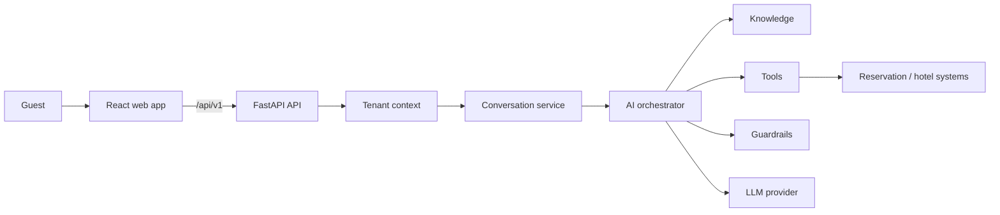

Inside the process:

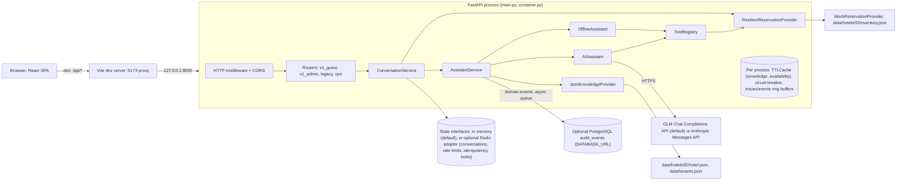

State stores are implementation details behind interfaces; nothing above the `state/` and `db/` packages depends on which one is wired.

- **Docker/containerization:** NOT REQUIRED FOR CURRENT PROJECT — removed intentionally. An earlier container setup (with an nginx edge) was removed as out of scope.
- **Hosting requirement (not implemented in this repo):** whatever serves the built SPA in a real deployment must set `Content-Security-Policy`, `Permissions-Policy` and, at TLS termination, `Strict-Transport-Security`, and must not expose `/metrics` publicly. If it sits in front of the API as a reverse proxy, it must overwrite `X-Forwarded-For` before the backend is run with `TRUST_PROXY_HEADERS=true`.
- **Dev** (`frontend/vite.config.ts`): Vite proxies `/api` to `VITE_PROXY_TARGET` (default `http://127.0.0.1:8000`). `TRUST_PROXY_HEADERS` defaults to `false`, so every browser shares the proxy's socket IP for the per-IP limits.
- **Composition root** (`container.py`): chooses every implementation.
  - `build_llm_provider` builds a provider only when `Settings.llm_configured` is true: `GLMProvider` for `LLM_PROVIDER=glm` (the default) when `LLM_API_KEY` and `LLM_BASE_URL` are set; `AnthropicProvider` for `LLM_PROVIDER=anthropic` when `ANTHROPIC_API_KEY` is set; `LatencyMockProvider` for `LLM_PROVIDER=mock` (fixed latency, for load tests; rejected in production). `AI_ENABLED=false` or `LLM_PROVIDER=none` also means no provider. Without a provider `AIAssistant` is `None` and the offline engine answers every turn.
  - `build_state` builds in-memory or Redis stores for conversations, locks, rate limiting and idempotency (`STATE_BACKEND`).
  - `PostgresAuditSink` is added as an event publisher when `DATABASE_URL` is set; it syncs tenant and hotel rows from the registry at startup.
  - All settings are listed in [CONFIGURATION.md](CONFIGURATION.md).
- **Lifespan** (`main.py`): at startup the AnyIO default thread limiter is set to `WORKER_THREADS` (default 150), and the `startup` log records it together with `state_backend`. Every 300 s (`PURGE_INTERVAL_SECONDS`), `purge_expired()` removes expired conversations (a no-op for Redis, which expires keys itself). On shutdown (uvicorn first stops accepting connections and drains in-flight requests, bounded by `--timeout-graceful-shutdown` when set), the purge task is cancelled, the audit sink is flushed and closed, the LLM client and Redis client are closed, and `shutdown_complete` is logged.

---

## 2. Request lifecycle: POST messages

`POST /api/v1/hotels/{hotel_id}/conversations/{conversation_id}/messages` with body `{"message": str(1..1000, stripped, not blank), "locale": "xx" | "xx-YY" | null}` (`schemas.PostMessageRequest`, extra fields forbidden).

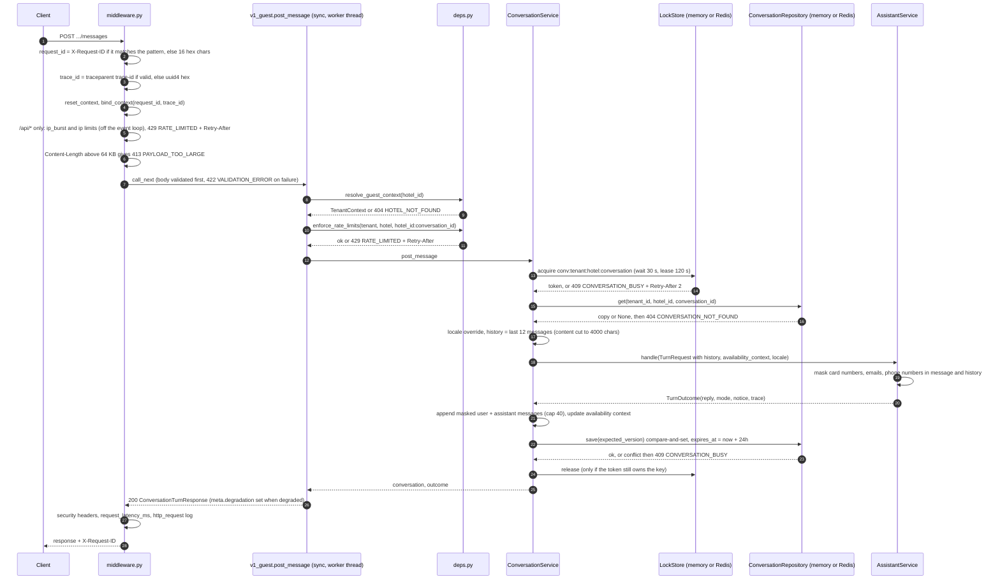

### 2.1 Middleware (`api/middleware.py`, `main.py`)

| Step | Behaviour |
|---|---|
| Request id | Accepts `X-Request-ID` only if it matches `^[A-Za-z0-9._\-]{1,64}$`. Otherwise it generates `uuid4().hex[:16]`. |
| Trace id | Parses `traceparent` against `^[0-9a-f]{2}-([0-9a-f]{32})-[0-9a-f]{16}-[0-9a-f]{2}$` and uses the 32-hex trace-id. Otherwise it uses `uuid4().hex`. No `traceparent` is sent back or propagated to outbound calls. |
| Context | `reset_context()`, then `bind_context(request_id, trace_id)` in a `ContextVar` (`core/observability.py`) that every log record reads. Tenant fields are bound later by `resolve_guest_context`, and `conversation_id` by `ConversationService`. `bind_context` updates the request's context dict in place, so ids bound inside the worker thread also appear on the middleware's `http_request` access log. |
| Body size | A `Content-Length` above 64 KB (or an unparsable one) returns **413 `PAYLOAD_TOO_LARGE`** without calling the endpoint. |
| Unhandled exception | Logs `unhandled_error` with the stack trace (server log only) and returns a structured 500 `INTERNAL_ERROR` in the envelope for that path (see §9). |
| Response headers | `X-Request-ID`, `X-Content-Type-Options: nosniff`, `Referrer-Policy: no-referrer`, `X-Frame-Options: DENY`, `Cache-Control: no-store` for `/api/*`, and `Strict-Transport-Security` only when `APP_ENV=production`. |
| Metric and log | `request_latency_ms{route=<route template or "unmatched">, status_class="2xx".."5xx"}` and a `http_request` event (method, route, status, latency_ms). |
| CORS | `CORSMiddleware` is added after the HTTP middleware, so it is the outer layer. Methods are GET/POST/DELETE. Allowed request headers: `Content-Type`, `X-Request-ID`, `Authorization`, `traceparent`. Exposed headers: `X-Request-ID`, `Retry-After`. |

### 2.2 Tenant resolution and rate limits (`api/deps.py`, `tenancy.py`, `core/rate_limit.py`, `state/redis_backend.py`)

1. The HTTP middleware applies the **IP limits** (`deps.ip_limit_exceeded`: `ip_burst`, then `ip`) to every `/api/` request before routing and body validation, running the limiter off the event loop. Unknown hotel ids, unknown routes, wrong methods and malformed bodies are therefore all counted (`test_unknown_hotel_probing_is_rate_limited`, `test_invalid_requests_and_unknown_routes_count_toward_the_ip_limit`). `/health`, `/ready` and `/metrics` are not rate limited. `resolve_guest_context` then calls `TenantRegistry.resolve(hotel_id)`. An unknown hotel, or a hotel whose tenant is not `active`, returns **404 `HOTEL_NOT_FOUND`**. On success it binds `tenant_id`, `hotel_id` and `channel=web` to the log context.
2. `enforce_rate_limits` then applies the tenant and hotel limits and, when there is a conversation id, the conversation limit. All limits are skipped when `RATE_LIMIT_ENABLED=false`, which configuration validation rejects in production. Each limit is a sliding window:

| Dimension | Key | Default limit | Applied by | Applies to |
|---|---|---|---|---|
| `ip_burst` | client IP: `X-Forwarded-For` first hop if `TRUST_PROXY_HEADERS`, else socket IP | 30 per 10 s (`RATE_LIMIT_IP_BURST`, `RATE_LIMIT_BURST_WINDOW_SECONDS`) | `ip_limit_exceeded`, called by the HTTP middleware | every `/api/` request (guest, admin, legacy, unknown routes, invalid bodies) |
| `ip` | client IP | 60/min | `ip_limit_exceeded` (middleware) | same as `ip_burst` |
| `tenant` | `tenant_id` | 3000/min | `enforce_rate_limits` | every v1 guest endpoint, legacy `/api/chat` and `/api/availability` |
| `hotel` | `hotel_id` | 1200/min | `enforce_rate_limits` | same as `tenant` |
| `conversation` | `{hotel_id}:{conversation_id}` | 20/min | `enforce_rate_limits` | endpoints that take a conversation id (messages, conversation availability, get, delete) |

A rejection raises **429 `RATE_LIMITED`** with `details=[{"dimension": ...}]`, a `Retry-After` value computed from the oldest hit in the window (minimum 1), and increments `rate_limited_total{dimension}`. A limit that ran earlier has already recorded its hit when a later limit rejects. The conversation key includes the hotel, so ids sent through another hotel's URL can't use up this hotel's conversation budget. Rate limiting happens before the conversation lookup, so unknown conversation ids still use up their own bucket. Legacy `/api/health` and `/api/hotel` and the ops endpoints are not rate limited.

The burst limit was first 15 per 5 s. A Playwright run with desktop and mobile in parallel from one IP hit it, which showed it would also affect guests sharing a hotel Wi-Fi IP, so the default was relaxed to 30 per 10 s ([DECISIONS.md](DECISIONS.md#ip-burst-limit-relaxed-to-30-per-10-s)).

**Backends.** `InMemorySlidingWindowRateLimiter` counts per process. `RedisSlidingWindowRateLimiter` keeps one sorted set per key, updated by a Lua script that uses the Redis server clock (`TIME`), and hashes the key so raw IPs never appear in Redis. If Redis fails, the Redis limiter **fails open**: it logs `rate_limiter_unavailable` and increments `state_backend_errors_total{component="rate_limiter"}`.

### 2.3 ConversationService.post_message (`conversations/service.py`)

- **Lock.** Holds a lease lock from the `LockStore` for the key `conv:{tenant_id}:{hotel_id}:{conversation_id}` for the whole turn, including the LLM call and the save, so concurrent turns on one conversation run one after another. It waits up to `CONVERSATION_LOCK_WAIT_SECONDS` (30) and then returns **409 `CONVERSATION_BUSY`** with `Retry-After: 2`. The lease is `CONVERSATION_LOCK_LEASE_SECONDS` (120); configuration validation requires it to exceed `LLM_TIMEOUT_SECONDS × (LLM_MAX_RETRIES + 1)`. Release only deletes the key if the caller's token still owns it. `InMemoryLockStore` is per process; `RedisLockStore` uses `SET NX PX` with a random token and a compare-and-delete Lua script.
- **Load.** The conversation is loaded by `(tenant_id, hotel_id, conversation_id)`. The in-memory repository returns a **deep copy** and deletes an expired entry on read; the Redis repository returns a deserialised copy and relies on the key's TTL.
- If a `locale` is sent, it overwrites `conversation.locale`.
- **Windowed history:** the last `CONVERSATION_CONTEXT_WINDOW` (12) stored messages, with each message's content cut to 4000 characters. The structured `availability_context` (dates and guest counts) is passed as `booking_context`. There is no summarisation.
- The call to `AssistantService.handle` is synchronous and runs in the AnyIO worker thread.
- **Persistence after the turn:** appends the user message as masked by `AssistantService.handle` (card numbers, and emails and phone numbers by default; not the guardrail-sanitised text) and the assistant `reply.text` with its `reply_type`. The list is capped at `CONVERSATION_MAX_MESSAGES` (40), dropping the oldest. `_update_context` stores the availability dates and guests from `reply.availability`, or merges non-null `booking_prefill` fields. Values that fail `BookingContext` validation (adults 1–10, children 0–6) are silently not remembered. `active_intent` becomes `availability` for availability or form replies and `information` otherwise.
- **Compare-and-set save.** `_touch_and_save` slides `expires_at` to now + `CONVERSATION_TTL_SECONDS` (24 h), increments `version` and calls `save(conversation, expected_version)`. If the stored version changed, the save fails, `conversation_conflicts_total` is incremented and the request returns **409 `CONVERSATION_BUSY`**. If the conversation has expired or been deleted in the meantime, the save returns 404 `CONVERSATION_NOT_FOUND`. The lock avoids wasted model calls; the version check is what guarantees no lost update if a lease expires mid-turn. The in-memory repository keeps at most `CONVERSATION_MAX_ACTIVE` (50 000) conversations and evicts the least recently written. The Redis repository stores JSON with `PX` = `expires_at − now` and does the version check in a Lua script.
- **Redis errors** from the repository or lock store return **503 `STATE_UNAVAILABLE`** with `Retry-After: 5`.
- If `handle` raises (for example, from a bug), nothing is saved and the request ends as a 500 (or as the `AppError` status, such as 503 `KNOWLEDGE_UNAVAILABLE`).

### 2.4 AssistantService.handle (`assistant/service.py`)

1. **Minimisation** (`core/privacy.py`): the message and every history item are masked before anything else. Luhn-valid card numbers are always replaced; email addresses and phone numbers (8–15 digits, date shapes excluded) are replaced when `PII_MASK_CONTACT_DETAILS=true` (the default). Masking is idempotent, so text already masked in an earlier turn passes through unchanged. The masked kinds (never values) go to `trace.pii_masked` and `pii_masked_total{kind}`. Names and addresses are not detected. See [PRIVACY.md](PRIVACY.md).
2. Creates an `AITrace` (trace_id from the context), increments `assistant_requests_total{channel}`.
3. `resolve_turn`: loads the tenant's `feature_flags`, takes today's date in the hotel's timezone (`core/clock.local_today`), and loads the knowledge snapshot for that date (`knowledge/provider.py`). The snapshot contains only entries servable on that date, and `knowledge_version` is a content hash. An unreadable or invalid hotel file raises **503 `KNOWLEDGE_UNAVAILABLE`** (`Retry-After: 30`). The time taken is recorded as `knowledge_latency_ms`. It then emits `GuestQuestionAsked` (message length and locale, no text).
4. `_respond`: runs the input guardrails, then either returns the guardrail's canned reply, runs the offline engine (AI unavailable), runs the AI, or falls back. See §5.
5. **Latency breakdown**: `total_latency_ms`, `llm_latency_ms`, `tool_latency_ms` (sum of tool calls), `retrieval_latency_ms`, and `app_latency_ms` = total − llm − tools.
6. `_observe`: increments `assistant_success_total{mode}`, `turn_latency_ms{mode}`, `app_latency_ms{mode}`, `retrieval_latency_ms`, `assistant_replies_total{reply_type,mode}`, `unsupported_question_total` for fallback replies, `assistant_fallback_total{reason}` and a `FallbackTriggered` event when a fallback was used, `guardrail_interventions_total{guardrail}` for each guardrail hit, and `prompt_injection_signals_total{flag}` for each input flag, whether or not the input was blocked. A `GuardrailTriggered` event is emitted when there are guardrail hits **or** input flags. It always emits `AssistantResponseGenerated`. The trace is recorded through `CompositeTraceSink`, which writes the log line and the in-memory ring buffer. Events go through `CompositeEventPublisher` (log, ring buffer, and `PostgresAuditSink` when configured). A failing sink or publisher is logged and ignored.

**Response** (`ConversationTurnResponse`): `request_id`, `conversation_id`, `mode` (`ai` or `offline`), `reply` (`ChatReply`), `notice`, and `meta` with `trace_id`, `prompt_version`, `tool_schema_version`, `knowledge_version` and `degradation`. `prompt_version` and `tool_schema_version` are set only when the AI path ran far enough to build the request. They are `null` for offline-only and guardrail-blocked turns, and still set when the AI call failed and the offline engine answered. `degradation` is `{code, message}` when the turn was served in degraded mode (§5) and `null` otherwise; `ai_disabled` is not a degradation.

---

## 3. AI tool flow

Source: `assistant/agent.py`, `assistant/prompts.py`, `llm/provider.py`, `llm/glm_provider.py`, `llm/anthropic_provider.py`, `tools/base.py`, `tools/builtin.py`.

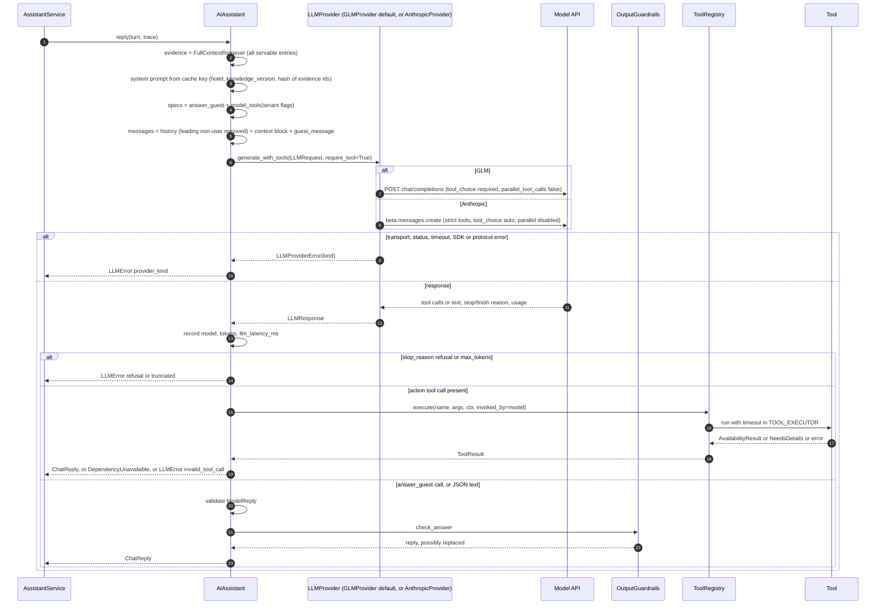

### 3.1 Prompt assembly

- **System prompt** (`render_system_prompt`): the `SYSTEM_PROMPT` template (grounding rules, reply-through-one-tool rule, availability rules, field rules) plus a `<hotel_knowledge_base>` block listing each evidence entry as `[id] title: content`. It is cached in `AIAssistant._system_prompts` keyed by `(hotel_id, knowledge_version, content_hash(evidence ids))`, so the bytes stay identical within a knowledge version. The dict has no size limit. `PROMPT_VERSION = "guest-assistant@4+<hash of template>"`.
- **Retrieval**: the AI path uses `FullContextRetriever`, which returns every servable entry, so the evidence set changes only when the knowledge changes. Semantic retrieval is *future*. Setting `semantic_retrieval_enabled` makes `build_container` raise `ConfigError`.
- **Messages** (`build_messages`): the stored history as plain `user`/`assistant` messages, each passed through `neutralise_prompt_tags` (replayed history is guest-controlled too), with leading non-user messages dropped. The final user message is `<context>` followed by `<guest_message>`. The context block holds today's date at the hotel with the weekday, the last booking details if any field is known (unknown fields written as `unknown`), and `Reply language: <name> (locale xx)` when the locale is set and not `en`. The current guest text has already been masked (§2.4) and been through `InputGuardrails`, which uses the same `neutralise_prompt_tags` helper to rewrite the angle brackets of any `<guest_message>`, `<context>`, `<system>` or `<hotel_knowledge_base>` tag to `‹ ›` (flag `prompt_tag_injection`).
- **Routing** (`llm/router.py`): model and max tokens come from `ModelRouter.route(GUEST_TURN)`. For GLM the model is `LLM_MODEL` (default `glm-5.2`); for Anthropic it is `ANTHROPIC_MODEL` (default `claude-opus-5`). `LLM_MAX_TOKENS` defaults to 16000. `effort` is set only for the Anthropic provider.
- **GLM request** (`GLMProvider._body`): OpenAI-compatible Chat Completions at `LLM_BASE_URL` + `/chat/completions`. The system prompt is the first `system` message. Tools are sent as `function` definitions with `tool_choice="required"` (the assistant always sets `require_tool=True`) and `parallel_tool_calls=false`. The httpx client has connect `min(5, LLM_TIMEOUT_SECONDS)`, read `LLM_TIMEOUT_SECONDS` (20 s), write 10 s and pool 5 s timeouts; a timed-out request is closed, not left running. The adapter retries up to `LLM_MAX_RETRIES` (1) times on timeouts, connection errors and HTTP 408/409/429/500/502/503/504/529, with jittered exponential backoff (base 0.25 s, cap 4 s). Other statuses fail immediately. Errors are typed as `timeout`, `connection`, `status` or `protocol` (non-JSON body, no `choices`). `finish_reason` maps `tool_calls`→`tool_use`, `stop`→`end_turn`, `length`→`max_tokens`, `content_filter`→`refusal`. Tool arguments that are not valid JSON are passed through unparsed and rejected by the assistant.
- **Anthropic request** (`AnthropicProvider._kwargs`): the system block has `cache_control: ephemeral`. `output_config.effort` comes from `ANTHROPIC_EFFORT` (default `low`). Every tool is sent with `strict: true`. `tool_choice={"type":"auto","disable_parallel_tool_use":true}`: a forced tool choice is rejected while thinking is on, so this adapter relies on the prompt instruction to call exactly one tool. With `ANTHROPIC_REFUSAL_FALLBACK=default` (the default), the request also sends `betas=["server-side-fallback-2026-07-01"]` and `fallbacks="default"`. The SDK client is built with `timeout=LLM_TIMEOUT_SECONDS` and `max_retries=LLM_MAX_RETRIES`, and optional `ANTHROPIC_BASE_URL`. Which errors the SDK retries is decided by the SDK. `APIStatusError`, `APITimeoutError`, `APIConnectionError` and other `AnthropicError`s map to `status`, `timeout`, `connection` and `sdk`.
- In production, `LLM_BASE_URL` and `ANTHROPIC_BASE_URL` must use `https://` (configuration validation).
- **Tool schema version**: `content_hash` of `(name, description, input_schema)` for the tools sent. The model sees three tools: `answer_guest`, `check_availability` and `request_booking_details`. `create_booking` has `exposed_to_model=False`.

Provider-neutral contract tests (`tests/test_contracts.py`) run the same failure contract against the Anthropic, GLM and scripted providers: a timeout becomes fallback reason `provider_timeout` and public code `LLM_TIMEOUT`, a 503 becomes `provider_status` and `LLM_UNAVAILABLE`, and plain text instead of a tool call becomes `invalid_output` and `LLM_UNAVAILABLE`. Each degrades to a grounded offline answer.

### 3.2 Handling the response (`AIAssistant.reply`)

1. `stop_reason == "refusal"` raises `LLMError("refusal")`. `"max_tokens"` raises `LLMError("truncated")`. Any stop reason outside the known set is mapped to `other` and is not treated specially.
2. **Tool selection**: if several tool calls come back despite the instructions, the first non-`answer_guest` call wins ("an action beats a text answer").
3. **`answer_guest`**: `ModelReply` validation (`type` must be answer, clarification or fallback, `text` non-empty, `source_ids` and `suggestions` lists). Failure raises `LLMError("invalid_output")`. On success, `OutputGuardrails.check_answer` runs these checks in order:
   - suggestions are trimmed, limited to 80 characters each, dropped if they leak or contain a price or inventory claim (`_unsupported_claim`: availability-claim or currency-amount regex), and capped at 3;
   - a secret or prompt-marker leak in the text returns a safe fallback (`secret_leak` or `prompt_leak`);
   - unknown source ids are dropped (`unknown_source`, not blocking);
   - an `answer` with no valid source becomes a fallback (`uncited_answer`);
   - an inventory claim ("sold out", "N rooms left", and similar) becomes a `collect_booking_details` form (`availability_claim`);
   - a currency amount not found in the cited entries becomes a fallback (`unsupported_price`), when `guardrail_price_check_enabled` is on. `AIAssistant._answer` evaluates this flag per call with the tenant's overrides, and the container-level value is only the default;
   - a `fallback` reply without the hotel phone number gets the contact line appended.
4. **Action tools**: `ToolRegistry.execute` runs this pipeline: lookup, then the exposure check (`invoked_by=model`), then the feature flag, then `_normalise_nulls` (turns `""`, `"null"` and `"none"` into `None`) and Pydantic validation, then authorization (roles, then confirmation and idempotency key for mutating tools), then `call_with_timeout(tool.run, definition.timeout_seconds, TOOL_EXECUTOR)`, then the `tool_audit` log (arguments never logged), `tool_calls_total`, `tool_latency_ms`, and for failures `tool_failures_total` plus a `ToolFailed` event. Validated arguments go into the trace only for read-only tools.
   - Tool errors that are the dependency's fault raise `DependencyUnavailable` (§5) with a reason from `dependency_reason`: `DEPENDENCY_UNAVAILABLE` → `reservation_unavailable`, `TIMEOUT` → `tool_timeout`, `EXECUTION_FAILED` → `tool_unavailable`.
   - Any other error (`UNKNOWN_TOOL`, `NOT_EXPOSED`, `FEATURE_DISABLED`, `INVALID_ARGUMENTS`, `BUSINESS_RULE`, authorization codes) raises `LLMError("invalid_tool_call")`.
   - Data `NeedsDetails` produces `ChatReply(type="collect_booking_details", text, booking_prefill, form_error)`. The message goes through `check_model_text` first. If it contains a leak (`secret_leak`, `prompt_leak`) or a price or inventory claim (`unsupported_claim`), it is dropped and replaced with "Please choose your dates and number of guests."
   - Data `AvailabilityResult` produces `ChatReply(type="availability", text=result.message, availability=result, suggestions=[...])`. The text is written by code, so prices never pass through the model's output.
   - Any other data type raises `LLMError("invalid_tool_call")`.
5. **No tool call**: if `text` is `None`, it raises `LLMError("invalid_output")`. If the text parses as JSON, it goes through the same `answer_guest` validation and guardrails. Plain prose raises `LLMError("invalid_output")`. With GLM the tool call is forced, which removed the plain-text replies seen earlier over the Anthropic-format endpoint ([DECISIONS.md](DECISIONS.md#glm-native-adapter-as-the-default-runtime-provider)).

Tool timeouts (`tools/builtin.py`): `check_availability` 20 s (above the reservation wrapper's 16 s deadline, §4.3), `request_booking_details` 2 s, `create_booking` 20 s.

**NeedsDetails vs AvailabilityResult** (`CheckAvailabilityTool.run`): `merge_with_context` reuses remembered dates only when the model gave **no** dates, and fills adults and children from the context when missing. If check-in, check-out or adults is still missing, the tool returns `NeedsDetails` without `form_error`. If `AvailabilityValidationError` is raised (past check-in, check-out not after check-in, more than 30 nights, check-in more than 365 days ahead, adults < 1, children < 0), it returns `NeedsDetails` with `form_error=<message>`. A `ReservationError` with code `UNAVAILABLE` raises `ToolExecutionError(DEPENDENCY_UNAVAILABLE)`, and other codes raise `EXECUTION_FAILED`. Success records `availability_search_total{source="assistant"}` and an `AvailabilityChecked` event, then returns the result.

---

## 4. Availability flows

### 4.1 Paths

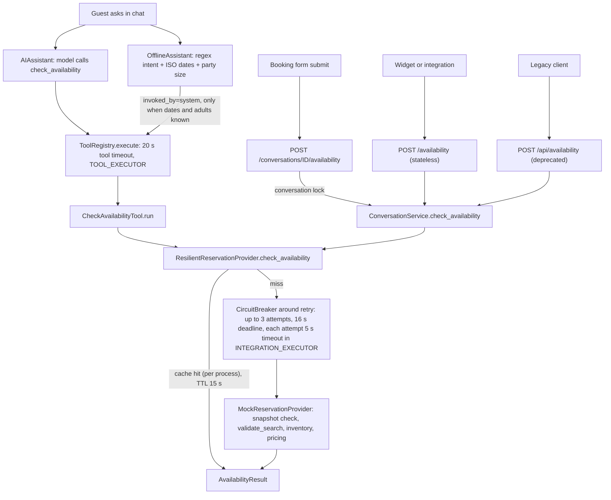

### 4.2 Form and stateless endpoints (no LLM)

`POST /api/v1/hotels/{hotel_id}/conversations/{conversation_id}/availability` and `POST /api/v1/hotels/{hotel_id}/availability` take `AvailabilityRequest` (`check_in`, `check_out`, adults 1–10, children 0–6, extra fields forbidden) and return `AvailabilityResult`. Both are sync endpoints running in the worker thread pool.

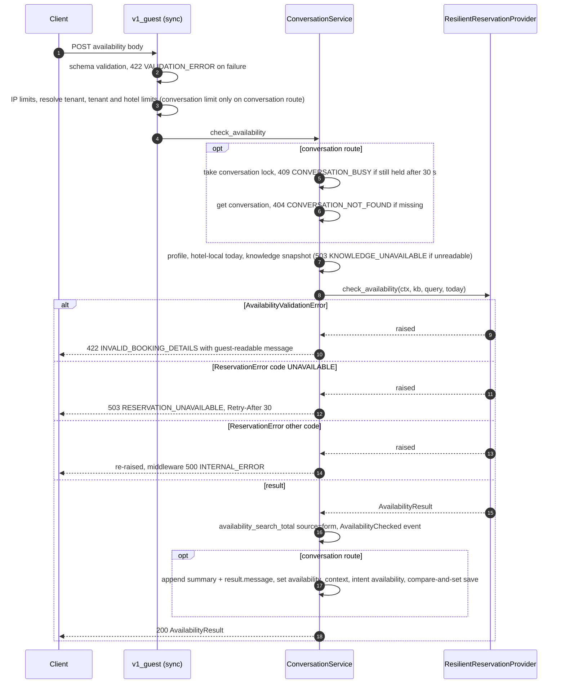

**Business validation, two ways**: on these endpoints a rule violation is **HTTP 422 `INVALID_BOOKING_DETAILS`**, and the form shows the server message inline. In chat, the same violation is **HTTP 200** with `reply.type="collect_booking_details"` and `reply.form_error` set, and the UI renders a form showing that error. Schema errors (for example adults > 10) are 422 `VALIDATION_ERROR` and never reach the provider. Only `ReservationErrorCode.UNAVAILABLE` maps to 503. Non-transient codes (for example `INVALID_REQUEST` from the snapshot/hotel mismatch check) are re-raised as bugs or misconfiguration and become a structured **500 `INTERNAL_ERROR`**.

### 4.3 Resilience wrapper (`reservations/provider.py`, `core/resilience.py`)

How a real PMS or booking engine would plug into this boundary is described in [RESERVATION_INTEGRATION.md](RESERVATION_INTEGRATION.md). No real PMS integration exists.

- **Cache**: key `availability:{tenant_id}:{hotel_id}:{today}:{query JSON}` in the process's `TTLCache` (10 000 entries, LRU), with TTL `AVAILABILITY_CACHE_TTL_SECONDS` (15). A cache hit skips the breaker and provider entirely. Only successful results are cached. The chat and form paths share the cache. The cache is per process by design, also with `STATE_BACKEND=redis`: the TTL is short, results are cheap to rebuild, and it avoids deserialising Python objects from a shared store. Replicas do not share it.
- **Order**: `breaker.call(with_retries)`, where `with_retries = retry(shielded, attempts = 1 + RESERVATION_READ_RETRIES, deadline_seconds = deadline)` and `shielded = call_with_timeout(inner call, RESERVATION_TIMEOUT_SECONDS)`. With defaults that is up to 3 attempts with a 5 s timeout each and jittered exponential backoff (base 0.1 s, cap 2 s). Only `IntegrationTimeout` and `ConnectionError` are retried.
- **Deadline**: `deadline = timeout × (retries + 1) + 1 s`, which is 16 s by default. `retry` does not start a new attempt once the elapsed time plus the next backoff reaches the deadline. The deadline is below the `check_availability` tool timeout (20 s), which `test_reservation_deadline_is_below_the_tool_timeout` asserts.
- **Business outcomes do not trip the breaker**: `AvailabilityValidationError`, and `ReservationError` with any code other than `UNAVAILABLE`, are returned through the breaker as `_BusinessOutcome` values and raised again afterwards, so the breaker sees them as successful calls.
- **Circuit breaker** (`CIRCUIT_BREAKER_FAILURES`=5, `CIRCUIT_BREAKER_RESET_SECONDS`=30): counts consecutive failed **logical calls** across all callers. The breaker wraps the whole retry sequence, so one request that times out three times counts as one failure. At the threshold the breaker opens and calls fail fast with `CircuitOpenError`. After the cooldown it is `half_open`, and **exactly one** caller gets the trial permit; concurrent callers during the trial get `CircuitOpenError`. A successful trial closes the breaker. A failed trial reopens it for a full cooldown regardless of the threshold. The breaker also accepts an `is_failure` classifier: errors it does not classify as failures never count, and during a trial they release the permit. Breaker state is per process.
- **Error mapping**: `CircuitOpenError`, or timeout or connection error after retries, becomes `ReservationError(UNAVAILABLE, retryable=True)`. While the breaker is `open`, `/ready` stays **HTTP 200** and reports `checks.reservations: "degraded"`. Every replica shares the same reservation system, so failing readiness would take all of them out of service and stop FAQ answers that still work.
- **Readiness** (`api/ops.py`): `/ready` reports `knowledge`, `state`, `reservations`, `llm` and `audit_store`. It returns 503 only when `knowledge` or `state` is failing (`state` pings Redis when `STATE_BACKEND=redis`). `audit_store` is reported (`ok`, `failing` or `not_configured`) but not required. `/health` is the only `async` endpoint, served on the event loop, so a saturated thread pool can't fail liveness.
- **Timeouts do not stop work**: when a per-attempt timeout fires, the caller stops waiting, but the worker thread keeps running until the inner call returns. Mutating calls rely on idempotency keys for this reason (§10).

---

## 5. Fallback and degradation

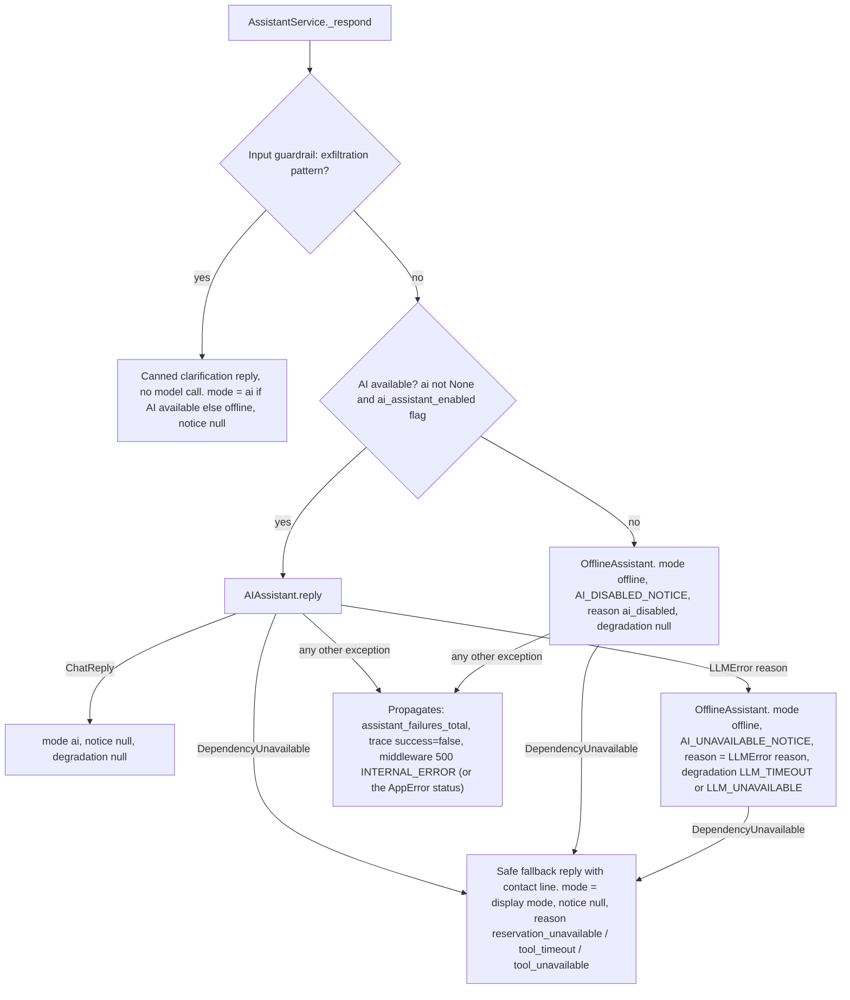

Every degraded turn above, except the unexpected exception, returns **HTTP 200**. On the v1 turn endpoint, `meta.degradation` names the public code for the fallback reason (`core/errors.DEGRADATION_CODES`): `provider_timeout` → `LLM_TIMEOUT`; `provider_status`, `provider_connection`, `provider_sdk`, `provider_protocol`, `refusal`, `truncated`, `invalid_output`, `invalid_tool_call` → `LLM_UNAVAILABLE`; `tool_timeout` → `TOOL_TIMEOUT`; `tool_unavailable` → `TOOL_UNAVAILABLE`; `reservation_unavailable` → `RESERVATION_UNAVAILABLE`. The offline engine (`assistant/offline.py`) answers only on a clear keyword match with up to 2 entries, handles party-size room questions, detects availability intent with regexes (ISO `YYYY-MM-DD` dates only), and otherwise returns a fallback with front-desk contact details. Its text is always English.

| Failure | Detection (code) | Guest-visible behaviour | HTTP | Metric / event / trace fields |
|---|---|---|---|---|
| API status error (after adapter or SDK retries) | GLM: status not 2xx; Anthropic: `APIStatusError` → `LLMProviderError("status")` → `LLMError("provider_status")` | Offline answer + "AI assistant is temporarily unavailable" notice | 200, `mode=offline`, `meta.degradation.code=LLM_UNAVAILABLE` | `llm_failure` ERROR log; `assistant_fallback_total{reason=provider_status}`; `FallbackTriggered`; trace `mode=offline, fallback_used, fallback_reason, error_type` |
| Timeout (`LLM_TIMEOUT_SECONDS`, 20 s) | GLM: `httpx.TimeoutException`; Anthropic: `APITimeoutError` → `provider_timeout` | same | 200, `LLM_TIMEOUT` | same, reason `provider_timeout` |
| Connection error | GLM: `httpx.TransportError`; Anthropic: `APIConnectionError` → `provider_connection` | same | 200, `LLM_UNAVAILABLE` | reason `provider_connection` |
| Protocol error (GLM) | non-JSON body or no `choices` → `provider_protocol` | same | 200, `LLM_UNAVAILABLE` | reason `provider_protocol` |
| Other SDK error (Anthropic) | `AnthropicError` → `provider_sdk` | same | 200, `LLM_UNAVAILABLE` | reason `provider_sdk` |
| Refusal | `stop_reason == "refusal"` (GLM `finish_reason=content_filter`) | same | 200, `LLM_UNAVAILABLE` | reason `refusal`; trace `stop_reason`, token usage, `llm_latency_ms` |
| Truncated | `stop_reason == "max_tokens"` (GLM `finish_reason=length`) | same | 200, `LLM_UNAVAILABLE` | reason `truncated` |
| Invalid output | no tool call and no text, non-JSON text, or `ModelReply` validation failure | same | 200, `LLM_UNAVAILABLE` | reason `invalid_output` |
| Invalid tool call | tool error other than `DEPENDENCY_UNAVAILABLE`, `TIMEOUT`, `EXECUTION_FAILED`, or unexpected tool data | same (offline may run `check_availability` itself as `system`) | 200, `LLM_UNAVAILABLE` | reason `invalid_tool_call`; `tool_failures_total{tool,error_code}`; `ToolFailed` |
| Reservations down / circuit open (chat) | `ToolErrorCode.DEPENDENCY_UNAVAILABLE` → `DependencyUnavailable("reservation_unavailable")` | `type=fallback` "can't check live availability right now" + contact; suggestions "Try again" and contact | 200, mode unchanged, `notice=null`, `RESERVATION_UNAVAILABLE` | `tool_failures_total`; `ToolFailed`; `assistant_fallback_total{reason=reservation_unavailable}`; `FallbackTriggered`; trace `tool_calls[].status=error` |
| Tool timeout (chat) | `ToolErrorCode.TIMEOUT` → `tool_timeout` | same | 200, `TOOL_TIMEOUT` | same, reason `tool_timeout` |
| Tool failed (chat) | `ToolErrorCode.EXECUTION_FAILED` (tool crash, or non-`UNAVAILABLE` `ReservationError` in `check_availability`) → `tool_unavailable` | same | 200, `TOOL_UNAVAILABLE` | same, reason `tool_unavailable` |
| Reservations down (form, stateless, legacy availability) | `ReservationError` with code `UNAVAILABLE` in `ConversationService.check_availability` | Form shows the localised "Could not check availability" message | **503** `RESERVATION_UNAVAILABLE`, `Retry-After: 30` | `request_latency_ms{status_class=5xx}`; no conversation write; `/ready` stays 200 with `reservations: degraded` while the breaker is open |
| Non-transient reservation error (form path) | `ReservationError` with any other code, re-raised | Form shows the localised "Could not check availability" message | **500** `INTERNAL_ERROR` | `unhandled_error` log with stack; `request_latency_ms{status_class=5xx}` |
| Knowledge file unreadable or invalid | `OSError` / `ValueError` in `JsonKnowledgeProvider._load` | UI `error.unavailable` bubble | **503** `KNOWLEDGE_UNAVAILABLE`, `Retry-After: 30` | `knowledge_load_failed` log; `assistant_failures_total` if raised inside `handle`; `/ready` 503 with `knowledge: failing` |
| Redis unavailable (`STATE_BACKEND=redis`) | `redis.RedisError` in the conversation repository or lock store | UI `error.unavailable` bubble | **503** `STATE_UNAVAILABLE`, `Retry-After: 5` | `state_backend_error` log; `/ready` 503 with `state: failing`. The rate limiter fails open instead (`state_backend_errors_total{component="rate_limiter"}`); the idempotency store raises `ReservationError(UNAVAILABLE)` |
| Conversation busy | lock not acquired within 30 s, or compare-and-set conflict | Frontend waits (capped at 3 s) and retries once; then `error.busy` bubble | **409** `CONVERSATION_BUSY`, `Retry-After: 2` | `conversation_conflicts_total` on a save conflict |
| Audit store unavailable | `PostgresAuditSink` write fails or queue is full | none | none (request unaffected) | `audit_events_total{outcome}`; `/ready` `audit_store: failing` (still ready) |
| AI disabled (`AI_ENABLED=false`, `LLM_PROVIDER=none`, missing key or base URL, or tenant flag `ai_assistant_enabled=false`) | `ai_available_for()` false | Offline answer + "AI answers are turned off" notice | 200, `mode=offline`, `meta.degradation=null` | `assistant_fallback_total{reason=ai_disabled}`; `FallbackTriggered`; `/ready` reports `llm: not_configured` (still ready) |
| Input guardrail block | `_EXFILTRATION` regex | Canned clarification; model never called | 200 | trace `mode=guardrail`, `guardrails=[input_blocked]`, `input_flags` incl. `exfiltration_attempt`; `guardrail_interventions_total{guardrail=input_blocked}`; `prompt_injection_signals_total{flag}`; `GuardrailTriggered` |
| Injection signal only (not blocked) | `_INJECTION_FLAGS` / `_PROMPT_TAGS` regexes | Normal turn; tags neutralised in the text sent to the model | 200 | trace `input_flags`; `prompt_injection_signals_total{flag}`; `GuardrailTriggered` |
| Output guardrail | `OutputGuardrails` (§3.2), including `unsupported_claim` on the booking-form message | Safe fallback, booking form, or default form text in place of the model text | 200, `mode=ai` | `guardrail_interventions_total{guardrail}`; `GuardrailTriggered` |
| Unexpected bug | any other exception | Generic "Something went wrong" (UI: `error.server`, retryable) | **500** `INTERNAL_ERROR` (no stack trace in body) | `unhandled_error` log with stack; `assistant_failures_total{error_type}` if raised inside `handle`; trace `success=false` |

Notes:
- When `DependencyUnavailable` happens after an AI-disabled or LLM fallback, `fallback_reason` is overwritten with the dependency reason and the offline notice is **not** returned.
- Worst-case chat latency: the LLM call can take up to `LLM_TIMEOUT_SECONDS` (20 s) per attempt with 1 retry plus backoff, and a tool can add up to 20 s. That can exceed the frontend's 45 s abort (`REQUEST_TIMEOUT_MS`); any proxy placed in front of the API by the host needs a read timeout above that. When the client times out, the server may still finish the turn and save it.
- The legacy `/api/chat` response has no `meta`, so it does not report degradation.

---

## 6. Tenant isolation

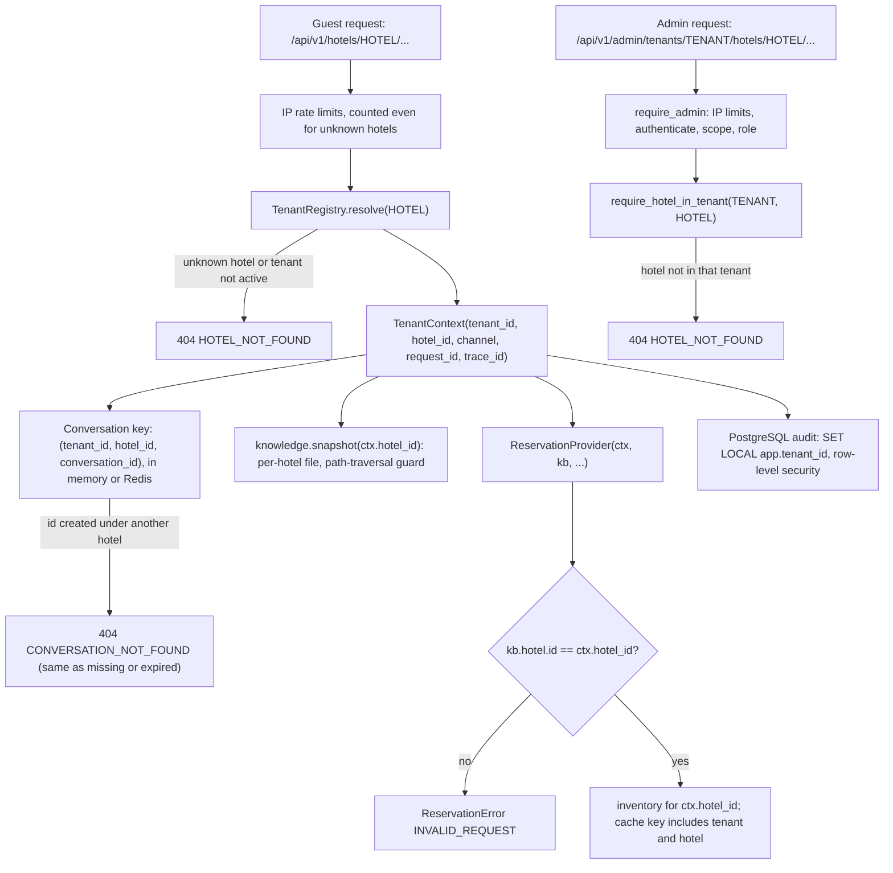

- **Resolution**: `TenantRegistry` (`tenancy.py`) is loaded from `data/tenants.json`. Hotel ids are globally unique, and loading fails if a hotel is assigned to two tenants. The tenant is always derived from `hotel_id` and never taken from client input.
- **Repository scoping**: both conversation repositories are keyed by the full triple (the Redis key is `{prefix}:conv:{tenant_id}:{hotel_id}:{conversation_id}`), so a conversation id used under another hotel's URL is simply not found. That gives **404 `CONVERSATION_NOT_FOUND`**, the same response as a missing or expired conversation, so the id's existence is not revealed. The Redis integration test reads a conversation through another tenant's hotel on another replica and gets 404.
- **Knowledge**: `JsonKnowledgeProvider._hotel_path` rejects non-alphanumeric ids (other than `-` and `_`) and checks that the file's declared hotel id matches. Cache keys are per hotel.
- **Reservations**: `MockReservationProvider.check_availability` refuses a knowledge snapshot from another hotel (`INVALID_REQUEST`). `bookings_for` filters by tenant and hotel. The idempotency scope is `booking:{tenant_id}:{hotel_id}` (hashed in Redis keys).
- **PostgreSQL** (`migrations/0001_domain_model.sql`): every table has `tenant_id`, composite keys and foreign keys include it so references can't cross tenants, and row-level security is enabled and forced on all tables with the policy `tenant_id = current_setting('app.tenant_id')`. The audit sink writes each tenant's batch in its own transaction with `SET LOCAL app.tenant_id`. The application role is not a superuser and has no `BYPASSRLS`. See §12.
- **Tools**: tools with `required_roles` also check `principal.can_access_hotel(ctx.tenant)`.
- **Observability**: metrics carry no tenant or hotel labels (`core/metrics.py`). Per-tenant data is in logs, events and traces through the bound context.

---

## 7. Admin API and auth modes

Routes (`api/v1_admin.py`, read-only): `GET /api/v1/admin/tenants/{tenant_id}/hotels` (hotel_staff), `.../hotels/{hotel_id}/knowledge?include_unpublished=` (hotel_staff), `.../hotels/{hotel_id}/ai-config` (hotel_admin). Write operations (publishing content, changing AI configuration) are *designed, not exposed*.

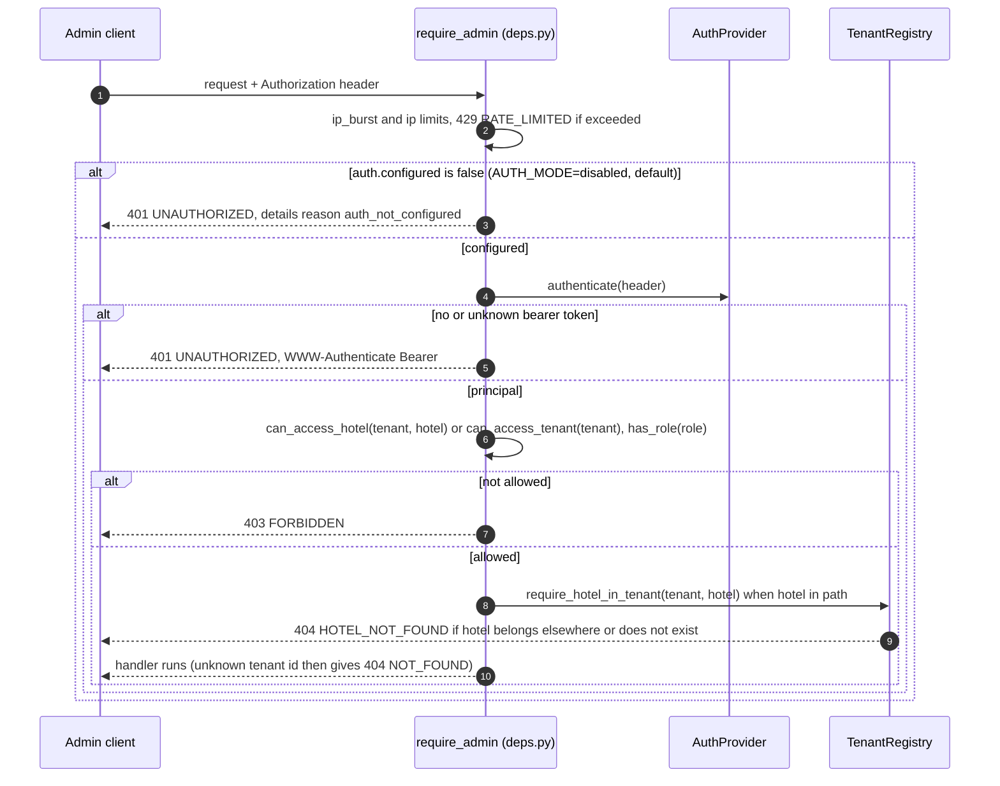

| Mode | Implementation | Behaviour |
|---|---|---|
| `disabled` (default) | `DisabledAuthProvider` | Every admin call returns 401 `UNAUTHORIZED` with `details=[{"reason": "auth_not_configured"}]`. The endpoints do not claim protection they don't have. |
| `static_token` | `StaticTokenAuthProvider` | **Development only**; `Settings.validate()` rejects it when `APP_ENV=production`. `ADMIN_API_TOKENS="<token>=<tenant or *>:<role>[\|role]:[hotel\|hotel]"`. Tokens need at least 16 characters. `*` is allowed only for `platform_admin`. Tokens are compared with `hmac.compare_digest`. |
| OIDC / JWT | not implemented | *Future*: an OIDC-aware gateway or an `AuthProvider` that validates issuer, audience, expiry and JWKS signature and maps claims to `Principal`. |

Role hierarchy (`auth/principal.py`): platform_admin includes tenant_admin, which includes hotel_admin, which includes hotel_staff. `guest` is separate. A principal limited to specific hotels gets **403** for other hotels, because the scope check runs first. The **404** from `require_hotel_in_tenant` applies when the principal can access the tenant in the path but the hotel id belongs to a different tenant or does not exist. It is deliberately indistinguishable from "does not exist".

---

## 8. Frontend interaction model

Source: `frontend/src/hooks/useChat.ts`, `frontend/src/api/client.ts`, `components/MessageList.tsx`, `components/AvailabilityForm.tsx`.

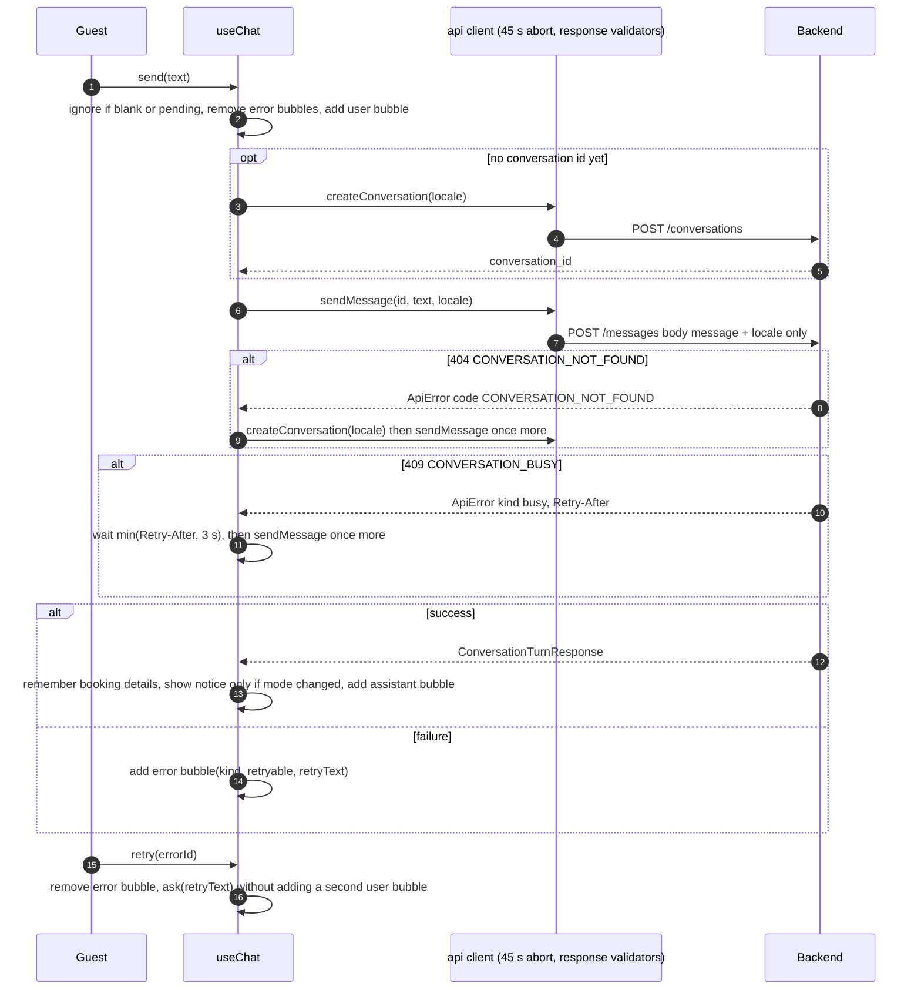

- **Lazy creation**: no conversation exists until the first message or form submission (`withConversation`). The client stores only the id. History and booking context stay on the server.
- **Minimal payload**: messages send only `{message, locale}`. The client never sends history, so it can't forge context. The composer caps input at 1000 characters, matching the server schema.
- **Expired conversation**: a `CONVERSATION_NOT_FOUND` code makes the hook create a new conversation and repeat the call **once**. A second failure surfaces as an error. The new conversation starts with empty server-side history and booking context.
- **Busy conversation**: a 409 on `sendMessage` (another tab, or a double submit still being answered) makes the hook wait for `Retry-After` capped at 3 s and send once more. A second 409 surfaces as a `busy` error.
- **Response validation**: a 2xx body that doesn't have the shape the UI renders (hotel, conversation, turn, availability validators; for example a proxy HTML page) raises `unexpected` instead of rendering broken data.
- **Error kinds** (`client.ts` → `MessageList.tsx` `ERROR_KEYS`):

| Condition | Kind | Chat bubble text key | Retry button |
|---|---|---|---|
| `fetch` rejects | `network` | `error.network` | yes |
| 45 s `AbortController` fires | `timeout` | `error.timeout` | yes |
| 429 | `rate_limited` (`retryAfterSeconds` from header, default 5; captured but not used by the UI) | `error.rateLimited` | yes |
| 409 | `busy` (after the one automatic retry) | `error.busy` | yes |
| 413 | `too_large` | `error.tooLarge` | no |
| 422 | `validation` (message = server message) | `error.server` | no |
| 404 | `not_found` (after the one recreate attempt, if applicable) | `error.server` | no |
| 503 | `unavailable` | `error.unavailable` | yes |
| 2xx with an unexpected body | `unexpected` | `error.server` | yes |
| other non-2xx | `server` | `error.server` | yes |

- **Retry without duplication**: `retry` removes the error bubble and calls `ask(retryText)`. It does not add a second user bubble. The server has no message idempotency key, so a retry after a client timeout where the server had already finished stores the exchange twice on the server.
- **Booking form**: `openBookingForm` renders a local `collect_booking_details` bubble pre-filled from the last known details. Submission calls `checkAvailability`, which posts **directly** to `/conversations/{id}/availability` (no LLM, same lazy-create and recreate behaviour, no automatic busy retry). The form does its own client checks (check-out after check-in, at most 30 nights, adults 1–10, children 0–6). On `validation` it shows the server message inline (for example from `INVALID_BOOKING_DETAILS`). Any other error shows `error.availability` inline, and the form stays open for another try. On success the form collapses to a summary and a user bubble plus an availability bubble are added. A `form_error` in a chat reply is passed to the form as `serverError`.
- **Locale**: `useChat(locale)` takes the i18n locale (`en` or `hi`, offered only if listed in the hotel's `languages`). It is sent at conversation creation and with every message, and the server applies it to the prompt's reply-language line when it is not `en`. The availability request carries no locale, and code-generated availability text and offline answers are English.
- **Degraded-mode notice**: shown once when `mode` changes, not on every reply. `meta.degradation` is typed in `frontend/src/api/types.ts`.

---

## 9. Error model

`api/errors.py` produces two envelopes depending on the path:

```jsonc
// v1 (/api/v1/*) and non-API paths (/health, /ready, /metrics)
{"error": {"code": "CONVERSATION_NOT_FOUND", "message": "...", "request_id": "…", "details": null}}
// legacy (/api/* but not /api/v1/*)
{"request_id": "…", "error": {"code": "validation_error", "message": "...", "details": [...]}}
```

Legacy codes use `LEGACY_CODES` for `validation_error`, `invalid_booking_details` and `internal_error`, and `code.lower()` for everything else (for example `rate_limited`, `reservation_unavailable`). Handlers exist for `AppError`, `RequestValidationError` (422 `VALIDATION_ERROR`, `details=[{field, message}]`) and Starlette `HTTPException`. The latter maps 401 to `UNAUTHORIZED`, 403 to `FORBIDDEN`, 404 to `NOT_FOUND`, 405 to `METHOD_NOT_ALLOWED`, 413 to `PAYLOAD_TOO_LARGE` and 429 to `RATE_LIMITED`; any other status below 500 becomes `VALIDATION_ERROR`, and 500 and above `INTERNAL_ERROR`. Stack traces never appear in responses (tested with an injected `RuntimeError`).

| Code (`core/errors.py`) | HTTP | Raised by |
|---|---|---|
| `VALIDATION_ERROR` | 422 | request schema validation, malformed JSON |
| `INVALID_BOOKING_DETAILS` | 422 | availability business rules on form, stateless and legacy endpoints |
| `PAYLOAD_TOO_LARGE` | 413 | middleware, `Content-Length` above 64 KB |
| `METHOD_NOT_ALLOWED` | 405 | wrong HTTP method on an existing route |
| `NOT_FOUND` | 404 | unknown tenant (admin), `/metrics` when disabled, unmatched routes |
| `HOTEL_NOT_FOUND` | 404 | unknown or inactive hotel, admin hotel outside tenant, bad hotel path |
| `CONVERSATION_NOT_FOUND` | 404 | missing, expired, deleted or other-hotel conversation |
| `UNAUTHORIZED` | 401 | admin with `AUTH_MODE=disabled` (`details=[{"reason": "auth_not_configured"}]`), or missing or invalid token (+ `WWW-Authenticate: Bearer`) |
| `FORBIDDEN` | 403 | admin scope or role check |
| `RATE_LIMITED` | 429 | HTTP middleware IP limits (every `/api/` request) or `enforce_rate_limits` (tenant, hotel, conversation) (+ `Retry-After`, `details=[{"dimension"}]`) |
| `CONVERSATION_BUSY` | 409 | conversation lock not acquired in time, or compare-and-set conflict on save (+ `Retry-After: 2`) |
| `RESERVATION_UNAVAILABLE` | 503 | `ReservationError` with code `UNAVAILABLE` on availability endpoints (+ `Retry-After: 30`); also a degradation code |
| `KNOWLEDGE_UNAVAILABLE` | 503 | hotel knowledge file unreadable or invalid (+ `Retry-After: 30`) |
| `STATE_UNAVAILABLE` | 503 | Redis error in the conversation repository or lock store (+ `Retry-After: 5`) |
| `LLM_TIMEOUT`, `LLM_UNAVAILABLE`, `TOOL_TIMEOUT`, `TOOL_UNAVAILABLE` | — (200) | not HTTP errors: reported in `meta.degradation` of a v1 turn response (§5) |
| `FEATURE_DISABLED`, `NOT_SUPPORTED`, `IDEMPOTENCY_CONFLICT` | — | defined in the enum, but no HTTP path raises them today (similar codes exist inside `ToolErrorCode` / `ReservationErrorCode`) |
| `INTERNAL_ERROR` | 500 | unhandled exception (middleware), including non-`UNAVAILABLE` `ReservationError` on availability endpoints |

**Legacy endpoints** (`api/legacy.py`, default hotel only): `GET /api/health`, `GET /api/hotel`, `POST /api/chat` (stateless, with client-sent `history` of up to 20 items and `booking_context`, and no `meta`; the history is masked like v1 history), and `POST /api/availability`. Every response carries `Deprecation: true` and `Link: <successor>; rel="successor-version"`, pointing at `/health`, `/api/v1/hotels/{id}`, `/api/v1/hotels/{id}/conversations` and `/api/v1/hotels/{id}/availability` respectively. The deprecation headers are set on the injected `Response`, so they are present on successful responses. Error responses are built by the exception handlers and do not include them.

---

## 10. Idempotent booking flow (architecture exercise)

`create_booking` (`tools/builtin.py`) exists to exercise the authorization and idempotency path end to end. It is **not exposed to the model** (`exposed_to_model=False`), requires the `booking_tools_enabled` flag (default off), and **no HTTP endpoint invokes it**. Only tests call it (`invoked_by="api"`). Modify and cancel raise `NOT_SUPPORTED` in the mock.

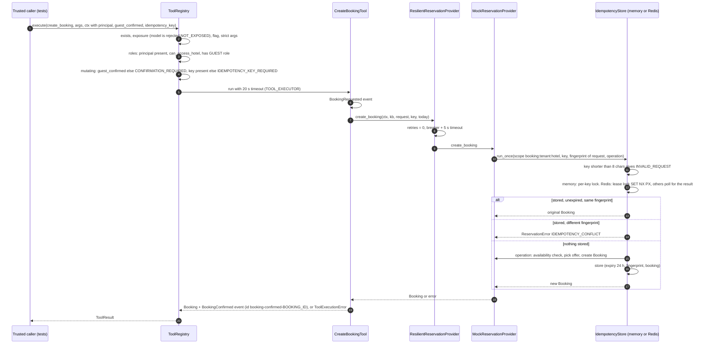

Semantics:
- **Same key and same request** (fingerprint = `content_hash(request JSON incl. guest_reference, 32)`): returns the original booking and no second booking is created.
- **Same key and different request**: `IDEMPOTENCY_CONFLICT`. It passes through the resilience wrapper as a business outcome (does not trip the breaker) and becomes `ToolErrorCode.BUSINESS_RULE`.
- **Concurrent duplicates**: in memory, a per-key `threading.Lock` serialises them within one process. With Redis (`RedisIdempotencyStore`), one replica takes a lease lock (`SET NX PX`, 60 s) and runs the operation; the others poll for the stored result for up to 15 s and then get `IN_PROGRESS`. A Redis error becomes `ReservationError(UNAVAILABLE)`. Keys hash the scope and the idempotency key.
- **Failures are not stored**: if the operation raises (for example `NOT_AVAILABLE`, which becomes `BUSINESS_RULE`), a later call with the same key runs it again.
- **No retries on mutations**: `ResilientReservationProvider` uses `retries=0` for create, modify and cancel. The idempotency key makes a *caller's* retry safe. If the 5 s timeout fires, the operation may still finish in its worker thread and store its result, and a caller retry with the same key then returns that booking.
- **One durable confirmation**: `BookingConfirmed` uses the deterministic event id `booking-confirmed-{booking_id}`, so idempotent replays on any replica record one audit row.
- **Evidence**: 9 concurrent duplicate calls across 3 in-process replicas sharing Redis produced 1 booking id, created on exactly 1 replica (`tests/integration/test_redis_state.py`). This integration test was verified locally once against Redis 7.4; it skips unless `TEST_REDIS_URL` is set and is not run in CI.
- **Limits**: the mock's booking dict is per process, and a Redis lease that expires before the operation finishes lets a second attempt start. The `bookings` table's unique `(tenant_id, hotel_id, idempotency_key)` constraint exists in the migration as the durable backstop, but no bookings repository is wired (*designed*). See [RESERVATION_INTEGRATION.md](RESERVATION_INTEGRATION.md).

---

## 11. Concurrency notes

- **Sync endpoints, async liveness**: `/health` is the only `async def` endpoint, so it answers even when the worker thread pool is saturated. Every other endpoint, including `post_message`, both availability endpoints and legacy `chat`, is a plain `def` that FastAPI runs in the AnyIO worker thread pool. Earlier, those endpoints were `async def` wrappers that ran tenant resolution and rate limiting (Redis round trips in multi-replica mode) on the event loop; this was found during an earlier (since removed) container verification and fixed by making them sync ([DECISIONS.md](DECISIONS.md#sync-endpoints-instead-of-async-wrappers)). A regression test (`test_blocking_state_calls_never_run_on_the_event_loop`) checks that only `/health` is async and that it stays under 300 ms while 4 requests wait on a slow rate limiter.
- **Thread pool size**: the AnyIO thread limiter is set to `WORKER_THREADS` (default 150) at startup. Each in-flight AI turn holds one worker thread for the whole LLM call, so this, not CPU, caps concurrent AI turns per process. The measurement behind the default is in [PERFORMANCE.md](PERFORMANCE.md).
- **Two executors** (`core/resilience.py`): `TOOL_EXECUTOR` (32 workers) runs tool bodies, and `INTEGRATION_EXECUTOR` (32 workers) runs reservation calls. A tool running in `TOOL_EXECUTOR` calls the reservation wrapper, which submits to `INTEGRATION_EXECUTOR`. Using one shared pool could deadlock under load, with every worker blocked waiting on an inner call that can't get a worker.
- **Timeouts do not kill work**: `call_with_timeout` calls `future.cancel()`, which cannot stop a thread that is already running. A timed-out call keeps its worker until it returns. GLM HTTP timeouts are different: httpx closes the connection (tested with a real slow server).
- **Context propagation**: `call_with_timeout` runs the function via `contextvars.copy_context().run`, so `request_id`, `trace_id` and tenant fields reach logs written in worker threads. `bind_context` updates the request's context dict in place, so ids bound in a worker thread are also visible to the middleware's access log.
- **Thread safety**: the in-memory conversation repository, rate limiter, lock store, `TTLCache`, circuit breaker and in-memory idempotency store use `threading.Lock` or `threading.Condition`. The Redis implementations do each multi-step operation in one Lua script or a single `SET NX PX`. `MockReservationProvider`'s inventory and booking dicts and `AIAssistant._system_prompts` are unlocked plain dicts. That is safe enough for idempotent loads under the GIL, but not a design guarantee.
- **Per-conversation serialisation**: chat turns and booking-form submissions on a conversation take the same lease lock from the `LockStore` (§2.3), per process with `STATE_BACKEND=memory` and across replicas with Redis. The lock is an efficiency guard: a second request waits instead of spending a model call that would be thrown away. Correctness comes from the compare-and-set save: with locks disabled, 6 concurrent turns on 3 replicas saved 1 and rejected 5 with 409, with no lost update. With locks enabled, 6 concurrent turns on 3 in-process replicas stored all 12 messages (in-process tests with a shared Redis; verified locally once, not run in CI). Conversation deletion does not take the lock.
- **No message idempotency**: messages carry no idempotency key. A client retry after a timeout, where the server had already finished, stores the exchange twice.
- **What is shared and what is not**: see §12.

---

## 12. Shared state and durable records

| State | `STATE_BACKEND=memory` (default) | `STATE_BACKEND=redis` |
|---|---|---|
| Conversations | per process, LRU cap 50 000, purge task | shared, JSON with native TTL, compare-and-set in Lua |
| Rate-limit windows | per process | shared, sorted set + Lua, server clock, fails open |
| Idempotency results | per process | shared, lease lock + stored result with fingerprint |
| Conversation locks | per process | shared, `SET NX PX` token, compare-and-delete release |
| Knowledge and availability cache | per process | per process (by design) |
| Circuit breaker | per process | per process |
| Mock bookings, event and trace ring buffers (500 each), system prompt cache | per process | per process |

With `STATE_BACKEND=memory` and several replicas or workers, limits are multiplied, locks don't serialise turns across processes, conversations are not found on other replicas without sticky routing, and duplicate bookings are not prevented across processes. Redis holds only state that may be lost without losing business records. Why this split: [DECISIONS.md](DECISIONS.md#redis-for-ephemeral-shared-state-postgresql-for-durable-records).

**PostgreSQL** (`migrations/`, `db/`):
- `migrations/0001_domain_model.sql` defines tenants, hotels, rooms, knowledge_documents, knowledge_versions, conversations, messages, tool_calls, bookings, audit_events and evaluations, with `tenant_id` on every table, composite keys and foreign keys, a unique `(tenant_id, hotel_id, idempotency_key)` on bookings, CHECK constraints, and row-level security enabled and forced on all tables.
- `python -m app.db.migrate` applies migrations in order, one transaction each, records a SHA-256 checksum per migration in `schema_migrations` (an edited applied migration is an error), and takes `pg_advisory_lock` against concurrent migrators.
- **Wired**: `PostgresAuditSink` (when `DATABASE_URL` is set). `publish` puts the event on a bounded queue (10 000) and returns; a background thread inserts batches, one transaction per tenant. Dropped events are counted in `audit_events_total{outcome}`. The queue is flushed and closed on shutdown. This is best-effort, not a transactional outbox ([DECISIONS.md](DECISIONS.md#audit-sink-is-asynchronous-and-best-effort)). Events carry ids and counts, never guest text.
- **Retention**: `python -m app.db.retention` (`AUDIT_RETENTION_DAYS`, default 365) deletes old audit events and expired database conversations tenant by tenant, under row-level security with the application role.
- **Not wired (designed)**: repositories for conversations, messages, tool calls, bookings, knowledge and evaluations. Conversations live in memory or Redis.

Running locally, optional adapters and migrations: [DEPLOYMENT.md](DEPLOYMENT.md). Environment variables: [CONFIGURATION.md](CONFIGURATION.md). Data handling and retention: [PRIVACY.md](PRIVACY.md).
