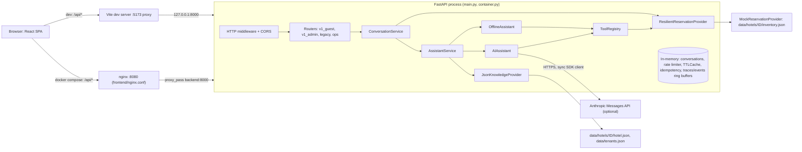
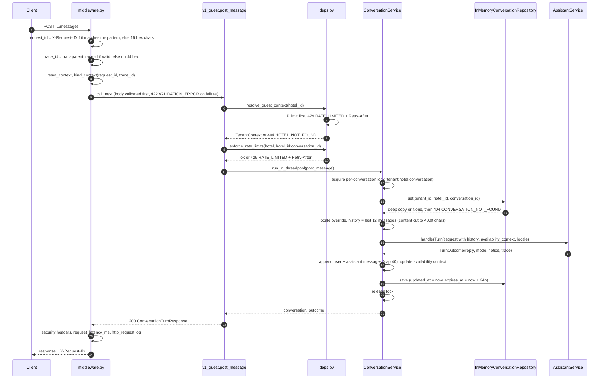
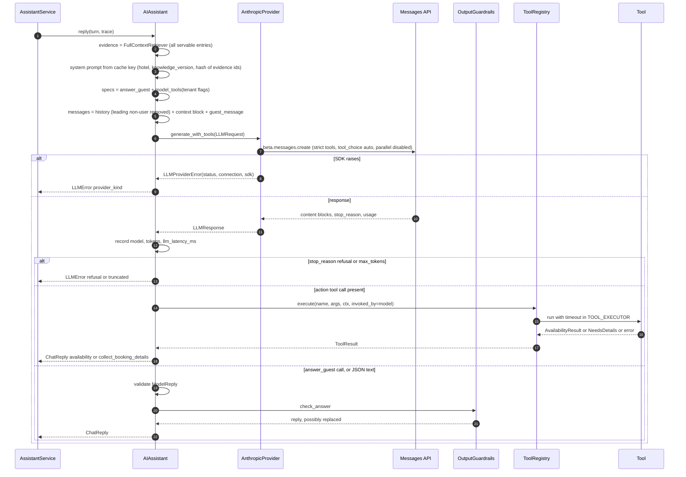
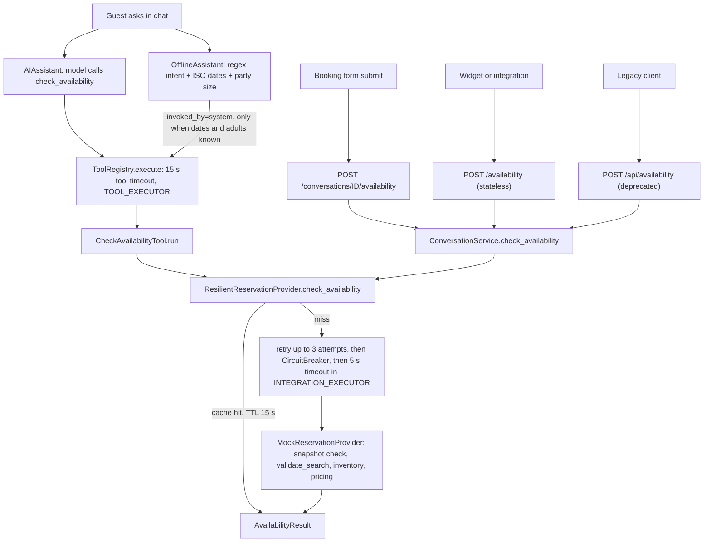
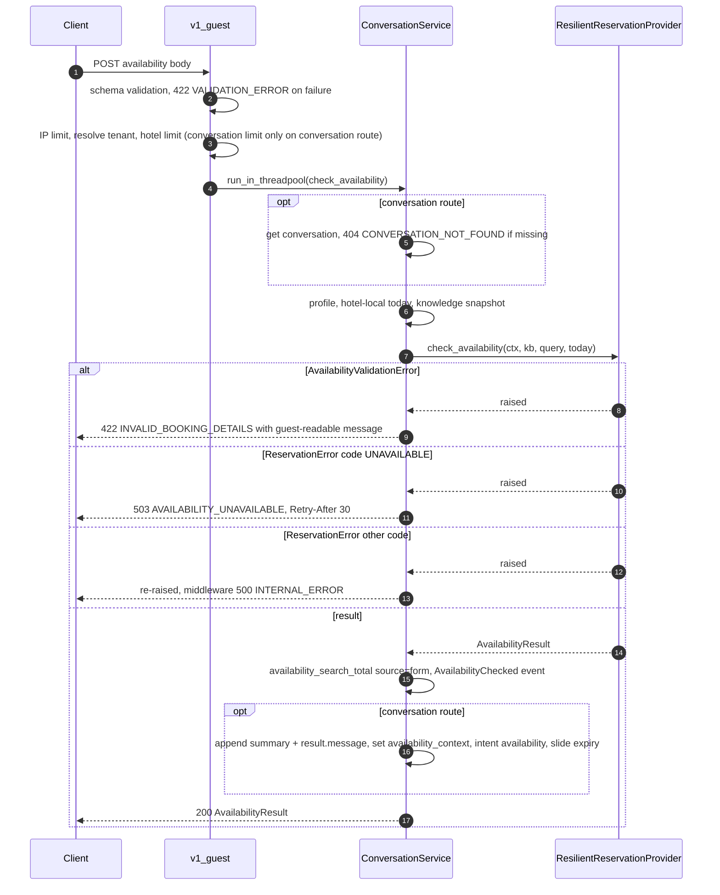
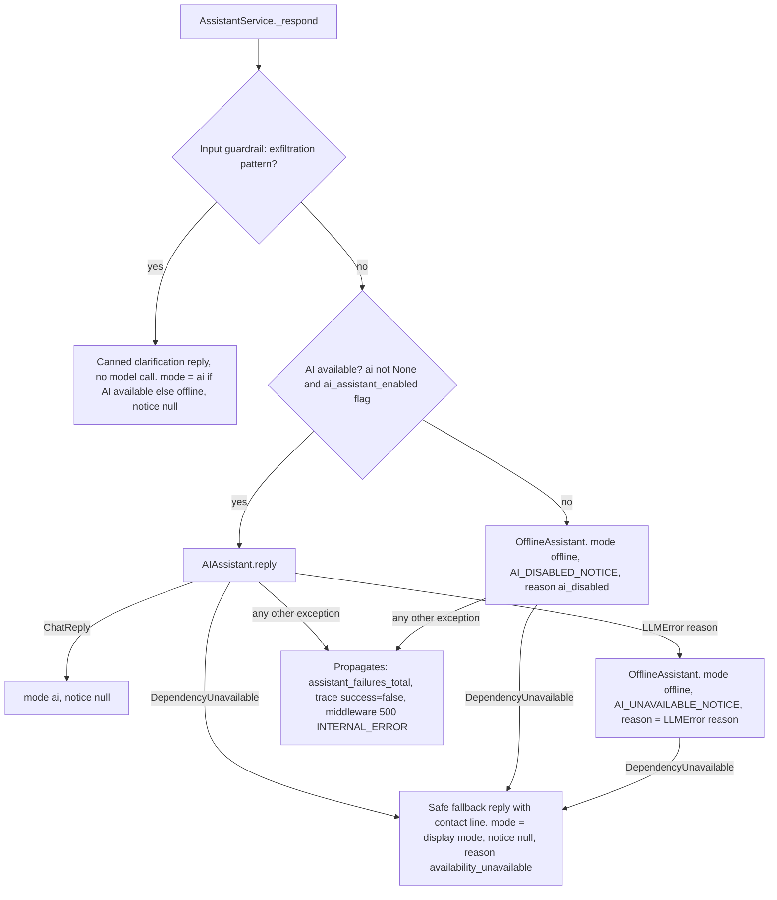
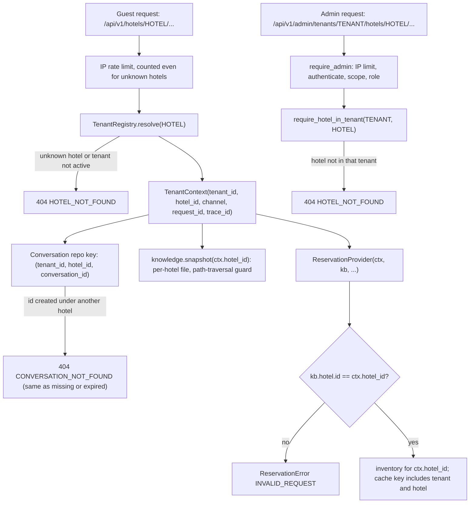
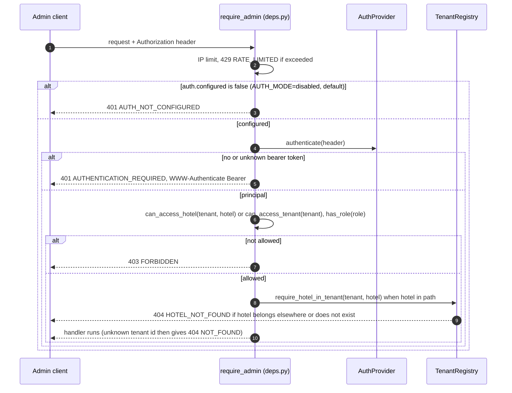
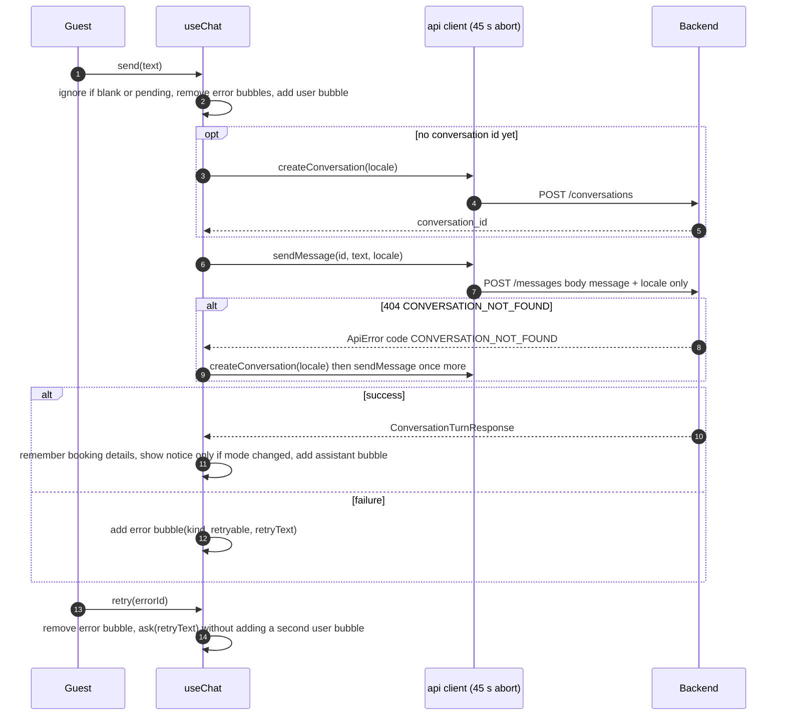
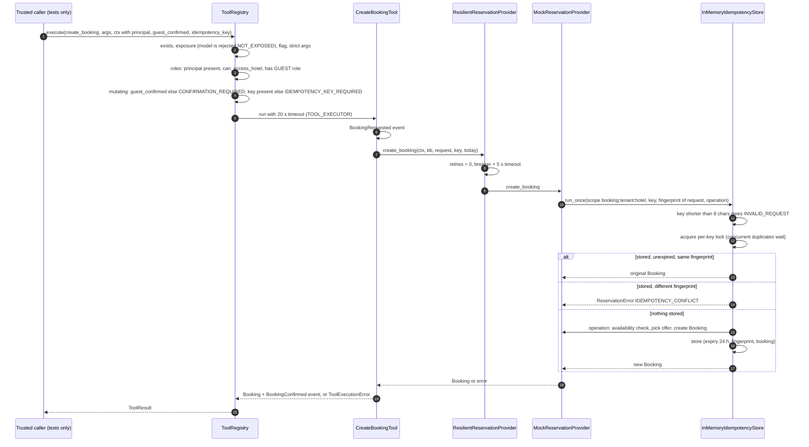

# System Design: Request Flows and Failure Behaviour

This document describes how requests move through the hotel guest assistant and what happens when something fails. It is written from the code as it is today. Paths are relative to `backend/app/` unless they start with `frontend/`. Anything described as *future* or *designed* is not implemented.

> Status: this is a development build. The Anthropic adapter (`llm/anthropic_provider.py`) is exercised by tests against a fake messages client. It has **not** been checked against the live Anthropic API in this repository, and nothing here is production-ready. All stores (conversations, rate limits, caches, idempotency, bookings) live in process memory.

Contents: [1 Topology](#1-runtime-topology) · [2 Message lifecycle](#2-request-lifecycle-post-messages) · [3 AI tool flow](#3-ai-tool-flow) · [4 Availability](#4-availability-flows) · [5 Fallback and degradation](#5-fallback-and-degradation) · [6 Tenant isolation](#6-tenant-isolation) · [7 Admin API](#7-admin-api-and-auth-modes) · [8 Frontend](#8-frontend-interaction-model) · [9 Error model](#9-error-model) · [10 Idempotent booking](#10-idempotent-booking-flow-architecture-exercise) · [11 Concurrency](#11-concurrency-notes)

---

## 1. Runtime topology



- **Compose** (`docker-compose.yml`, `frontend/nginx.conf`): nginx serves the built SPA and proxies only `location /api/` to `backend:8000`. It **overwrites** `X-Forwarded-For` with `$remote_addr` and `X-Request-ID` with `$request_id`, and uses `proxy_read_timeout 60s` and `client_max_body_size 64k`. Security headers (`X-Content-Type-Options`, `Referrer-Policy`, `X-Frame-Options`, CSP) come from `frontend/security-headers.conf`, copied to `/etc/nginx/snippets/` and included in each of the `/api/`, `/assets/` and `/` locations. It has to be included per location because nginx drops inherited `add_header` directives in any block that sets its own. On `/api/`, `proxy_hide_header` removes the backend's copies of the first three headers so responses don't carry duplicates. The `/healthz` location has no include. The backend runs with `TRUST_PROXY_HEADERS=true`. `/health`, `/ready` and `/metrics` are not under `/api/`, so nginx does not proxy them (they fall through to the SPA's `index.html`).
- **Dev** (`frontend/vite.config.ts`): Vite proxies `/api` to `VITE_PROXY_TARGET` (default `http://127.0.0.1:8000`). `TRUST_PROXY_HEADERS` defaults to `false`, so every browser shares the proxy's socket IP for the per-IP limit.
- **Composition root** (`container.py`): chooses every implementation. `AnthropicProvider` is only built when `Settings.llm_configured` is true (`AI_ENABLED` is true, `LLM_PROVIDER=anthropic`, and an API key is set). Otherwise `AIAssistant` is `None` and the offline engine answers every turn.
- **Background task** (`main.py`): every 300 s (`PURGE_INTERVAL_SECONDS`), `purge_expired()` removes expired conversations.

---

## 2. Request lifecycle: POST messages

`POST /api/v1/hotels/{hotel_id}/conversations/{conversation_id}/messages` with body `{"message": str(1..1000, stripped, not blank), "locale": "xx" | "xx-YY" | null}` (`schemas.PostMessageRequest`, extra fields forbidden).



### 2.1 Middleware (`api/middleware.py`, `main.py`)

| Step | Behaviour |
|---|---|
| Request id | Accepts `X-Request-ID` only if it matches `^[A-Za-z0-9._\-]{1,64}$`. Otherwise it generates `uuid4().hex[:16]`. In compose, nginx always replaces the header with its own `$request_id`. |
| Trace id | Parses `traceparent` against `^[0-9a-f]{2}-([0-9a-f]{32})-[0-9a-f]{16}-[0-9a-f]{2}$` and uses the 32-hex trace-id. Otherwise it uses `uuid4().hex`. No `traceparent` is sent back or propagated to outbound calls. |
| Context | `reset_context()`, then `bind_context(request_id, trace_id)` in a `ContextVar` (`core/observability.py`) that every log record reads. Tenant fields are bound later by `resolve_guest_context`. The endpoint runs in a copied context, so the middleware's own access log line carries only `request_id` and `trace_id`. |
| Unhandled exception | Logs `unhandled_error` with the stack trace (server log only) and returns a structured 500 `INTERNAL_ERROR` in the envelope for that path (see §9). |
| Response headers | `X-Request-ID`, `X-Content-Type-Options: nosniff`, `Referrer-Policy: no-referrer`, `X-Frame-Options: DENY`, `Cache-Control: no-store` for `/api/*`, and `Strict-Transport-Security` only when `APP_ENV=production`. |
| Metric and log | `request_latency_ms{route=<route template or "unmatched">, status_class="2xx".."5xx"}` and a `http_request` event (method, route, status, latency_ms). |
| CORS | `CORSMiddleware` is added after the HTTP middleware, so it is the outer layer. Methods are GET/POST/DELETE. Allowed request headers: `Content-Type`, `X-Request-ID`, `Authorization`, `traceparent`. Exposed headers: `X-Request-ID`, `Retry-After`. |

### 2.2 Tenant resolution and rate limits (`api/deps.py`, `tenancy.py`, `core/rate_limit.py`)

1. `resolve_guest_context` first applies the **IP limit** (`enforce_ip_limit`) and then calls `TenantRegistry.resolve(hotel_id)`. Because the IP limit comes first, requests probing unknown hotel ids are counted too. An unknown hotel, or a hotel whose tenant is not `active`, returns **404 `HOTEL_NOT_FOUND`**. On success it binds `tenant_id`, `hotel_id` and `channel=web` to the log context.
2. `enforce_rate_limits` then applies the hotel limit and, when there is a conversation id, the conversation limit. All limits are skipped when `RATE_LIMIT_ENABLED=false`, which configuration validation rejects in production. Each limit uses a 60 s sliding window:

| Dimension | Key | Default limit | Applied by | Applies to |
|---|---|---|---|---|
| `ip` | `X-Forwarded-For` first hop if `TRUST_PROXY_HEADERS`, else socket IP | 60/min | `enforce_ip_limit`, called from `resolve_guest_context` and `require_admin` | every v1 guest endpoint, legacy `/api/chat` and `/api/availability`, every admin endpoint |
| `hotel` | `hotel_id` | 1200/min | `enforce_rate_limits` | every v1 guest endpoint, legacy `/api/chat` and `/api/availability` |
| `conversation` | `{hotel_id}:{conversation_id}` | 20/min | `enforce_rate_limits` | endpoints that take a conversation id (messages, conversation availability, get, delete) |

A rejection raises **429 `RATE_LIMITED`** with `details=[{"dimension": ...}]`, a `Retry-After` value computed from the oldest hit in the window (minimum 1), and increments `rate_limited_total{dimension}`. A limit that ran earlier has already recorded its hit when a later limit rejects. The conversation key includes the hotel, so ids sent through another hotel's URL can't use up this hotel's conversation budget. Rate limiting happens before the conversation lookup, so unknown conversation ids still use up their own bucket. Legacy `/api/health` and `/api/hotel` and the ops endpoints are not rate limited.

### 2.3 ConversationService.post_message (`conversations/service.py`)

- Holds an in-process `threading.Lock` for the key `tenant_id:hotel_id:conversation_id` for the whole turn, including the LLM call and the save, so concurrent turns on one conversation run one after another. `delete` removes the lock entry.
- Loads the conversation by `(tenant_id, hotel_id, conversation_id)`. The repository returns a **deep copy**, and an expired entry is deleted on read and reported as not found.
- If a `locale` is sent, it overwrites `conversation.locale`.
- **Windowed history:** the last `CONVERSATION_CONTEXT_WINDOW` (12) stored messages, with each message's content cut to 4000 characters. The structured `availability_context` (dates and guest counts) is passed as `booking_context`. There is no summarisation.
- The call to `AssistantService.handle` is synchronous and runs in the AnyIO worker thread.
- **Persistence after the turn:** appends the user message (the validated, stripped text, not the guardrail-sanitised text) and the assistant `reply.text` with its `reply_type`. The list is capped at `CONVERSATION_MAX_MESSAGES` (40), dropping the oldest. `_update_context` stores the availability dates and guests from `reply.availability`, or merges non-null `booking_prefill` fields. Values that fail `BookingContext` validation (adults 1–10, children 0–6) are silently not remembered. `active_intent` becomes `availability` for availability or form replies and `information` otherwise. `_touch_and_save` slides `expires_at` to now + `CONVERSATION_TTL_SECONDS` (24 h). The repository keeps at most `CONVERSATION_MAX_ACTIVE` (50 000) conversations and evicts the least recently written.
- If `handle` raises (for example, from a bug), nothing is saved and the request ends as a 500.

### 2.4 AssistantService.handle (`assistant/service.py`)

1. Creates an `AITrace` (trace_id from the context), increments `assistant_requests_total{channel}`.
2. `resolve_turn`: loads the tenant's `feature_flags`, takes today's date in the hotel's timezone (`core/clock.local_today`), and loads the knowledge snapshot for that date (`knowledge/provider.py`). The snapshot contains only entries servable on that date, and `knowledge_version` is a content hash. It then emits `GuestQuestionAsked` (message length and locale, no text).
3. `_respond`: runs the input guardrails, then either returns the guardrail's canned reply, runs the offline engine (AI unavailable), runs the AI, or falls back. See §5.
4. `_observe`: increments `assistant_success_total{mode}`, `assistant_replies_total{reply_type,mode}`, `unsupported_question_total` for fallback replies, `assistant_fallback_total{reason}` and a `FallbackTriggered` event when a fallback was used, `guardrail_interventions_total{guardrail}` for each guardrail hit, and `prompt_injection_signals_total{flag}` for each input flag, whether or not the input was blocked. A `GuardrailTriggered` event is emitted when there are guardrail hits **or** input flags. It always emits `AssistantResponseGenerated`. The trace is recorded through `CompositeTraceSink`, which writes the log line and the in-memory ring buffer. A failing sink or publisher is logged and ignored.

**Response** (`ConversationTurnResponse`): `request_id`, `conversation_id`, `mode` (`ai` or `offline`), `reply` (`ChatReply`), `notice`, and `meta` with `trace_id`, `prompt_version`, `tool_schema_version` and `knowledge_version`. `prompt_version` and `tool_schema_version` are set only when the AI path ran far enough to build the request. They are `null` for offline-only and guardrail-blocked turns, and still set when the AI call failed and the offline engine answered.

---

## 3. AI tool flow

Source: `assistant/agent.py`, `assistant/prompts.py`, `llm/anthropic_provider.py`, `tools/base.py`, `tools/builtin.py`.



### 3.1 Prompt assembly

- **System prompt** (`render_system_prompt`): the `SYSTEM_PROMPT` template (grounding rules, reply-through-one-tool rule, availability rules, field rules) plus a `<hotel_knowledge_base>` block listing each evidence entry as `[id] title: content`. It is cached in `AIAssistant._system_prompts` keyed by `(hotel_id, knowledge_version, content_hash(evidence ids))`, so the bytes stay identical within a knowledge version. The dict has no size limit. `PROMPT_VERSION = "guest-assistant@4+<hash of template>"`.
- **Retrieval**: the AI path uses `FullContextRetriever`, which returns every servable entry, so the evidence set changes only when the knowledge changes. Semantic retrieval is *future*. Setting `semantic_retrieval_enabled` makes `build_container` raise `ConfigError`.
- **Messages** (`build_messages`): the stored history as plain `user`/`assistant` messages, each passed through `neutralise_prompt_tags` (replayed history is guest-controlled too), with leading non-user messages dropped. The final user message is `<context>` followed by `<guest_message>`. The context block holds today's date at the hotel with the weekday, the last booking details if any field is known (unknown fields written as `unknown`), and `Reply language: <name> (locale xx)` when the locale is set and not `en`. The current guest text has already been through `InputGuardrails`, which uses the same `neutralise_prompt_tags` helper to rewrite the angle brackets of any `<guest_message>`, `<context>`, `<system>` or `<hotel_knowledge_base>` tag to `‹ ›` (flag `prompt_tag_injection`).
- **Request** (`AnthropicProvider._kwargs`): model and max tokens from `ModelRouter.route(GUEST_TURN)` (defaults `ANTHROPIC_MODEL=claude-opus-5`, `LLM_MAX_TOKENS=16000`). The system block has `cache_control: ephemeral`. `output_config.effort` defaults to `low`. Every tool is sent with `strict: true`. `tool_choice={"type":"auto","disable_parallel_tool_use":true}`. With `ANTHROPIC_REFUSAL_FALLBACK=default` (the default), the request also sends `betas=["server-side-fallback-2026-07-01"]` and `fallbacks="default"`. The SDK client is built with `timeout=LLM_TIMEOUT_SECONDS` (20 s) and `max_retries=LLM_MAX_RETRIES` (1). Which errors the SDK retries is decided by the SDK, not by this code.
- **Tool schema version**: `content_hash` of `(name, description, input_schema)` for the tools sent. The model sees three tools: `answer_guest`, `check_availability` and `request_booking_details`. `create_booking` has `exposed_to_model=False`.

### 3.2 Handling the response (`AIAssistant.reply`)

1. `stop_reason == "refusal"` raises `LLMError("refusal")`. `"max_tokens"` raises `LLMError("truncated")`. Any stop reason outside the known set is mapped to `other` and is not treated specially.
2. **Tool selection**: if several tool calls come back despite the instructions, the first non-`answer_guest` call wins ("an action beats a text answer").
3. **`answer_guest`**: `ModelReply` validation (`type` must be answer, clarification or fallback, `text` non-empty, `source_ids` and `suggestions` lists). Failure raises `LLMError("invalid_output")`. On success, `OutputGuardrails.check_answer` runs these checks in order:
   - suggestions are trimmed, limited to 80 characters each, dropped if they leak or contain a price or inventory claim (`_unsupported_claim`: availability-claim or currency-amount regex), and capped at 3;
   - a secret or prompt-marker leak in the text returns a safe fallback (`secret_leak` or `prompt_leak`);
   - unknown source ids are dropped (`unknown_source`, not blocking);
   - an `answer` with no valid source becomes a fallback (`uncited_answer`);
   - an inventory claim ("sold out", "N rooms left", and similar) becomes a `collect_booking_details` form (`availability_claim`);
   - a currency amount not found in the cited entries becomes a fallback (`unsupported_price`), when `guardrail_price_check_enabled` is on. `AIAssistant._answer` evaluates this flag per call with the tenant's overrides, and the container-level value is only the default;
   - a `fallback` reply without the hotel phone number gets the contact line appended.
4. **Action tools**: `ToolRegistry.execute` runs this pipeline: lookup, then the exposure check (`invoked_by=model`), then the feature flag, then `_normalise_nulls` (turns `""`, `"null"` and `"none"` into `None`) and Pydantic validation, then authorization (roles, then confirmation and idempotency key for mutating tools), then `call_with_timeout(tool.run, definition.timeout_seconds, TOOL_EXECUTOR)`, then the `tool_audit` log (arguments never logged), `tool_calls_total`, `tool_latency_ms`, and for failures `tool_failures_total` plus a `ToolFailed` event. Validated arguments go into the trace only for read-only tools.
   - `ToolResult` error `DEPENDENCY_UNAVAILABLE` or `TIMEOUT` raises `DependencyUnavailable` (§5).
   - Any other error (`UNKNOWN_TOOL`, `NOT_EXPOSED`, `FEATURE_DISABLED`, `INVALID_ARGUMENTS`, `EXECUTION_FAILED`, authorization codes) raises `LLMError("invalid_tool_call")`.
   - Data `NeedsDetails` produces `ChatReply(type="collect_booking_details", text, booking_prefill, form_error)`. The message goes through `check_model_text` first. If it contains a leak (`secret_leak`, `prompt_leak`) or a price or inventory claim (`unsupported_claim`), it is dropped and replaced with "Please choose your dates and number of guests."
   - Data `AvailabilityResult` produces `ChatReply(type="availability", text=result.message, availability=result, suggestions=[...])`. The text is written by code, so prices never pass through the model's output.
   - Any other data type raises `LLMError("invalid_tool_call")`.
5. **No tool call**: if `text` is `None`, it raises `LLMError("invalid_output")`. If the text parses as JSON, it goes through the same `answer_guest` validation and guardrails. Plain prose raises `LLMError("invalid_output")`.

Tool timeouts (`tools/builtin.py`): `check_availability` 15 s, `request_booking_details` 2 s, `create_booking` 20 s.

**NeedsDetails vs AvailabilityResult** (`CheckAvailabilityTool.run`): `merge_with_context` reuses remembered dates only when the model gave **no** dates, and fills adults and children from the context when missing. If check-in, check-out or adults is still missing, the tool returns `NeedsDetails` without `form_error`. If `AvailabilityValidationError` is raised (past check-in, check-out not after check-in, more than 30 nights, check-in more than 365 days ahead, adults < 1, children < 0), it returns `NeedsDetails` with `form_error=<message>`. A `ReservationError` with code `UNAVAILABLE` raises `ToolExecutionError(DEPENDENCY_UNAVAILABLE)`, and other codes raise `EXECUTION_FAILED`. Success records `availability_search_total{source="assistant"}` and an `AvailabilityChecked` event, then returns the result.

---

## 4. Availability flows

### 4.1 Paths



### 4.2 Form and stateless endpoints (no LLM)

`POST /api/v1/hotels/{hotel_id}/conversations/{conversation_id}/availability` and `POST /api/v1/hotels/{hotel_id}/availability` take `AvailabilityRequest` (`check_in`, `check_out`, adults 1–10, children 0–6, extra fields forbidden) and return `AvailabilityResult`.



**Business validation, two ways**: on these endpoints a rule violation is **HTTP 422 `INVALID_BOOKING_DETAILS`**, and the form shows the server message inline. In chat, the same violation is **HTTP 200** with `reply.type="collect_booking_details"` and `reply.form_error` set, and the UI renders a form showing that error. Schema errors (for example adults > 10) are 422 `VALIDATION_ERROR` and never reach the provider. Only `ReservationErrorCode.UNAVAILABLE` maps to 503. Non-transient codes (for example `INVALID_REQUEST` from the snapshot/hotel mismatch check) are re-raised as bugs or misconfiguration and become a structured **500 `INTERNAL_ERROR`**.

### 4.3 Resilience wrapper (`reservations/provider.py`, `core/resilience.py`)

- **Cache**: key `availability:{tenant_id}:{hotel_id}:{today}:{query JSON}` in the shared `TTLCache` (10 000 entries, LRU), with TTL `AVAILABILITY_CACHE_TTL_SECONDS` (15). A cache hit skips the breaker and provider entirely. Only successful results are cached. The chat and form paths share the cache.
- **Order**: `retry(attempt, attempts = 1 + RESERVATION_READ_RETRIES)`, where `attempt = breaker.call(shielded)` and `shielded = call_with_timeout(inner call, RESERVATION_TIMEOUT_SECONDS)`. With defaults that is 3 attempts with a 5 s timeout each and jittered exponential backoff (base 0.1 s, cap 2 s). Only `IntegrationTimeout` and `ConnectionError` are retried.
- **Business outcomes do not trip the breaker**: `AvailabilityValidationError`, and `ReservationError` with any code other than `UNAVAILABLE`, are returned through the breaker as `_BusinessOutcome` and raised again afterwards.
- **Circuit breaker** (`CIRCUIT_BREAKER_FAILURES`=5, `CIRCUIT_BREAKER_RESET_SECONDS`=30): consecutive failures across all callers, where **each attempt counts**, so one request that times out three times adds 3. At the threshold the breaker opens and calls fail fast with `CircuitOpenError`. After 30 s it is `half_open` and calls go through. A failure reopens it immediately and a success closes it. Half-open does not limit how many trial calls run concurrently.
- **Error mapping**: `CircuitOpenError`, or timeout or connection error after retries, becomes `ReservationError(UNAVAILABLE, retryable=True)`. While the breaker is `open`, `/ready` stays **HTTP 200** and reports `checks.reservations: "degraded"`. Every replica shares the same reservation system, so failing readiness would take all of them out of service and stop FAQ answers that still work. `/ready` returns 503 only when the knowledge check fails. `/health` is an `async` endpoint served on the event loop, so a saturated thread pool can't fail liveness.
- Worst-case bound on the chat path: the tool's 15 s timeout can expire before three 5 s attempts plus backoff finish. The result is `ToolErrorCode.TIMEOUT`, handled the same as unavailable.

---

## 5. Fallback and degradation



Every degraded turn above, except the unexpected exception, returns **HTTP 200**. The offline engine (`assistant/offline.py`) answers only on a clear keyword match with up to 2 entries, handles party-size room questions, detects availability intent with regexes (ISO `YYYY-MM-DD` dates only), and otherwise returns a fallback with front-desk contact details. Its text is always English.

| Failure | Detection (code) | Guest-visible behaviour | HTTP | Metric / event / trace fields |
|---|---|---|---|---|
| API status error (4xx/5xx after SDK retry) | `anthropic.APIStatusError` → `LLMProviderError("status")` → `LLMError("provider_status")` | Offline answer + "AI assistant is temporarily unavailable" notice | 200, `mode=offline` | `llm_failure` ERROR log; `assistant_fallback_total{reason=provider_status}`; `FallbackTriggered`; trace `mode=offline, fallback_used, fallback_reason, error_type` |
| Connection error / timeout (20 s) | `APIConnectionError` → `provider_connection` | same | 200 | same, reason `provider_connection` |
| Other SDK error | `AnthropicError` → `provider_sdk` | same | 200 | reason `provider_sdk` |
| Refusal | `stop_reason == "refusal"` | same | 200 | reason `refusal`; trace `stop_reason`, token usage, `llm_latency_ms` |
| Truncated | `stop_reason == "max_tokens"` | same | 200 | reason `truncated` |
| Invalid output | no tool call and no text, non-JSON text, or `ModelReply` validation failure | same | 200 | reason `invalid_output` |
| Invalid tool call | tool error other than timeout/unavailable, or unexpected tool data | same (offline may run `check_availability` itself as `system`) | 200 | reason `invalid_tool_call`; `tool_failures_total{tool,error_code}`; `ToolFailed` |
| Reservations down / circuit open / tool timeout (chat) | `ToolErrorCode.DEPENDENCY_UNAVAILABLE` or `TIMEOUT` → `DependencyUnavailable` | `type=fallback` "can't check live availability right now" + contact; suggestions "Try again" and contact | 200, mode unchanged, `notice=null` | `tool_failures_total`; `ToolFailed`; `assistant_fallback_total{reason=availability_unavailable}`; `FallbackTriggered`; trace `tool_calls[].status=error` |
| Reservations down (form, stateless, legacy availability) | `ReservationError` with code `UNAVAILABLE` in `ConversationService.check_availability` | Form shows the localised "Could not check availability" message | **503** `AVAILABILITY_UNAVAILABLE`, `Retry-After: 30` | `request_latency_ms{status_class=5xx}`; no conversation write; `/ready` stays 200 with `reservations: degraded` while the breaker is open |
| Non-transient reservation error (form path) | `ReservationError` with any other code, re-raised | Form shows the localised "Could not check availability" message | **500** `INTERNAL_ERROR` | `unhandled_error` log with stack; `request_latency_ms{status_class=5xx}` |
| AI disabled (`AI_ENABLED=false`, `LLM_PROVIDER=none`, no key, or tenant flag `ai_assistant_enabled=false`) | `ai_available_for()` false | Offline answer + "AI answers are turned off" notice | 200, `mode=offline` | `assistant_fallback_total{reason=ai_disabled}`; `FallbackTriggered`; `/ready` reports `llm: not_configured` (still ready) |
| Input guardrail block | `_EXFILTRATION` regex | Canned clarification; model never called | 200 | trace `mode=guardrail`, `guardrails=[input_blocked]`, `input_flags` incl. `exfiltration_attempt`; `guardrail_interventions_total{guardrail=input_blocked}`; `prompt_injection_signals_total{flag}`; `GuardrailTriggered` |
| Injection signal only (not blocked) | `_INJECTION_FLAGS` / `_PROMPT_TAGS` regexes | Normal turn; tags neutralised in the text sent to the model | 200 | trace `input_flags`; `prompt_injection_signals_total{flag}`; `GuardrailTriggered` |
| Output guardrail | `OutputGuardrails` (§3.2), including `unsupported_claim` on the booking-form message | Safe fallback, booking form, or default form text in place of the model text | 200, `mode=ai` | `guardrail_interventions_total{guardrail}`; `GuardrailTriggered` |
| Unexpected bug | any other exception | Generic "Something went wrong" (UI: `error.server`, retryable) | **500** `INTERNAL_ERROR` (no stack trace in body) | `unhandled_error` log with stack; `assistant_failures_total{error_type}` if raised inside `handle`; trace `success=false` |

Notes:
- When `DependencyUnavailable` happens after an AI-disabled or LLM fallback, `fallback_reason` is overwritten with `availability_unavailable` and the offline notice is **not** returned.
- Worst-case chat latency: the SDK's 20 s timeout with 1 retry, plus up to 15 s of tool time, can approach the frontend's 45 s abort (`REQUEST_TIMEOUT_MS`). nginx allows 60 s. When the client times out, the server may still finish the turn and save it.

---

## 6. Tenant isolation



- **Resolution**: `TenantRegistry` (`tenancy.py`) is loaded from `data/tenants.json`. Hotel ids are globally unique, and loading fails if a hotel is assigned to two tenants. The tenant is always derived from `hotel_id` and never taken from client input.
- **Repository scoping**: `InMemoryConversationRepository.get` and `delete` are keyed by the full triple, so a conversation id used under another hotel's URL is simply not found. That gives **404 `CONVERSATION_NOT_FOUND`**, the same response as a missing or expired conversation, so the id's existence is not revealed.
- **Knowledge**: `JsonKnowledgeProvider._hotel_path` rejects non-alphanumeric ids (other than `-` and `_`) and checks that the file's declared hotel id matches. Cache keys are per hotel.
- **Reservations**: `MockReservationProvider.check_availability` refuses a knowledge snapshot from another hotel (`INVALID_REQUEST`). `bookings_for` filters by tenant and hotel. The idempotency scope is `booking:{tenant_id}:{hotel_id}`.
- **Tools**: tools with `required_roles` also check `principal.can_access_hotel(ctx.tenant)`.
- **Observability**: metrics carry no tenant or hotel labels (`core/metrics.py`). Per-tenant data is in logs, events and traces through the bound context.

---

## 7. Admin API and auth modes

Routes (`api/v1_admin.py`, read-only): `GET /api/v1/admin/tenants/{tenant_id}/hotels` (hotel_staff), `.../hotels/{hotel_id}/knowledge?include_unpublished=` (hotel_staff), `.../hotels/{hotel_id}/ai-config` (hotel_admin). Write operations (publishing content, changing AI configuration) are *designed, not exposed*.



| Mode | Implementation | Behaviour |
|---|---|---|
| `disabled` (default) | `DisabledAuthProvider` | Every admin call returns 401 `AUTH_NOT_CONFIGURED`. The endpoints do not claim protection they don't have. |
| `static_token` | `StaticTokenAuthProvider` | **Development only**; `Settings.validate()` rejects it when `APP_ENV=production`. `ADMIN_API_TOKENS="<token>=<tenant or *>:<role>[\|role]:[hotel\|hotel]"`. Tokens need at least 16 characters. `*` is allowed only for `platform_admin`. Tokens are compared with `hmac.compare_digest`. |
| OIDC / JWT | not implemented | *Future*: an OIDC-aware gateway or an `AuthProvider` that validates issuer, audience, expiry and JWKS signature and maps claims to `Principal`. |

Role hierarchy (`auth/principal.py`): platform_admin includes tenant_admin, which includes hotel_admin, which includes hotel_staff. `guest` is separate. A principal limited to specific hotels gets **403** for other hotels, because the scope check runs first. The **404** from `require_hotel_in_tenant` applies when the principal can access the tenant in the path but the hotel id belongs to a different tenant or does not exist. It is deliberately indistinguishable from "does not exist".

---

## 8. Frontend interaction model

Source: `frontend/src/hooks/useChat.ts`, `frontend/src/api/client.ts`, `components/MessageList.tsx`, `components/AvailabilityForm.tsx`.



- **Lazy creation**: no conversation exists until the first message or form submission (`withConversation`). The client stores only the id. History and booking context stay on the server.
- **Minimal payload**: messages send only `{message, locale}`. The client never sends history, so it can't forge context.
- **Expired conversation**: a `CONVERSATION_NOT_FOUND` code makes the hook create a new conversation and repeat the call **once**. A second failure surfaces as an error. The new conversation starts with empty server-side history and booking context.
- **Error kinds** (`client.ts` → `MessageList.tsx` `ERROR_KEYS`):

| Condition | Kind | Chat bubble text key | Retry button |
|---|---|---|---|
| `fetch` rejects | `network` | `error.network` | yes |
| 45 s `AbortController` fires | `timeout` | `error.timeout` | yes |
| 429 | `rate_limited` (`retryAfterSeconds` from header, default 5; captured but not used by the UI) | `error.rateLimited` | yes |
| 422 | `validation` (message = server message) | `error.server` | no |
| 404 | `not_found` (after the one recreate attempt, if applicable) | `error.server` | no |
| 503 | `unavailable` | `error.server` | yes |
| other non-2xx / unparsable body | `server` | `error.server` | yes |

- **Retry without duplication**: `retry` removes the error bubble and calls `ask(retryText)`. It does not add a second user bubble. The server has no message idempotency key, so a retry after a client timeout where the server had already finished stores the exchange twice on the server.
- **Booking form**: `openBookingForm` renders a local `collect_booking_details` bubble pre-filled from the last known details. Submission calls `checkAvailability`, which posts **directly** to `/conversations/{id}/availability` (no LLM, same lazy-create and recreate behaviour). The form does its own client checks (check-out after check-in, at most 30 nights, adults 1–10, children 0–6). On `validation` it shows the server message inline (for example from `INVALID_BOOKING_DETAILS`). Any other error shows `error.availability` inline, and the form stays open for another try. On success the form collapses to a summary and a user bubble plus an availability bubble are added. A `form_error` in a chat reply is passed to the form as `serverError`.
- **Locale**: `useChat(locale)` takes the i18n locale (`en` or `hi`, offered only if listed in the hotel's `languages`). It is sent at conversation creation and with every message, and the server applies it to the prompt's reply-language line when it is not `en`. The availability request carries no locale, and code-generated availability text and offline answers are English.
- **Degraded-mode notice**: shown once when `mode` changes, not on every reply.

---

## 9. Error model

`api/errors.py` produces two envelopes depending on the path:

```jsonc
// v1 (/api/v1/*) and non-API paths (/health, /ready, /metrics)
{"error": {"code": "CONVERSATION_NOT_FOUND", "message": "...", "request_id": "…", "details": null}}
// legacy (/api/* but not /api/v1/*)
{"request_id": "…", "error": {"code": "validation_error", "message": "...", "details": [...]}}
```

Legacy codes use `LEGACY_CODES` for `validation_error`, `invalid_booking_details` and `internal_error`, and `code.lower()` for everything else (for example `rate_limited`, `availability_unavailable`). Handlers exist for `AppError`, `RequestValidationError` (422 `VALIDATION_ERROR`, `details=[{field, message}]`) and Starlette `HTTPException`. The latter maps 401, 403, 404 and 429 to their codes, any other status below 500 (for example 405) to `NOT_FOUND`, and 500 and above to `INTERNAL_ERROR`. Stack traces never appear in responses.

| Code (`core/errors.py`) | HTTP | Raised by |
|---|---|---|
| `VALIDATION_ERROR` | 422 | request schema validation |
| `INVALID_BOOKING_DETAILS` | 422 | availability business rules on form, stateless and legacy endpoints |
| `HOTEL_NOT_FOUND` | 404 | unknown or inactive hotel, admin hotel outside tenant, bad hotel path |
| `CONVERSATION_NOT_FOUND` | 404 | missing, expired or other-hotel conversation |
| `NOT_FOUND` | 404 | unknown tenant (admin), `/metrics` when disabled, unmatched routes |
| `RATE_LIMITED` | 429 | `enforce_ip_limit` (guest and admin) or `enforce_rate_limits` (hotel, conversation) (+ `Retry-After`) |
| `AVAILABILITY_UNAVAILABLE` | 503 | `ReservationError` with code `UNAVAILABLE` on availability endpoints (+ `Retry-After: 30`) |
| `AUTHENTICATION_REQUIRED` | 401 | admin, missing or invalid token (+ `WWW-Authenticate: Bearer`) |
| `AUTH_NOT_CONFIGURED` | 401 | admin with `AUTH_MODE=disabled` |
| `FORBIDDEN` | 403 | admin scope or role check |
| `FEATURE_DISABLED`, `NOT_SUPPORTED`, `IDEMPOTENCY_CONFLICT` | — | defined in the enum, but no HTTP path raises them today (similar codes exist inside `ToolErrorCode` / `ReservationErrorCode`) |
| `INTERNAL_ERROR` | 500 | unhandled exception (middleware), including non-`UNAVAILABLE` `ReservationError` on availability endpoints |

**Legacy endpoints** (`api/legacy.py`, default hotel only): `GET /api/health`, `GET /api/hotel`, `POST /api/chat` (stateless, with client-sent `history` of up to 20 items and `booking_context`, and no `meta`), and `POST /api/availability`. Every response carries `Deprecation: true` and `Link: <successor>; rel="successor-version"`, pointing at `/health`, `/api/v1/hotels/{id}`, `/api/v1/hotels/{id}/conversations` and `/api/v1/hotels/{id}/availability` respectively. The deprecation headers are set on the injected `Response`, so they are present on successful responses. Error responses are built by the exception handlers and do not include them.

---

## 10. Idempotent booking flow (architecture exercise)

`create_booking` (`tools/builtin.py`) exists to exercise the authorization and idempotency path end to end. It is **not exposed to the model** (`exposed_to_model=False`), requires the `booking_tools_enabled` flag (default off), and **no HTTP endpoint invokes it**. Only tests call it (`invoked_by="api"`). Modify and cancel raise `NOT_SUPPORTED` in the mock.



Semantics:
- **Same key and same request** (fingerprint = `content_hash(request JSON incl. guest_reference, 32)`): returns the original booking and no second booking is created.
- **Same key and different request**: `IDEMPOTENCY_CONFLICT`. It passes through the resilience wrapper as a business outcome (does not trip the breaker) and becomes `ToolErrorCode.BUSINESS_RULE`.
- **Concurrent duplicates** are serialised by a per-key `threading.Lock`. The second caller waits and then receives the stored result.
- **Failures are not stored**: if the operation raises (for example `NOT_AVAILABLE`, which becomes `BUSINESS_RULE`), a later call with the same key runs it again.
- **No retries on mutations**: `ResilientReservationProvider` uses `retries=0` for create, modify and cancel. The idempotency key makes a *caller's* retry safe. If the 5 s timeout fires, the operation may still finish in its worker thread and store its result, and a caller retry with the same key then returns that booking.
- The store is in memory and per process, with expiry based on `time.monotonic`. The *designed* production version is a unique-constrained table written in the same transaction as the booking.

---

## 11. Concurrency notes

- **Liveness on the event loop**: `/health` is `async def`, so it answers even when the worker thread pool is saturated.
- **Sync LLM client off the event loop**: `post_message`, the availability endpoints and legacy `chat` are `async def` and call the service with `starlette.concurrency.run_in_threadpool`. Plain `def` endpoints run in the same AnyIO worker pool through FastAPI. The Anthropic SDK client is synchronous, so each in-flight turn holds one worker thread for the whole LLM call.
- **Two executors** (`core/resilience.py`): `TOOL_EXECUTOR` (32 workers) runs tool bodies, and `INTEGRATION_EXECUTOR` (32 workers) runs reservation calls. A tool running in `TOOL_EXECUTOR` calls the reservation wrapper, which submits to `INTEGRATION_EXECUTOR`. Using one shared pool could deadlock under load, with every worker blocked waiting on an inner call that can't get a worker.
- **Timeouts do not kill work**: `call_with_timeout` calls `future.cancel()`, which cannot stop a thread that is already running. A timed-out call keeps its worker until it returns.
- **Context propagation**: `call_with_timeout` runs the function via `contextvars.copy_context().run`, so `request_id`, `trace_id` and tenant fields reach logs written in worker threads. Values bound inside a worker do not flow back to the caller.
- **Thread safety**: the conversation repository, rate limiter, `TTLCache`, circuit breaker and idempotency store all use `threading.Lock`. `MockReservationProvider`'s inventory and booking dicts and `AIAssistant._system_prompts` are unlocked plain dicts. That is safe enough for idempotent loads under the GIL, but not a design guarantee.
- **Per-conversation serialisation**: `ConversationService.post_message` holds a `threading.Lock` keyed `tenant_id:hotel_id:conversation_id` (created on demand under a guard lock, removed on delete) from load to save. Concurrent turns on one conversation run one after another instead of overwriting each other, and a second request waits while the first one's LLM call is in flight. The lock is per process only. The booking-form path (`check_availability` with a conversation id) does not take this lock, so a form submission that runs at the same time as a chat turn on the same conversation can still overwrite it (last save wins).
- **No message idempotency**: messages carry no idempotency key. A client retry after a timeout, where the server had already finished, stores the exchange twice.
- **Per-process state**: conversations, rate-limit windows, caches (knowledge 300 s, availability 15 s), circuit breaker state, idempotency records, mock bookings, and the event and trace ring buffers (500 each) all live in one process. With several replicas or workers, limits are multiplied, per-conversation locks don't serialise turns across processes, conversations are not found on other replicas without sticky routing, and duplicate bookings are not prevented across processes. *Designed* replacements are named in the code: Redis or a relational table for conversations, Redis or gateway limits, Redis cache, and a DB-backed idempotency table.
